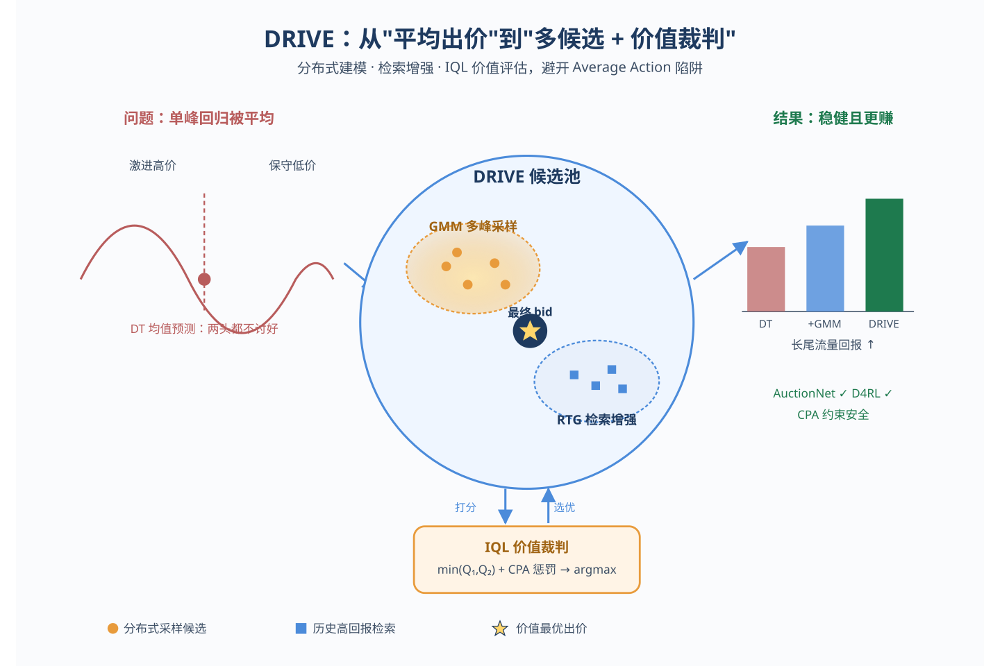
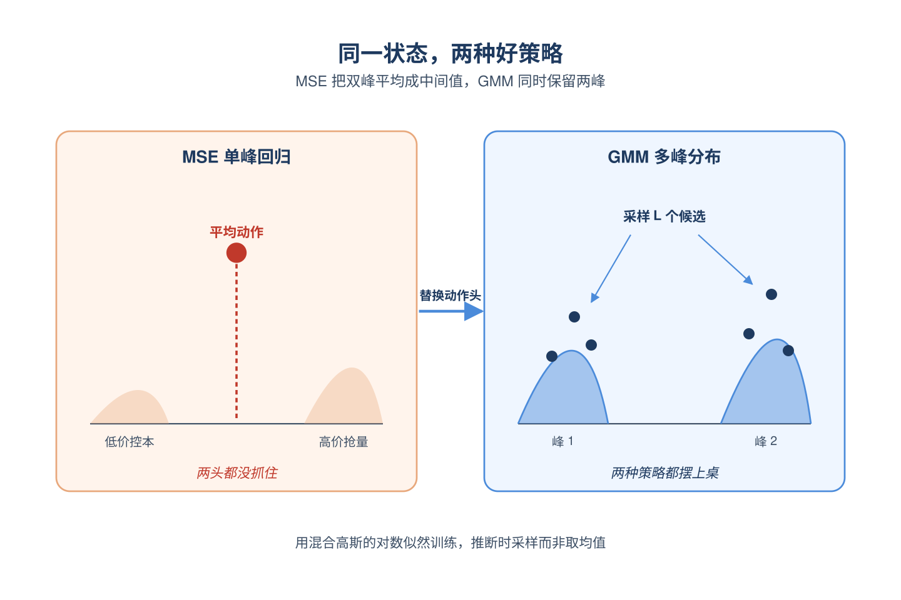
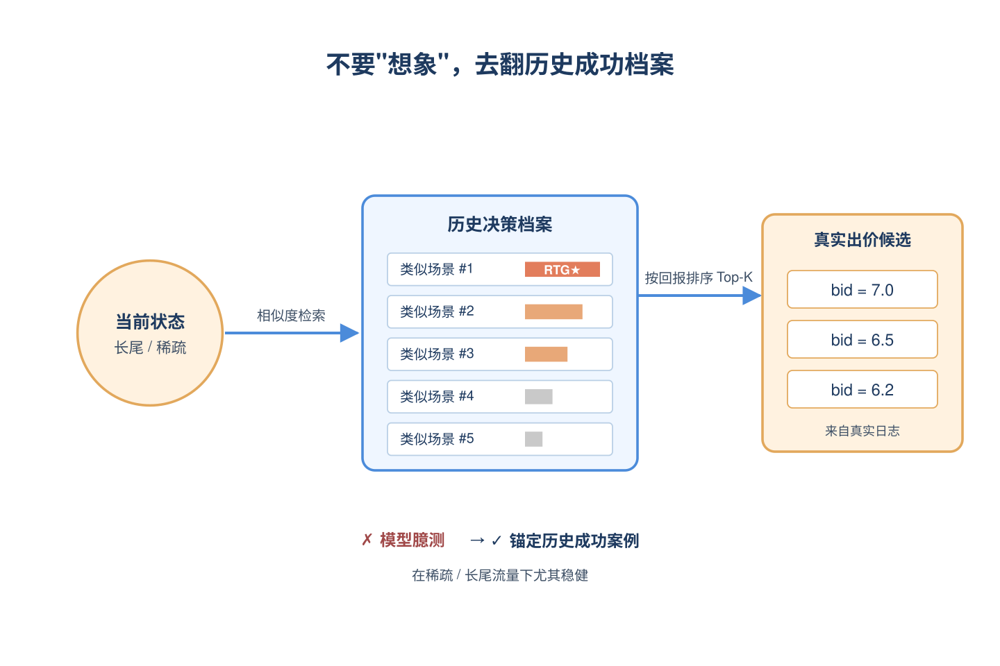
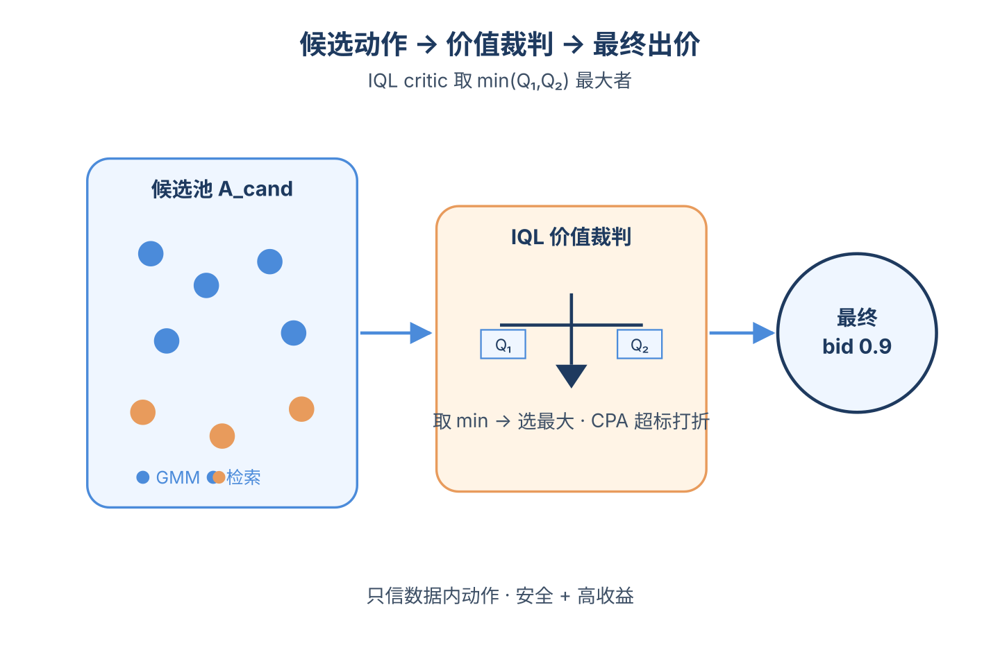
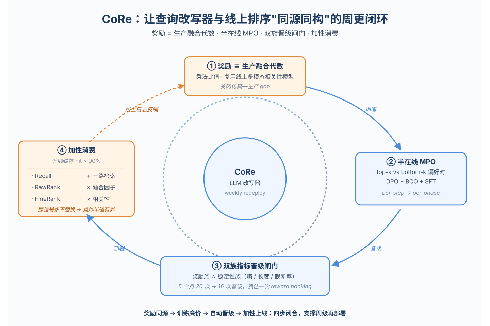
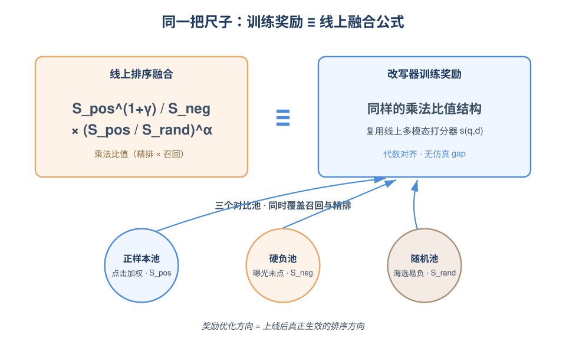
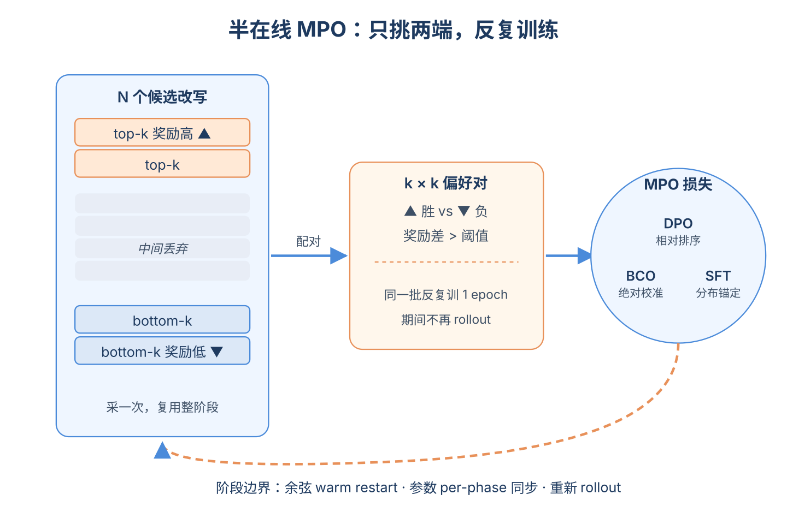
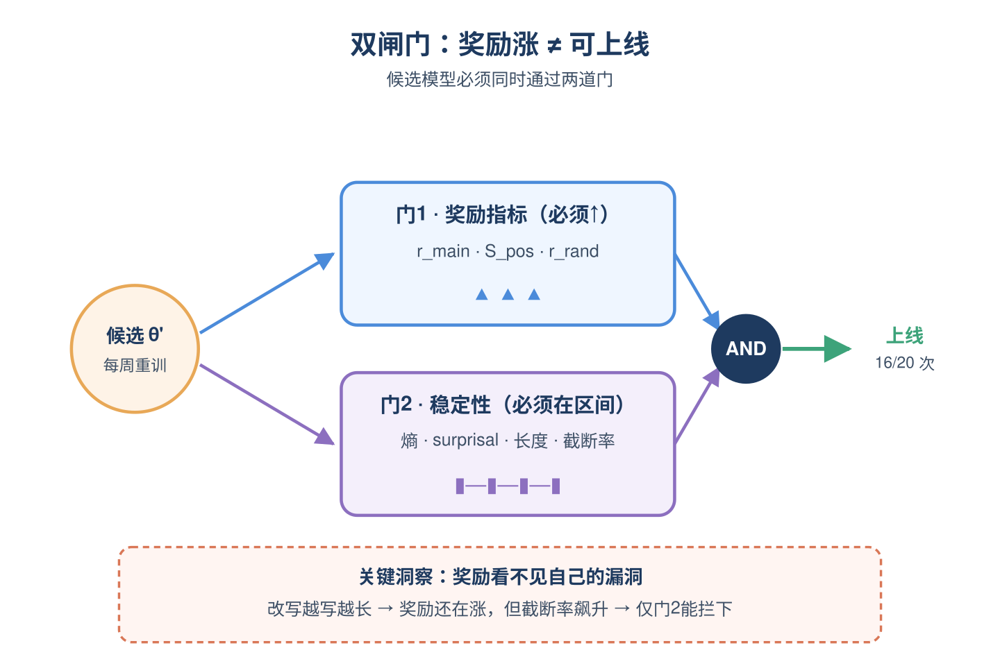
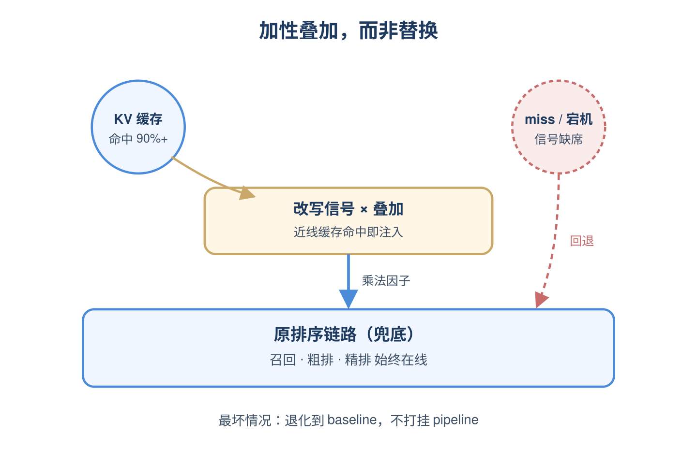

# 2026-06-15 论文日报

## 一、今日趋势与创新观察

### 1. 趋势概况

- 今天全量278篇中cs.AI 148篇、cs.LG 117篇、cs.IR 13篇，LLM与语言理解以91篇继续领跑，研究重心从纯推理对齐进一步转向与检索、生成式推荐和搜索改写的结合。
- 表示学习与检索排序方向有69篇，集中在RAG的chunk选择、查询改写、知识图增强长上下文记忆等检索链路细节优化，呈现出明显的'把LLM塞进多级排序'工程化趋势。
- Agent与多智能体方向54篇，今天的新意在于长生命周期Agent运行时的静默故障分类、版本化推理记忆(GitOfThoughts)、技能条件化的Agent声誉攻击等，更偏运行时治理。
- 商业化决策与资源优化仅21篇，但出现了自动出价(DRIVE)与电商高频定价(Zalando)两篇贴近真实业务的工作，迁移信号61篇说明跨域工程化论文比例仍然较高。

### 2. 推荐系统 / 排序相关创新点

- DRIVE在自动出价场景把Transformer离线RL与检索增强候选生成、价值评估融合，用历史轨迹检索来缓解纯序列模型的分布外风险，AuctionNet上验证。
- CoRe针对工业级视频搜索提出每周可重训的LLM查询改写器，奖励直接对齐下游多级排序消费方式，给广告召回-粗排-精排链路提供了可持续上线的范式。
- ChronoID把显式时间戳信号注入生成式推荐的语义ID构建过程，让时间不再只通过session顺序隐式表达，对商业化排序的ID体系设计有借鉴价值。

### 3. 全局创新点

- GitOfThoughts提出把推理链与Agent记忆纳入类Git的版本控制系统，使得思维链可以被replay、diff、merge，给Agent调试和审计提供了一种全新的工程抽象。
- Meta一篇论文对一个连续在产近一年的个人助理Agent运行时做了静默失败的纵向分类学研究，把Agent生产事故从'单次bug'提升为可结构化分析的故障谱，对实际部署LLM系统具有方法论价值。
- Zalando的高频定价系统用predict-then-optimize框架处理促销期波动需求与多目标约束，是一个与广告出价/收益优化高度同构的工业级参考设计。

### 4. 跨论文综合观察

- DRIVE、CoRe、Zalando定价三篇虽然分别落在出价、搜索改写和电商定价，但都共享'离线学习+在线约束优化+持续再训练'的工业范式，反映出商业化决策类工作正在向统一的predict/learn-then-optimize框架收敛。
- ChronoID、Implicit Reasoning for GR与KGE-MAR都在尝试给LLM/生成式模型补足结构化信号——分别是时间、推理链、知识图——说明纯语义ID或纯embedding不足以支撑长上下文与推荐场景，结构化先验回归是共同趋势。
- GitOfThoughts与Meta的Agent静默故障分类一正一反：前者试图给Agent推理加版本可控性，后者揭示长生命周期Agent中难以察觉的失效模式，两者共同指向Agent系统正从'能跑'走向'可观测、可回滚'的工程化阶段。

## 二、今日入选论文

### 1. DRIVE: Distributional and Retrieval-Augmented Bidding with Value Evaluation
- 挑选理由：直接面向实时广告自动出价，提出基于Transformer的离线RL+检索增强候选生成+价值评估框架，AuctionNet实验

### 2. CoRe: A Continuously Reward-Finetuned LLM Query Rewriter for Multi-Stage Context-Aware Relevance in Web-Scale Video Search
- 挑选理由：工业短视频搜索多级排序的LLM改写器持续训练系统，与广告召回-粗排-精排链路高度同构。

## 三、补充关注

1. **When Recommendation Denoising Meets Popularity Bias: Understanding and Mitigating Their Interaction**
   - 理由：隐式反馈去噪与流行度偏差，对广告CTR/转化建模中的样本权重问题有参考。
2. **ChronoID: Infusing Explicit Temporal Signals into Semantic IDs for Generative Recommendation**
   - 理由：生成式推荐的语义ID时序建模，对商业化排序ID体系有借鉴。

## 四、重点论文精读

### 1. DRIVE: Distributional and Retrieval-Augmented Bidding with Value Evaluation
- **为什么值得看：** 把检索增强+分布式动作+价值评估塞进DT，专治自动出价的均值塌缩
- **背景：** 自动出价场景里在线探索风险大，主流做法是离线RL或DT这类序列建模，但它们用单峰回归头预测动作，会把'高价抢量'和'低价控本'两种都不错的策略平均成一个既抢不到也省不了的中间值，论文叫它'Average Action陷阱'。同时纯参数化模型在稀疏和长尾流量段没有显式机制保留历史好决策，容易输出不靠谱的bid。DRIVE就是冲着这两个问题去的，并在AuctionNet和D4RL上验证。

*图示：这篇直接针对Transformer类离线RL在自动出价中的两大痛点：多模态最优动作被平均化、稀疏长尾流量下动作不可靠。它把GMM分布建模、检索增强和价值评估三件事拼成一个统一推断框架，对工业出价系统有很强的工程参考价值。*

**核心技术点：**

#### 技术点 1：GMM动作头建多峰策略
- 快速理解：把动作输出从一个均值改成一组高斯混合，保留多种合理出价模式

*图示：直觉上一个状态可能既适合激进出价也适合保守出价，强行用MSE拟合会逼模型输出两者中点，结果两头都不讨好。改成混合高斯后，模型可以同时承认'有一个高价峰、一个低价峰'，推断时从这个分布里采几个样本，就能把两种策略都摆到桌面上。*

- 技术细节：把DT原来确定性的MSE回归头换成Mixture Density Network风格的GMM头，给每一步预测M个混合分量的权重、均值、方差，用历史动作的对数似然做训练目标。推断时不取单点，而是从混合分布中采样L个候选动作，作为候选池的一部分。
- 通俗讲解：直觉上一个状态可能既适合激进出价也适合保守出价，强行用MSE拟合会逼模型输出两者中点，结果两头都不讨好。改成混合高斯后，模型可以同时承认'有一个高价峰、一个低价峰'，推断时从这个分布里采几个样本，就能把两种策略都摆到桌面上。
- 例子：论文图2展示了AuctionNet里两个真实case：数据中的最优动作其实分布在比如bid=4和bid=12两簇上，DT的均值预测落在中间8附近，错过两边的高回报区域。换成GMM后采样会同时给出靠近4和靠近12的候选动作，再交给后面的critic挑。

#### 技术点 2：RTG引导的检索增强候选
- 快速理解：用状态相似度从历史里捞出高RTG动作做非参数补充候选

*图示：纯参数化模型遇到罕见状态容易瞎编，但训练集里其实有结构相似的高质量决策，只是模型没显式记住。检索机制相当于给模型加了一本'历史好案例册'：来一个新状态先去册子里翻最像的几条，再按当时拿到的回报排序，把最赚钱的几个动作直接拎出来当候选。*

- 技术细节：用Transformer编码器把离线轨迹每一步的上下文(过去轨迹+RTG+当前状态)编成向量h，存进检索索引，value端记录动作a和该步RTG。推断时同样把当前上下文编码成h，用余弦相似度先取Top-Kpool近邻，再按存储的RTG排序选Top-K，得到一组高质量历史候选动作Are。
- 通俗讲解：纯参数化模型遇到罕见状态容易瞎编，但训练集里其实有结构相似的高质量决策，只是模型没显式记住。检索机制相当于给模型加了一本'历史好案例册'：来一个新状态先去册子里翻最像的几条，再按当时拿到的回报排序，把最赚钱的几个动作直接拎出来当候选。
- 例子：假设当前是某个稀疏长尾流量段，预算还剩30%、CPA压力大。编码器把这一刻的上下文做成向量，去索引里找到几条历史上类似时段的轨迹，从中挑出当时RTG最高的若干个λ值（比如0.7、0.8），这些值就和GMM采样出来的候选合并，避免模型在这种少见场景下凭空乱出。

#### 技术点 3：IQL价值打分选最终bid
- 快速理解：用IQL训的Q给生成+检索的所有候选打分，挑最高的那个执行

*图示：GMM能给多样性、检索能给稳健性，但都不保证选出来的就是当下最赚的那个，所以再加一层裁判。这个裁判用IQL训出来，只信数据里见过的动作，避免对没见过的动作过度乐观；约束任务里还会主动对超CPA的动作打折，让裁判天然偏向安全区。最后从十几个候选里挑Q值最高的那条出价。*

- 技术细节：用IQL范式离线训两个Q网络和一个V网络：V用expectile回归逼近Q分布的上分位，Q再用r+γV(s')做Bellman目标，保证只在数据支撑内学习。对于带CPA约束的任务，把奖励改成r乘以min(1,(K/(C+ε)) β)的惩罚因子。推断时把GMM采样的Agen和检索的Are合并成Acand，选两个Q取min后最大的那个动作执行。
- 通俗讲解：GMM能给多样性、检索能给稳健性，但都不保证选出来的就是当下最赚的那个，所以再加一层裁判。这个裁判用IQL训出来，只信数据里见过的动作，避免对没见过的动作过度乐观；约束任务里还会主动对超CPA的动作打折，让裁判天然偏向安全区。最后从十几个候选里挑Q值最高的那条出价。
- 例子：假设候选池里有GMM采的5个动作(0.6,0.7,0.9,1.1,1.3)和检索来的3个动作(0.8,1.0,1.2)，critic对每个算min(Q1,Q2)，发现0.9这个动作在当前状态下既不会爆CPA、预期价值又最高，就把0.9作为最终bid系数，乘到每条流量的预估价值上得到出价。

- **对广告的启发：** 出价/竞价策略可以借鉴'生成多候选+检索历史好案例+价值打分'三段式推断结构
- **适用边界：** 方法依赖一个高质量、覆盖足够多状态的离线日志库，索引代表性差时检索反而拉低决策；对强非平稳市场（分布快速漂移）需要更频繁地重建索引和重训critic。
- **实践建议：** 可以先在现有DT/CDT出价模型上做小改：把回归头换成GMM并加IQL critic做候选打分，验证均值塌缩是否缓解；再视情况上检索模块解决稀疏时段问题。

### 2. CoRe: A Continuously Reward-Finetuned LLM Query Rewriter for Multi-Stage Context-Aware Relevance in Web-Scale Video Search
- **为什么值得看：** 工业级LLM查询改写器，奖励对齐线上融合公式且持续迭代5个月，对广告链路高度可借鉴
- **背景：** LLM做查询改写在工业上有个核心矛盾：训练奖励要忠实反映改写在生产排序里的真实效果，但训练流程又要便宜到能随数据漂移持续重训上线。论文指出过去工作要么用离线reranker当奖励代理（仿真-生产gap大），要么用全在线GRPO（每步同步参数、成本高），都不适合周级重训。CoRe在TikTok短视频搜索周更5个月、20个候选16个被自动晋升，是少见的'LLM改写+自动晋升网关'长期生产记录，值得广告侧借鉴。

*图示：这是字节TikTok短视频搜索把7B LLM查询改写器做成可周更上线系统的工业实战论文。它把训练奖励直接对齐线上多模态相关性模型与排序融合公式，用半在线MPO控制成本，再用双族指标自动晋升网关防奖励黑客，并在召回/粗排/精排三段做加性并行接入。这套'奖励—训练—晋升—接入'的闭环对广告召回-粗排-精排链路的LLM改写或query理解几乎可以一比一迁移。*

**核心技术点：**

#### 技术点 1：对齐线上融合的奖励设计
- 快速理解：奖励直接调用线上多模态相关性模型，并用乘法比值形式镜像生产排序融合公式

*图示：直觉上：你给改写打分时用的就是线上排序用的那把尺子，并且打分公式的'形状'跟线上把相关性乘进总分的方式一模一样，那么训练时奖励涨1，线上排序得分也会沿同一方向涨。一次打分流程是：采样N个候选改写变成每个改写对正例/硬负/易负三组文档调线上多模态打分变成按点击率/无动作率加权聚合变成套乘法比值得到标量奖励。*

- 技术细节：对每条改写q̃，用部署中的多模态相关性模型在三类文档池上打分：严格点击正例池（用点击率加权）、无动作硬负例池（用无动作率加权）、随机易负例池。奖励主体是 (正例加权均分) (1+γ) / 负例加权均分，再乘以 (正例均分/随机均分) α，整体取clip。乘法形式刻意模仿线上rawrank/finerank把相关性作为乘性因子融合的代数结构，硬负例对应精排对照、易负例对应召回对照。后期还加了长度惩罚和截断惩罚来防奖励黑客。
- 通俗讲解：直觉上：你给改写打分时用的就是线上排序用的那把尺子，并且打分公式的'形状'跟线上把相关性乘进总分的方式一模一样，那么训练时奖励涨1，线上排序得分也会沿同一方向涨。一次打分流程是：采样N个候选改写变成每个改写对正例/硬负/易负三组文档调线上多模态打分变成按点击率/无动作率加权聚合变成套乘法比值得到标量奖励。
- 例子：比如用户刚看过一条'家用咖啡机评测'视频后搜'手冲'。系统采样几个改写如'手冲咖啡入门''手冲壶推荐''手冲'(原query)，分别对正例池(用户随后点了的手冲教程)、硬负池(展示了但没点的奶茶视频)、随机池(随便抽的5条短视频)用线上相关性模型打分。'手冲咖啡入门'在正例上分高、在硬负上分低，比值奖励就大；如果原query本身已经最好，则走另一分支让原query作为chosen去对比改写。

#### 技术点 2：半在线MPO训练循环
- 快速理解：用分阶段的top-k/bottom-k偏好对+混合MPO损失，把周级百万级训练做便宜

*图示：可以理解为'攒一批偏好对集中练，而不是每走一步就重新采样和同步'。GRPO要对每条rollout都回传梯度并立刻同步参数，而这里只挑最好的k个和最差的k个组pair回传，rollout只在phase开头采一次。损失里DPO让模型知道'A比B好'、BCO直接告诉它'A本身就该高分'、SFT让它别离高奖励样本太远，三者一起避免纯DPO那种chosen和rejected log-prob一起塌陷的问题。*

- 技术细节：训练分若干phase，每个phase开始时用当前策略对每条样本采样N个改写、调奖励打分一次，然后按top-k和bottom-k构造k×k个偏好对（且要求奖励差超过margin），整个phase内复用这批pair跑一个MPO epoch。损失是DPO+BCO+SFT的加权和：DPO负责相对排序、BCO对chosen做绝对校准防止chosen和rejected一起被压低、SFT把策略锚在高奖励样本附近。phase边界做cosine warm restart，参数同步从每步一次变成每phase一次，奖励调用也能挪到非高峰批量算。
- 通俗讲解：可以理解为'攒一批偏好对集中练，而不是每走一步就重新采样和同步'。GRPO要对每条rollout都回传梯度并立刻同步参数，而这里只挑最好的k个和最差的k个组pair回传，rollout只在phase开头采一次。损失里DPO让模型知道'A比B好'、BCO直接告诉它'A本身就该高分'、SFT让它别离高奖励样本太远，三者一起避免纯DPO那种chosen和rejected log-prob一起塌陷的问题。
- 例子：周更一次，拉一周日志约百万级(q,d-last)。对每条样本采N个改写，比如N=8，按奖励排序取top2和bottom2，组2×2=4个pair（差距过小的丢掉）。整个phase就在这批pair上跑一个epoch，期间训练机和推理机参数不再来回同步。一个epoch结束才把新权重推给采样服务，开始下一phase。

#### 技术点 3：双族指标自动晋升网关
- 快速理解：奖励类3指标+稳定性类4指标全通过才上线，曾真实拦截过verbosity奖励黑客

*图示：核心理念是奖励函数自己看不见自己被怎么薅。如果模型学会输出特别长的改写来抬高正例池均分，奖励指标看着还在涨，但'平均长度''截断率'这些和奖励无关的结构指标会先报警。配对del评估又能抵抗奖励源本身漂移：3月线上多模态模型升级时，绝对奖励值跳了一下，但候选vs线上的差值仍然可比，网关照常工作。*

- 技术细节：每周训出候选θ'后，在下一周的留出日志上和当前线上θ\*做配对评估。奖励类指标3个：主奖励r-main、正例池均分S-pos、易负例比r-rand，必须全部严格优于线上。稳定性类4个：top-10 token熵、平均surprisal、平均改写长度、被长度cap截断的stop-rate，必须落在预设区间。任何一项不达标就保留原模型。5个月20次重训晋升16次(80%)，其中3次因稳定性失败被拦——只看奖励的话本会被错误上线。
- 通俗讲解：核心理念是奖励函数自己看不见自己被怎么薅。如果模型学会输出特别长的改写来抬高正例池均分，奖励指标看着还在涨，但'平均长度''截断率'这些和奖励无关的结构指标会先报警。配对del评估又能抵抗奖励源本身漂移：3月线上多模态模型升级时，绝对奖励值跳了一下，但候选vs线上的差值仍然可比，网关照常工作。
- 例子：论文记载的真实事件：某段时间奖励主指标持续上涨，但avg-token-length缓慢上漂、stop-rate冲向长度cap。检查发现模型在学'尽量啰嗦+被截断'来薅奖励。于是在r-base后乘上长度惩罚和截断惩罚两个小指数因子，重训一周对比：长度降17%、截断率降一半多，三项奖励指标反而都还涨了。

#### 技术点 4：三段加性并行接入
- 快速理解：改写信号在召回/粗排/精排都作为新增并行信号叠加，绝不替换原信号

*图示：等于在原排序链路旁边'多挂一根线'，这根线提供的信号正好是奖励里优化的那个s(q̃,d)，所以训练目标和上线接入是同一个量，代数上闭环。坏处控制得很死：哪怕7B服务挂了或者首次出现的(q,d-last)没缓存，系统只是回到没有改写器的原状态，不会把排序打坏。论文还做了消融，把'加性'换成'替换'，短期headline指标更高，但安全失败和长尾相关性故障明显增加。*

- 技术细节：7B改写器近线异步服务：每个(q,d-last)事件触发一次生成，结果写入按(q,d-last,id)为key的内存KV缓存。线上请求来时查缓存，命中就把改写q̃喂进三处：召回新增一路'上下文相关性retriever'；粗排把s(q̃,d)作为一个L0/L1乘性融合因子；精排把s(q̃,d)接入full-relevance乘性因子。所有这些都是在原有信号之外加一路，缓存miss或改写器宕机就退化回原排序。线上覆盖率\>90%。
- 通俗讲解：等于在原排序链路旁边'多挂一根线'，这根线提供的信号正好是奖励里优化的那个s(q̃,d)，所以训练目标和上线接入是同一个量，代数上闭环。坏处控制得很死：哪怕7B服务挂了或者首次出现的(q,d-last)没缓存，系统只是回到没有改写器的原状态，不会把排序打坏。论文还做了消融，把'加性'换成'替换'，短期headline指标更高，但安全失败和长尾相关性故障明显增加。
- 例子：用户搜'手冲'刚看完咖啡机视频。事件触发后近线服务生成改写'手冲咖啡入门'写入缓存。下一刻线上请求查到该改写：召回除了原'手冲'路，再开一路用'手冲咖啡入门'拉候选；粗排把每个候选d的s('手冲咖啡入门',d)乘进打分；精排同样接入。如果改写器此刻挂了，缓存miss，整个链路就当没有改写器存在地正常排序。

- **对广告的启发：** 广告召回-粗排-精排可直接复刻：奖励对齐线上pCTR/pCVR融合，加性并联接入+自动晋升网关
- **适用边界：** 方法假设线上有一个可调用、可作为奖励source的强相关性模型，并且生产融合是清晰的乘法/加性代数；若广告排序是端到端深度模型且融合不可显式表达，奖励代数对齐这一招会打折扣。同时本文的瓶颈分析(梯度计算为主)适用于短输出场景，若改成长CoT或重judge奖励，半在线MPO的两块收益权重会反过来。
- **实践建议：** 可以先做一件低成本的事：把现有LLM改写/query理解的训练奖励改成'调用线上相关性或pCTR模型 + 用与线上融合一致的乘法/加性形式聚合正负例'，并加一个由长度、截断率、token熵组成的稳定性看板做晋升网关，再用加性并联方式灰度上线，先验证奖励对齐和graceful degradation，再考虑半在线MPO替换现有DPO/GRPO流程。
