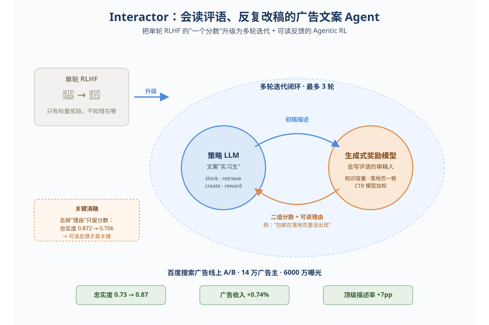
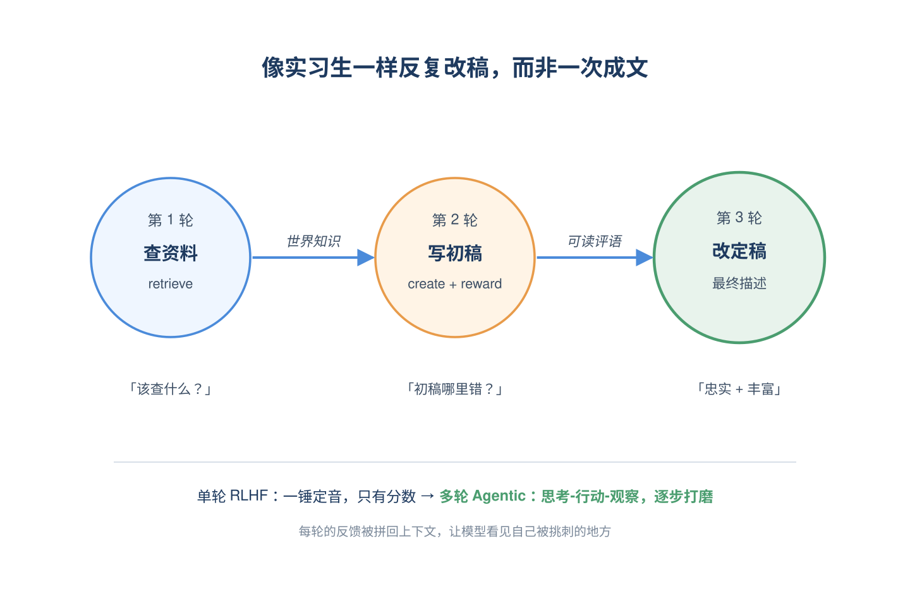
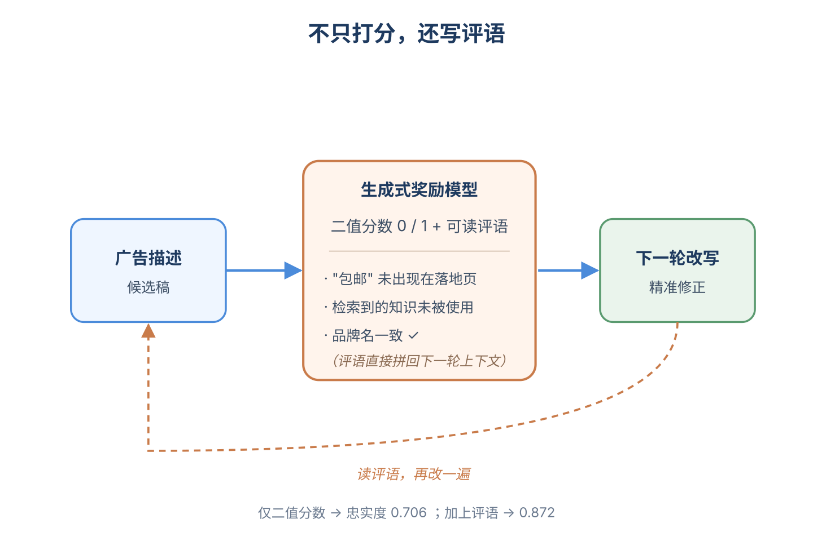
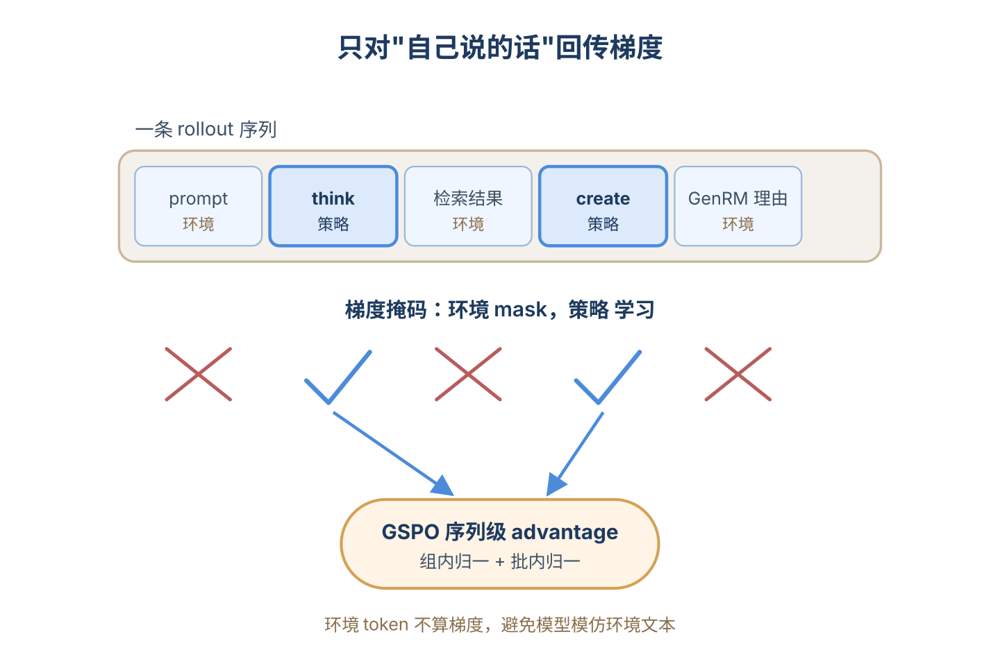
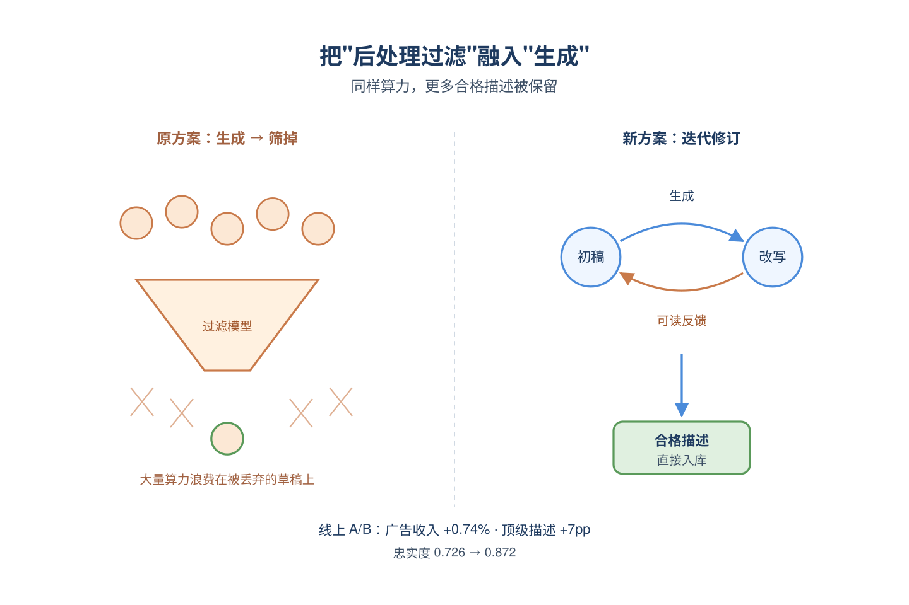
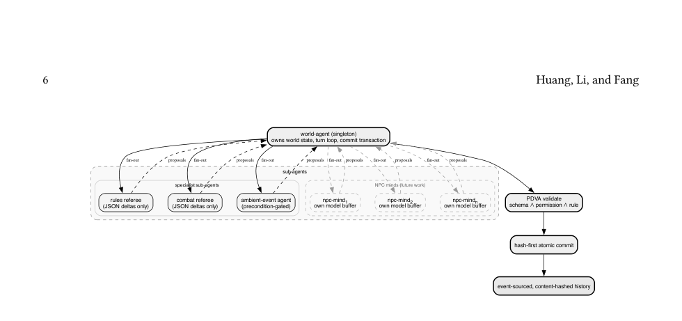
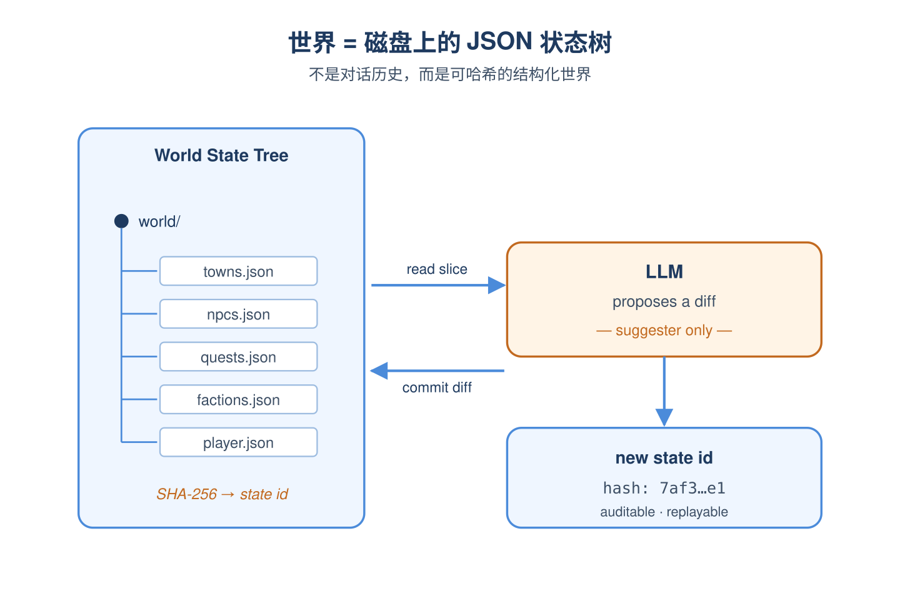
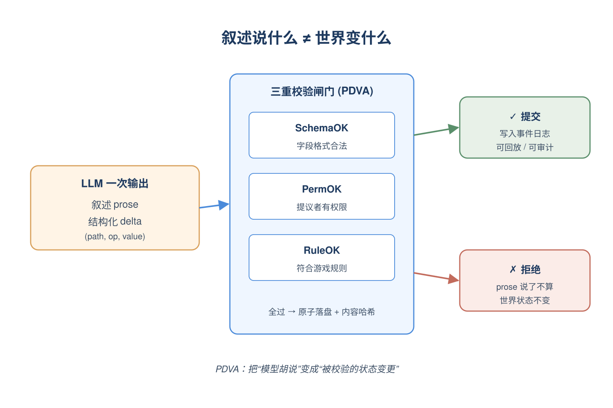
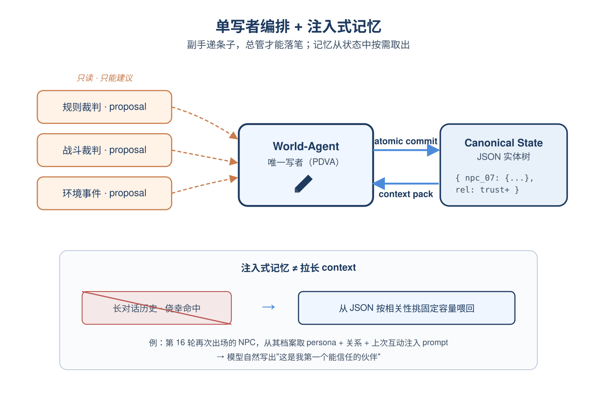

# 2026-06-16 论文日报

## 一、今日趋势与创新观察

### 1. 趋势概况

- 今天cs.AI/cs.LG/cs.IR共抓取705篇，cs.AI占417篇主导，LLM与语言理解以279篇继续领跑，但研究重心明显从纯推理对齐扩散到检索增强、embedding建模和agent系统。
- 表示学习与检索排序方向有216篇，集中在长上下文多模态embedding、过滤式ANN、RAG中chunk选择与rerank等检索链路细节，工程化趋势延续。
- Agent与多智能体138篇，开始与RAG、世界模型、协议化workflow结合，出现可执行协议、约束逃避行为分析等更系统化研究。
- 迁移学习与跨域泛化114篇，冷启动、跨语言预测、跨模态embedding、carbon-aware区域推荐等场景化迁移问题增多，纯bandit理论占比依旧偏小。

### 2. 推荐系统 / 排序相关创新点

- Interactor将Agentic RL用于搜索广告描述的迭代式生成，把世界知识注入广告文案并已在线上搜索广告系统部署，是今天最直接的广告业务创新。
- OneBar提出端到端内容grounded的生成式查询推荐框架，针对短视频feed下clickable搜索入口的延迟约束和目标错配问题，把生成式推荐推到电商视频场景。
- MMLongEmbed构建长上下文多模态embedding基准，揭示理论context window扩张并未带来真实长输入理解能力的提升，对多模态检索召回链路有直接指导意义。

### 3. 全局创新点

- Filtered ANN as a Phase Transition把过滤近邻查询的pre/post/in-filter计划选择建模为基于选择性估计误差的相变argmax问题，为向量检索系统的执行器设计提供了新的理论视角。
- RAID用检索增强的迭代扩散在语义图上做真冷启动和跨语言时间序列预测，绕开了基础模型对历史窗口的依赖假设，是扩散范式向冷启动迁移的有趣尝试。
- PHINN利用持久同调从点云embedding中提取Betti数拓扑指纹，作为稀有事件时序生成的稳定判别信号，提供了一种区别于纯统计的生成监督思路。

### 4. 跨论文综合观察

- Interactor、OneBar和Beyond Positive Signals从不同链路推动'生成式+行为信号'融合：广告文案侧用Agentic RL生成、查询侧用内容grounded生成、CTR侧挖掘隐式负反馈，共同体现把LLM生成能力嵌入排序全链路的趋势。
- MMLongEmbed、Lost at the End和Filtered ANN三篇虽切入点不同，但都在质疑当前检索系统的'容量幻觉'：长context未必被有效利用、多模态RAG存在primacy bias、ANN执行计划会因选择性误估而崩塌，提示召回阶段的鲁棒性问题被系统性低估。
- RAID与PHINN从扩散和拓扑两个角度处理稀缺/冷启动数据，方法论上呈现共性——都在用结构化先验（语义图、持久同调）替代纯历史相关性，对推荐冷启动和长尾建模有迁移价值。

## 二、今日入选论文

### 1. Interactor: Agentic RL oriented Iterative Creation for Ad Description Generation in Sponsored Search
- 挑选理由：搜索广告广告描述生成，已在搜索广告系统线上部署，直接广告业务

### 2. Orchestrated Reality: From Role-Play to Living, Playable Game Worlds -- LLM-Driven World Simulation as a Parameterized-Action POMDP
- 挑选理由：命中广告核心词：pacing。

## 三、补充关注

1. **Retrieval-as-a-Service:A System-Oriented Analysis of Industrial Retrieval Pipelines in Web Systems**
   - 理由：工业检索系统综述，提到广告定向但本质是系统架构survey，参考价值有限
2. **Robust Spoofed Speech Detection via Temporal Pyramid Modeling**
   - 理由：有一定相关信号，但不足以进入正式候选：calibration。
3. **Odds Law: The Decomposition Algebra On How Intelligence Organizes Itself to Solve Difficult Problems Reliably**
   - 理由：有一定相关信号，但不足以进入正式候选：matching。
4. **AnonShield: Scalable On-Premise Pseudonymization for CSIRT Vulnerability Data**
   - 理由：有一定相关信号，但不足以进入正式候选：recall。
5. **Retrieve, Don't Retrain: Extending Vision Language Action Models to New Tasks at Test Time**
   - 理由：有一定相关信号，但不足以进入正式候选：retrieval。
6. **Few-Shot Biomedical Relation Extraction with Large Language Models: A Viable Alternative to Supervised Learning?**
   - 理由：有一定相关信号，但不足以进入正式候选：recall。
7. **Evaluating the Robustness of Proof Autoformalization in Lean 4**
   - 理由：有一定相关信号，但不足以进入正式候选：counterfactual。
8. **Human genetic evidence is associated with drug approval across therapeutic areas: an observational analysis of 26,278 target-disease pairs with temporal validation and feature ablation**
   - 理由：有一定相关信号，但不足以进入正式候选：calibration。
9. **GeoRoPE: Ground-Aware Rotary Adaptation for Remote Sensing Foundation Models**
   - 理由：有一定相关信号，但不足以进入正式候选：calibration。
10. **RAMS: Resource-Adaptive and Detection-Conditioned Model Switching for Embedded Edge Perception**
   - 理由：有一定相关信号，但不足以进入正式候选：recall。

## 四、重点论文精读

### 1. Interactor: Agentic RL oriented Iterative Creation for Ad Description Generation in Sponsored Search
- **为什么值得看：** 百度搜索广告描述生成，多轮Agentic RL+生成式奖励，已上线带来收入提升
- **背景：** 搜索广告里大家以前主要优化标题点击率，但描述位长得多，可以承载世界知识来回应用户搜索意图，并展示更细的卖点。然而描述要同时满足'信息丰富'和'忠实于落地页'两类质量约束，单轮RLHF只给一个标量奖励，很难指出哪里写错了，导致rollout质量低、训练效率差。论文提出把描述生成做成多轮迭代+Agentic RL，用生成式奖励模型给出可读反馈来逐步改写，是直接落到搜索广告业务的工作。

*图示：这是百度搜索广告团队2026年5月已上线的广告描述生成系统，把广告文案生成从单轮RLHF升级为多轮Agentic RL，关键创新是用生成式奖励模型给出可读理由而不仅是分数，让LLM能像Agent一样反复修订描述。论文同时给出工业数据集对比、消融、线上A/B（广告收入+0.74%、人工质检顶级率+7pp）和具体case，对做广告创意生成的团队有直接借鉴价值。*

**核心技术点：**

#### 技术点 1：多轮迭代式生成框架
- 快速理解：把单轮生成改成LLM-Agent与环境多轮交互，逐轮修订描述

*图示：可以把模型想成一个广告文案实习生：先查资料、写初稿、交给审稿人、根据审稿意见改稿，而不是闭着眼睛一次写完。每轮的'思考-动作-观察'都被记入上下文，模型下一轮能看到自己上一稿哪里被挑刺，然后有针对性地改。*

- 技术细节：把描述生成定义为一个多轮rollout：每轮LLM先在\<think\>里思考，再选一个动作——可以是\<retrieve\>调内部搜索引擎拿世界知识、\<create\>写一版描述、或\<reward\>请奖励模型打分。环境会回传观察（检索到的网页内容或奖励模型的理由），拼到下一轮上下文里。最大轮数设为3，最后一轮的\<create\>就是最终描述。
- 通俗讲解：可以把模型想成一个广告文案实习生：先查资料、写初稿、交给审稿人、根据审稿意见改稿，而不是闭着眼睛一次写完。每轮的'思考-动作-观察'都被记入上下文，模型下一轮能看到自己上一稿哪里被挑刺，然后有针对性地改。
- 例子：论文里电钢琴的例子：第一轮模型先\<retrieve\>'电钢琴型号推荐'，搜回'要看键盘手感、音质、品牌口碑'；第二轮\<create\>写出含'快递包邮'的初稿；环境回'包邮在落地页里没有，知识也没融进去'；第三轮模型把'包邮'改成'快递上楼'（落地页里有'送上门'），并加入'兼顾键盘质量、手感及品牌口碑'，得到一版同时忠实且有知识的描述。

#### 技术点 2：生成式奖励模型给可读反馈
- 快速理解：奖励模型不仅给0/1，还输出指出错在哪、缺什么的自然语言理由

*图示：传统RLHF奖励就一个分数，模型只知道'差'但不知道哪里差。这里奖励模型像个会写评语的审稿人：除了打分还告诉你'卖点包邮在落地页里没出现'或'检索到了知识但没用上'。这些评语被直接塞回下一轮上下文，模型读着评语改稿，比盲改高效得多。消融实验里把理由去掉只保留二值信号，忠实度从0.872掉到0.706，说明可读反馈才是真正起作用的部分。*

- 技术细节：针对'知识容量'和'落地页一致性'两个维度各自构建一个GenRM：把业务规则总结成rubric，用Qwen3-30B-A3B加few-shot prompt，输出两部分——所有规则都满足才给1的二值奖励，以及具体说明为什么不通过的理由文本。再加一个基于Qwen3-Embedding-0.6B在点击日志上训练的CTR模型给(0,1)实数奖励，三者加权（权重1/2/5）作为最终奖励。GenRM与人工标注一致率约0.8。
- 通俗讲解：传统RLHF奖励就一个分数，模型只知道'差'但不知道哪里差。这里奖励模型像个会写评语的审稿人：除了打分还告诉你'卖点包邮在落地页里没出现'或'检索到了知识但没用上'。这些评语被直接塞回下一轮上下文，模型读着评语改稿，比盲改高效得多。消融实验里把理由去掉只保留二值信号，忠实度从0.872掉到0.706，说明可读反馈才是真正起作用的部分。
- 例子：落地页一致性GenRM的prompt会让它先把候选描述里的功能点和品牌名一一拆出来，再到落地页里逐项比对，最后输出JSON包含function-verdict、brand-verdict和具体哪一条找不到证据，模型下一轮就能精准把'包邮'换成落地页里真实存在的'送上门'。

#### 技术点 3：Agentic RL优化（GSPO）
- 快速理解：用序列级GSPO优化策略，只对模型自己生成的token算梯度

*图示：多轮rollout里有大量内容是搜索引擎返回或奖励模型写的，如果把这些token也当成模型输出去算梯度，模型会被'教坏'去模仿环境文本。所以训练时只对\<think\>和\<create\>等真正由策略产生的部分回传梯度。GSPO的好处是按整段序列算重要性比，与按整条rollout给奖励的粒度对得上，比逐token的方法更稳。*

- 技术细节：采用GSPO（critic-free，序列级重要性采样），每个prompt采G=8条rollout，用最后一轮的加权奖励做组内+全局两次归一化得到advantage。关键工程点：rollout序列里既有模型生成的action token，也有环境塞进来的observation token和任务输入，policy gradient只对action token算损失，其余mask掉。基模型Qwen3-30B-A3B，用Slime+SGLang异步训练，并用routing replay稳定MoE训练，所有对比方法都用同一份10万条DeepSeek-V3.2合成描述做冷启SFT。
- 通俗讲解：多轮rollout里有大量内容是搜索引擎返回或奖励模型写的，如果把这些token也当成模型输出去算梯度，模型会被'教坏'去模仿环境文本。所以训练时只对\<think\>和\<create\>等真正由策略产生的部分回传梯度。GSPO的好处是按整段序列算重要性比，与按整条rollout给奖励的粒度对得上，比逐token的方法更稳。
- 例子：一条rollout里包含（任务prompt, retrieve动作, 检索结果, create动作, GenRM理由, 再次create动作），最终奖励=1·知识+2·一致性+5·CTR算在最后一轮的create上，组内8条rollout先按组归一再按batch归一得到advantage，仅对两次create和think的token更新参数。

#### 技术点 4：工业落地与效果
- 快速理解：线上A/B覆盖14万广告主，广告收入+0.74%，人工顶级率+7pp

*图示：作者强调他们的方法看起来推理成本更高（多轮），但工业部署里反而更省：原来是先生成再用一堆后处理模型筛，被筛掉的算力都浪费了；现在把后处理融进多轮迭代里，每条最后产出的描述大概率合格，整体资源利用率反而更高。*

- 技术细节：在百度搜索广告系统A/B测试中覆盖超14万广告主、6000万次曝光，描述用离线批量生成（每个广告2条候选）写入KV库，在线竞价时取用，上线前还过一道100+条规则的内容安全过滤。论文报告广告收入相对+0.74%（在该业务+0.5%已属大幅提升），人工评估顶级描述比例+7pp。在离线指标上Faithfulness从单轮RL的0.726提升到0.872，是提升最大的维度。
- 通俗讲解：作者强调他们的方法看起来推理成本更高（多轮），但工业部署里反而更省：原来是先生成再用一堆后处理模型筛，被筛掉的算力都浪费了；现在把后处理融进多轮迭代里，每条最后产出的描述大概率合格，整体资源利用率反而更高。
- 例子：在线流程：广告主授权后，离线给每个广告跑Interactor生成两条描述，写入KV；用户搜索触发广告竞价时直接取这两条候选送审，省去了原先生成-后处理-丢弃的循环。

- **对广告的启发：** 广告创意生成可以从'单轮RLHF刷分'升级为'生成式奖励+多轮自我修订'
- **适用边界：** 方法适用于有结构化落地页+成熟内部搜索引擎+点击日志的大型搜索广告系统；在缺少高质量rubric或GenRM不稳定的场景下，多轮反馈反而可能放大错误。论文也承认未显式利用广告主自己写的描述语料，无法做human-in-the-loop的编辑建议。
- **实践建议：** 若你在做广告文案/描述生成，先别急着升级到多轮Agentic RL——可以先把现有RLHF奖励模型改造成'输出二值+理由'的GenRM，把理由拼回prompt做一次自我改写，往往就能拿到这篇论文里大部分忠实度收益。

### 2. Orchestrated Reality: From Role-Play to Living, Playable Game Worlds -- LLM-Driven World Simulation as a Parameterized-Action POMDP
- **为什么值得看：** 把LLM驱动的开放世界形式化为带JSON状态的POMDP，对广告创意编排有架构启发
- **背景：** 现在LLM做角色扮演、开放世界游戏的最大问题是：世界状态只存在于prose里，模型说啥就是啥，几轮之后人物位置、关系、剧情就开始自相矛盾。作者认为这不是模型能力问题，而是架构问题——没有人把‘世界’当成一个被校验、被持久化的对象。论文提出把LLM驱动的世界形式化为参数化动作POMDP，状态是一棵JSON实体树，转移由一个叫PDVA的校验流水线完成，从而让世界变成可审计、可回放、可分支的对象。值得看是因为它给所有‘LLM做长程编排’的场景提供了一种工程范式。

*图示：这是 Figure 1，直接展示论文核心的 world-agent harness：单例 world-agent、各类子代理提案、PDVA 验证阶段，以及提交到事件溯源历史的流程，最能概括方法架构与信息流。相比只截到局部横向条带的候选，这张虽然留白较多，但图主体更完整，包含从子代理到验证再到提交历史的完整链路，正文噪声也很低，更适合作为主方法总览图。*

**核心技术点：**

#### 技术点 1：世界即JSON状态树
- 快速理解：把世界拆成一堆带schema的JSON文件，每轮只读写小切片，可哈希可回放

*图示：传统LLM游戏的‘记忆’就是把越来越长的对话塞回prompt，模型说过什么就算什么。这里反过来：先有一份磁盘上的‘世界数据库’，每回合先从这份数据库里挑相关条目当上下文喂给模型，模型说完话之后再以结构化diff的形式回写数据库。模型只是‘建议者’，世界本身是被代码托管的。*

- 技术细节：状态S不再是对话历史，而是磁盘上一棵JSON文档树：城镇、NPC、任务、派系、玩家档案、运行时状态各自是一个带类型schema的JSON文件。整棵树可序列化、可SHA256哈希寻址，每一轮只读取与当前动作相关的小切片作为上下文，提交后整体重新哈希得到新状态id。
- 通俗讲解：传统LLM游戏的‘记忆’就是把越来越长的对话塞回prompt，模型说过什么就算什么。这里反过来：先有一份磁盘上的‘世界数据库’，每回合先从这份数据库里挑相关条目当上下文喂给模型，模型说完话之后再以结构化diff的形式回写数据库。模型只是‘建议者’，世界本身是被代码托管的。
- 例子：玩家走进酒馆这一回合，引擎只读取player.position=town-square、附近两个NPC（barkeep-milo、guard-ivor）、以及town-square位置文件，组成一个小JSON当context喂给模型，而不是把过去几十回合的对白都塞进去。

#### 技术点 2：PDVA转移流水线
- 快速理解：Plan-Diff-Validate-Apply四步把模型自由发挥变成schema校验后的原子提交

*图示：模型一次调用同时吐两样东西：给玩家看的故事文字、给引擎执行的JSON补丁。引擎不会因为故事说‘玩家拿了金币’就真的加金币，必须看那条结构化补丁是否合法。三重校验里：schema管字段格式，permission管‘谁有权改这个字段’（玩家不能直接改NPC血量），rule管游戏逻辑（比如进入封锁区是否需要技能检定）。只有全过的补丁才会落盘，落盘后立刻算哈希。*

- 技术细节：转移核F被实现为四步流水线：Plan从当前状态截取相关切片构造受限context；Diff让LLM同时输出一段叙述prose和一组结构化mutation（path、op、value）；Validate对每个mutation做三重检查——SchemaOK（符合JSON schema）、PermOK（提议者在其权限范围内）、RuleOK（满足游戏规则）；Apply只把通过校验的mutation原子提交，并对新状态做内容哈希，写入事件日志。
- 通俗讲解：模型一次调用同时吐两样东西：给玩家看的故事文字、给引擎执行的JSON补丁。引擎不会因为故事说‘玩家拿了金币’就真的加金币，必须看那条结构化补丁是否合法。三重校验里：schema管字段格式，permission管‘谁有权改这个字段’（玩家不能直接改NPC血量），rule管游戏逻辑（比如进入封锁区是否需要技能检定）。只有全过的补丁才会落盘，落盘后立刻算哈希。
- 例子：玩家输入‘我推门进酒馆’。模型返回叙述+一条delta：(path: player.position, op: set, value: rusty-anchor-tavern, actor: player)。校验时schema通过、player有权改自己position、酒馆是公共区域不需check，于是原子写入文件，新状态被哈希为h(S-(t+1))并记入事件日志，整轮可被审计与回放。

#### 技术点 3：单写者编排+注入式记忆
- 快速理解：一个单例世界Agent当唯一写者，记忆靠每轮重新注入而不是塞长上下文

*图示：把多agent协作里最容易出问题的‘谁能改什么’显式管控起来：只有总管能落盘，副手只能递条子。记忆方式也反过来——不是希望模型从长对话里自己捞回信息，而是引擎主动从结构化状态里挑最相关的实体‘喂回去’。这样十六回合前出现过的NPC，只要还在JSON里，就能被精确地重新塞进prompt。*

- 技术细节：整个游戏只有一个world-agent单例拥有写权限，其他子agent（规则裁判、战斗裁判、环境事件agent，未来还有多NPC mind）只能提proposal，最终由world-agent聚合成一次原子提交，避免并发写冲突。每个agent有契约c=(id, type, R, W)，默认deny。记忆机制不是靠拉长context window，而是每轮按相关性从canonical JSON里挑一份固定容量的context pack注入prompt，因此‘记忆’是commit过的世界状态的确定函数。
- 通俗讲解：把多agent协作里最容易出问题的‘谁能改什么’显式管控起来：只有总管能落盘，副手只能递条子。记忆方式也反过来——不是希望模型从长对话里自己捞回信息，而是引擎主动从结构化状态里挑最相关的实体‘喂回去’。这样十六回合前出现过的NPC，只要还在JSON里，就能被精确地重新塞进prompt。
- 例子：案例里一个早期出现的NPC在16轮之后再次出场，引擎从NPC文件里取出他的persona、和玩家的关系、上次互动事件，作为context pack注入当前回合，模型于是能自然地写出‘这是我第一个能信任的伙伴’这样的连贯回忆，而不是靠对话历史侥幸命中。

- **对广告的启发：** 对LLM驱动的广告创意编排有用：把‘账户/活动/创意’当成可校验的JSON状态而不是prompt里漂移的描述
- **适用边界：** 方法只对落入schema的字段强一致，schema没覆盖的细节（如NPC某只手有疤）仍会在prose里漂移；并发多写者尚未形式化，目前只支持单例写者；论文只在单一LLM provider上跑过，跨模型可迁移性未验证；玩家实验仍是planned，未给出实证效果。
- **实践建议：** 如果你在做LLM agent改投放/写创意的系统，立刻试一件事：把agent的输出强制拆成‘自然语言解释 + 结构化JSON diff’两部分，给diff加schema+权限+业务规则三层校验，只有通过校验的才真正落库并写事件日志——能立刻消掉一大半幻觉事故并拿到可回放的审计链。
