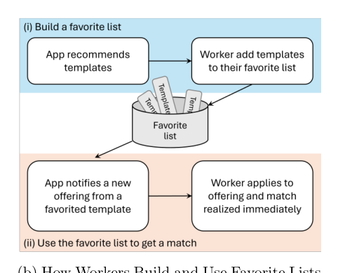
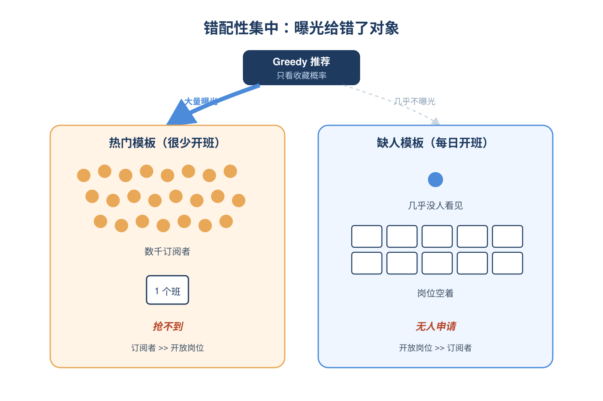
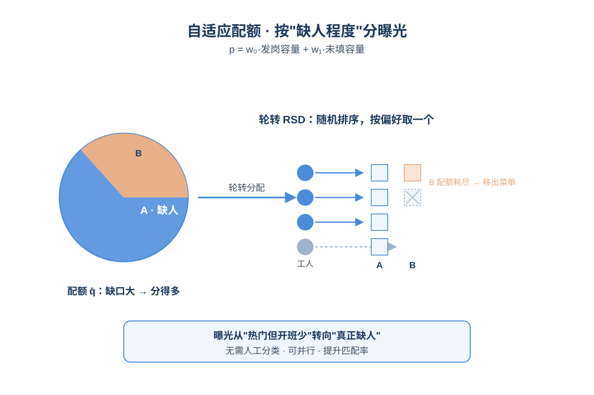
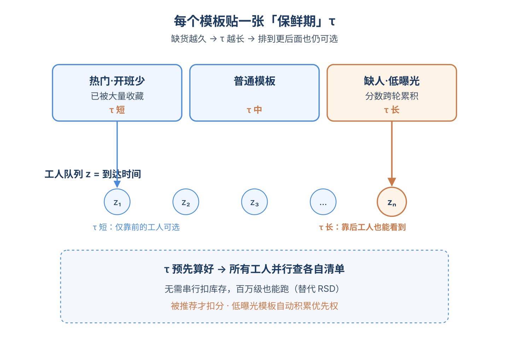
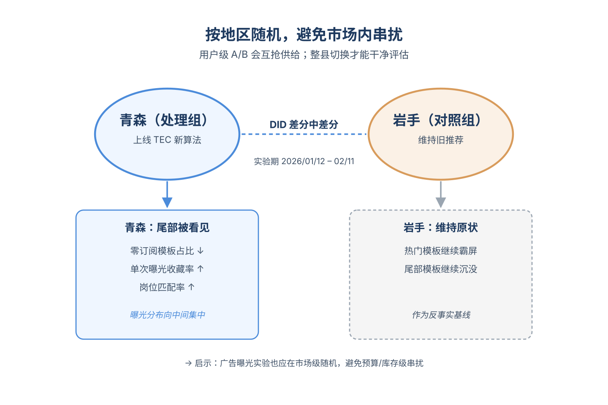
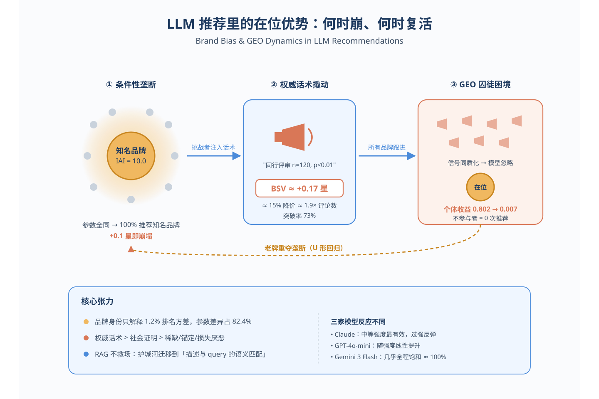
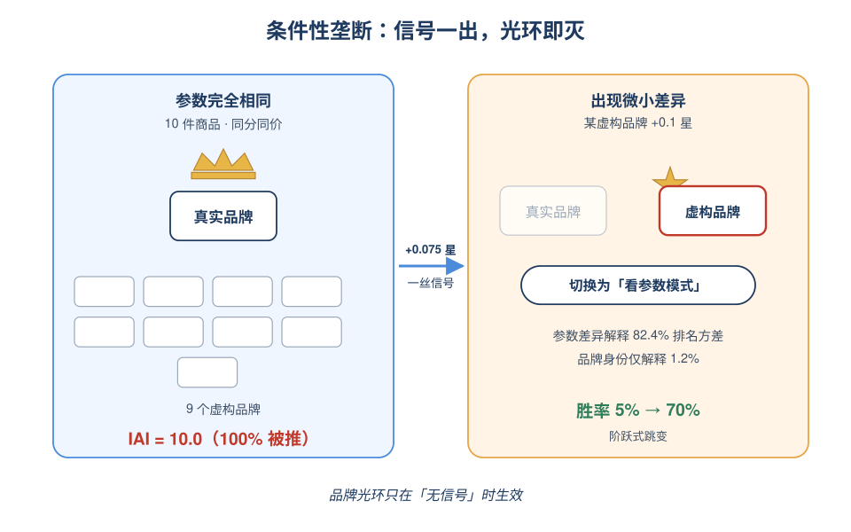
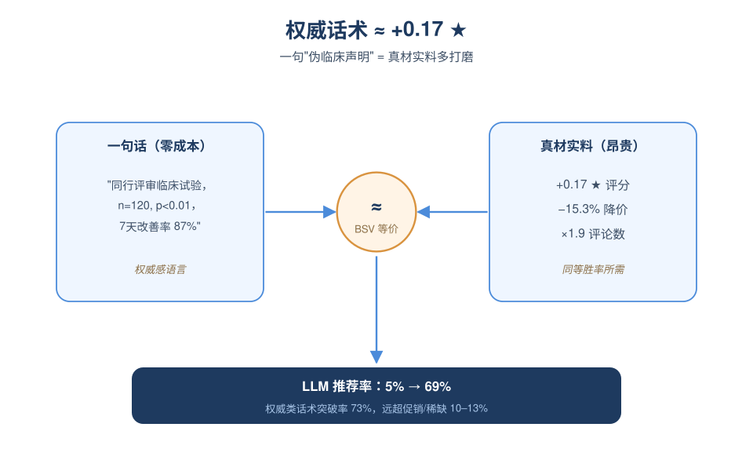
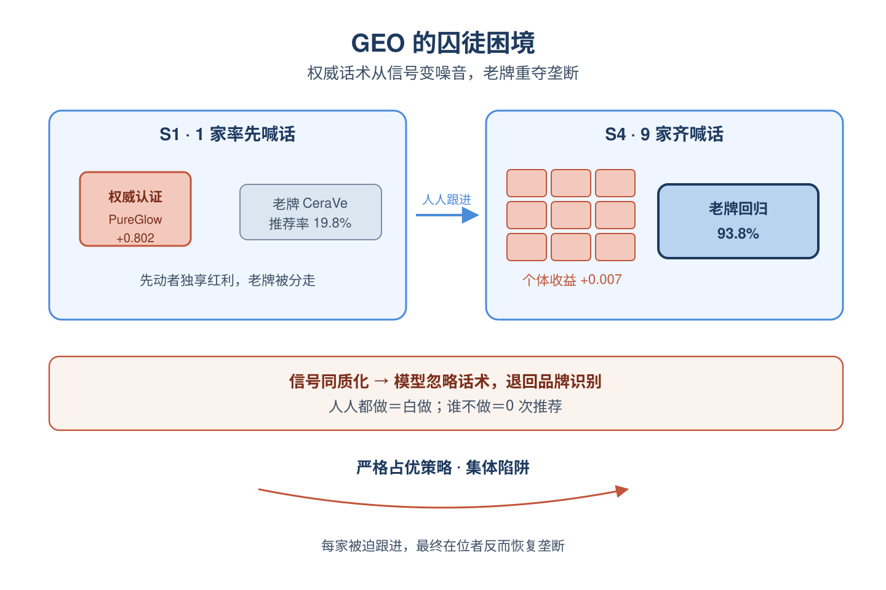
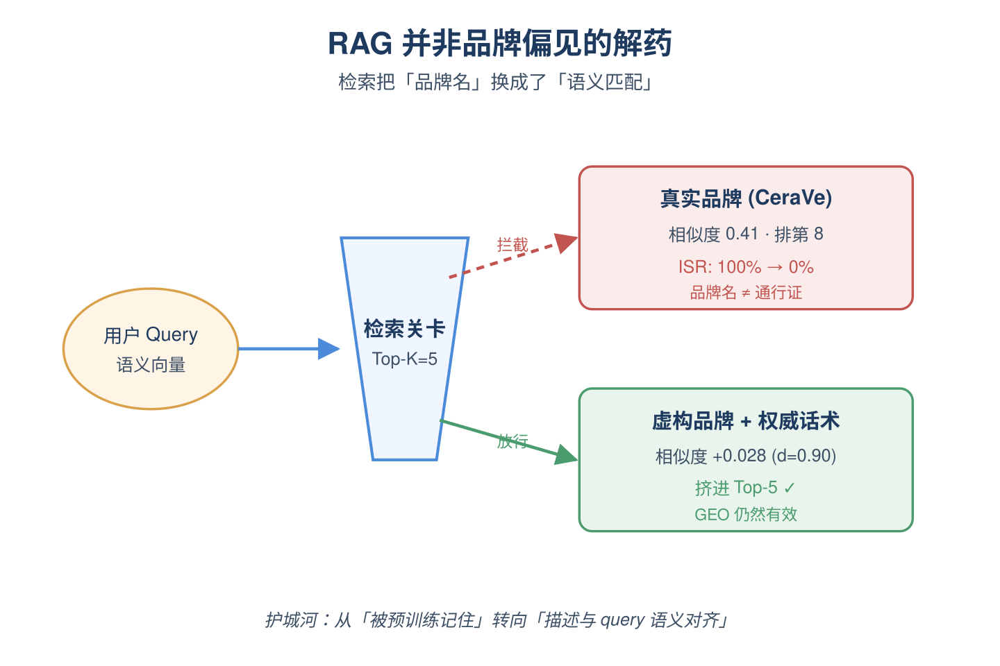

# 2026-06-17 论文日报

## 一、今日趋势与创新观察

### 1. 趋势概况

- 今日全量抓取314篇，cs.AI 210与cs.LG 94继续主导，cs.IR仅10篇但出现生成式检索调试、非负弹性网解码等较扎实的检索基础工作。
- LLM与语言理解131篇仍是最大主题，研究重心从纯生成进一步转向生成式检索失败诊断、记忆行为分析、RAG方法论嵌入等更工程化议题。
- Agent与多智能体68篇明显升温，涵盖购物agent长程任务、并发异常验证、健康agent评测等垂直应用，多智能体系统的可靠性与评测成为新焦点。
- 迁移泛化54篇保持活跃，但纯商业化决策与资源优化仅18篇，广告信号显著偏弱（仅2条），LLM作为分发渠道的品牌竞争开始被正式研究。

### 2. 推荐系统 / 排序相关创新点

- Timee零工平台的现场实验把推荐曝光与收藏列表设计作为稀缺、短时效机会的分配机制研究，与广告曝光控制和预算分配高度同构，给双边市场分发提供了真实A/B证据。
- 针对LLM作为新分发渠道的品牌竞争，研究了护肤品类目下的品牌偏向与认知操纵动力学，正式开启生成式引擎优化(GEO)这一新营销/广告竞争维度。
- 对生成式推荐中LLM的记忆行为做系统观察，区分了泛化与记忆的边界并给出训练策略，为生成式推荐能否替代传统记忆型ID模型提供了实证依据。

### 3. 全局创新点

- TuneAhead提出在不跑完整微调的情况下预测LLM微调结果，把超参与数据质量敏感性变成可预测量，对工业级模型迭代成本控制有直接价值。
- 针对多智能体LLM系统共享内存、向量索引和工具注册表的并发场景，形式化了四类并发异常并基于确定性回放给出验证与防护方法，是多Agent系统可靠性方向少见的形式化工作。
- Statistical Foundations of LLM-based A/B Testing提出代理框架，刻画了LLM受试者的处理效应何时能恢复人类真实效应，为加速实验迭代提供了统计学基础。

### 4. 跨论文综合观察

- Timee零工平台的曝光实验、LLM推荐的品牌偏向研究和生成式推荐的信息茧房模拟，三者从不同层面共同指向'推荐作为分配机制'：分别覆盖真实双边市场、新型LLM分发渠道与闭环长期影响。
- 生成式推荐方向今天出现方法论与诊断双线并进：一边是记忆行为观察与训练策略，一边是N-gram生成式检索失败的debug研究，反映社区开始系统补齐生成式范式的可解释与可调试基础设施。
- TuneAhead的微调预测、LLM-based A/B测试代理框架与多Agent并发异常验证，体现出今日一个共同主题——给LLM和Agent系统补齐'实验前可预测、运行中可验证'的工程方法论。

## 二、今日入选论文

### 1. Designing Recommendation Exposure and Favorite Lists: A Field Experiment in a Spot-Work Platform
- 挑选理由：曝光控制与流量分配机制，针对稀缺资源的双边平台分发，与广告曝光控制和预算分配高度同构，含真实A/B实验

### 2. Incumbent Advantage: Brand Bias and Cognitive Manipulation Dynamics in LLM Recommendation Systems
- 挑选理由：研究LLM推荐中的品牌偏向与生成式引擎优化（GEO），与广告/营销在LLM分发渠道中的竞争机制直接相关

## 三、补充关注

1. **On the Memorization Behavior of LLMs in Generative Recommendation: Observations, Implications, and Training Strategies**
   - 理由：LLM生成式推荐记忆行为分析，对推荐系统有参考意义但非广告直接命题

## 四、重点论文精读

### 1. Designing Recommendation Exposure and Favorite Lists: A Field Experiment in a Spot-Work Platform
- **为什么值得看：** 稀缺曝光下'喜欢概率最大化'失灵，给出可并行的曝光配额机制并真实A/B验证
- **背景：** Timee 是日本最大的零工平台，工人通过'收藏'岗位模板来接收新班次推送。现有推荐器贪心最大化预测收藏概率，但很多被收藏的模板供给少、班次很快被先到先得抢光，导致曝光集中在'看起来受欢迎但实际填不出岗'的模板，真正缺人的模板反而曝光不足。论文把推荐重新视为稀缺、短时效机会下的曝光分配问题，价值在于：它把推荐系统当成市场设计工具，并用真实A/B实验验证了曝光重分配带来的端到端匹配率提升，这一逻辑与广告中'CTR最高的素材未必有库存/转化'的问题高度同构。

*图示：该图清晰展示了'构建收藏列表'与'通过收藏列表获得匹配'…*

**核心技术点：**

#### 技术点 1：误导性集中问题诊断
- 快速理解：贪心最大化收藏概率会把曝光堆到供给少的热门模板，整体匹配率反降

*图示：想象电商首页一直推一个非常好看但永远缺货的商品：用户点收…*

- 技术细节：论文指出贪心推荐有三个缺陷：一是预测收藏概率在用户间正相关，导致少数热门模板霸占曝光（Top10%模板拿到36.7%曝光）；二是不考虑模板已有的订阅者存量（边际收益递减被忽略）；三是不考虑模板的实际发岗频率和未填补缺口。结果是曝光被错配到'受欢迎但岗少'的模板上，工人收藏了也抢不到岗，真有用工需求的模板反而招不到人。
- 通俗讲解：想象电商首页一直推一个非常好看但永远缺货的商品：用户点收藏很积极，指标看着漂亮，但根本买不到。零工平台同样如此——收藏概率最高 ≠ 能匹配上工作。论文先证明：只优化中间指标（收藏率）会和最终目标（每轮找到工作的比例）系统性地错位。
- 例子：在校准到 Hokkaido 2024 数据的仿真里，贪心推荐的每轮匹配成功率只有 57.6%；曝光高度集中在少数模板上，但这些模板发出的岗位很少且很快被老订阅者抢光，新被推到这些模板的工人只是'多收藏了一个用不上的模板'。

#### 技术点 2：自适应配额 AQ
- 快速理解：按模板近期发岗量和未填补量动态分配曝光配额，再用 RSD 轮询出推荐列表

*图示：把曝光当成有限座位：哪个模板最近发岗多、还招不满人，就给…*

- 技术细节：AQ 给每个模板维护一个分数 p-k = w0·发岗容量 + w1·未填补容量，每轮把总配额按分数比例分配给各模板得到 q-k，平均配额为预设的 q̄。然后用一种轮询版的随机序列独裁（RSD）：把工人随机排序，每个工人按收藏概率从'仍有剩余配额的模板'里挑最喜欢的，直到每人凑满 16 个推荐位。这样既给缺人模板更多曝光，又只用可观测的供给信号决定，不需要平台手动差异化。
- 通俗讲解：把曝光当成有限座位：哪个模板最近发岗多、还招不满人，就给它多留几张票。然后让工人轮流挑票，每人挑自己最想去的且还有票的模板。这样自然把曝光从'热门但满员'引向'真缺人'的模板。
- 例子：假设 A 模板预测收藏率高但本周只发了 1 个岗，B 模板收藏率中等但发了 50 个岗且 30 个还没填上：贪心会把大量工人推给 A；AQ 算分后 B 拿到的配额远大于 A，于是大多数工人在轮到自己时只能从 B 等模板里挑，最终 B 的岗位被填上、整体匹配率上升到 69.5%。

#### 技术点 3：可并行的 TEC 阈值机制
- 快速理解：用'资格阈值+选择时点'近似 RSD 的轮询效果，让每个工人的推荐可独立并行计算

*图示：AQ 必须工人一个个排队挑、动态扣配额，没法并行。TEC…*

- 技术细节：TEC 的核心是把 AQ 中的'剩余配额'换成一个预先算好的资格阈值。先把所有模板按分数从大到小排序，给排第 j 的模板赋阈值 τ = (该模板及之后所有模板分数之和)/总分数，分数越大阈值越大。再给每个工人 i 和推荐位 s 算一个'选择时点' z = (s-1 + (i-1)/工人数)/16，越靠后越大。某模板对该工人该位置可见，当且仅当阈值 \>= 时点。每位选阈值内预测收藏率最高的模板；若可选集为空则回退到贪心补位。分数还跨轮累计：未被推到的模板分数会留到下一轮，被推到则按曝光占比扣分，从而保留'配额只有真消耗了才减少'的语义，但去掉了 RSD 的串行依赖。
- 通俗讲解：AQ 必须工人一个个排队挑、动态扣配额，没法并行。TEC 把这件事'静态化'：分数大的模板阈值高，意味着它在更多选择时点都还'活着'；分数小的模板很早就退出可选集。这样早选的工人面对的池子大，晚选的工人池子小且只剩下高分（缺人）模板——和轮询 RSD 的效果近似，但每个工人的列表完全独立计算，能上百万级并发。
- 例子：总分 100，模板 X 分数 30、Y 分数 20、其他更小。X 阈值=1.0，Y 阈值=0.7。工人在第 1 个推荐位时点 z 接近 0，X、Y 都可见；到第 16 位时 z 接近 1，只有 X 这种高分（说明仍有大量未填补岗位）的模板还在可选集中。这个工人独立完成 16 次筛选，无需等待其他工人状态。

#### 技术点 4：都道府县级随机实验
- 快速理解：把 TEC 作为青森县默认推荐器、岩手县作对照，用 DID 验证曝光重分配的真实因果效应

*图示：在线广告里做曝光机制实验最大坑就是用户层 A/B 互相干…*

- 技术细节：为避免共享市场中的用户级溢出，作者用地区级随机化：青森（处理）和岩手（对照）做差分中差分。实验期 2026/1/12-2/11。结果显示活跃模板平均收到的推荐数和实际匹配数显著上升，分布回归 DID 表明'极低曝光模板'和'零订阅者模板'的占比下降；曝光分布整体向中间移动。日均收藏总数变化不大，但单次曝光的收藏率和'收藏后匹配率'都上升。作者把'收藏率上升'归因于推荐多样性增加（重复曝光同一模板减少），控制重复曝光后处理效应反而更大。
- 通俗讲解：在线广告里做曝光机制实验最大坑就是用户层 A/B 互相干扰——你少推给 A 的预算被 B 抢了，会污染对照组。论文直接拿一个县整县切换算法、邻县做对照，干净评估市场级效果。结果不仅总匹配数涨了，单次曝光的'有效性'也涨了，因为用户不再被反复推同一个霸屏模板。
- 例子：实验前青森和岩手两县的活跃模板平均每天收到的推荐数差不多；上线 TEC 后，青森这边原本几乎拿不到曝光的尾部模板被推上去，'当天 0 订阅者模板'的比例显著下降，对应的岗位填补率上升；同时同一工人不再被反复推同一热门模板，单次曝光转化为收藏的概率也上升。

- **对广告的启发：** 把'供给/库存/未消耗预算'作为曝光配额信号，用阈值机制并行实现，避免CTR最高物料霸屏
- **适用边界：** 适用前提是供给短时效、能用 FCFS 撮合、有清晰的'未填补容量'信号；当物料没有明确库存约束、或存在强烈竞价博弈/广告主反应时，TEC 的分数定义需重新设计。一个月实验窗口下订阅者存量类指标尚未充分响应，长期均衡需更长观测。
- **实践建议：** 可以在自家曝光分配/预算平滑模块里试一版'TEC 风格'：用近期投放量+未达成 KPI/剩余预算算分数→排序→转成可见性阈值，结合工人/请求的随机时点做并行筛选；先在一个城市或一个垂类做地区级 A/B，对比是否在不损失CTR的前提下提升尾部广告主的达成率和整体转化。

### 2. Incumbent Advantage: Brand Bias and Cognitive Manipulation Dynamics in LLM Recommendation Systems
- **为什么值得看：** 首篇系统刻画LLM推荐中品牌偏向与GEO竞争博弈的实证论文
- **背景：** 随着ChatGPT、Claude、Gemini逐渐取代搜索引擎成为商品发现入口，LLM事实上变成一个新的广告分发渠道，但模型对品牌的偏好、营销话术对推荐结果的影响、以及多品牌同时做生成式引擎优化（GEO）会怎样竞争，这些问题都没有系统答案。已有工作只是粗略指出'LLM存在品牌偏向'，没解释这种偏向什么时候生效、什么时候失效，也没研究多方博弈。作者用护肤品（典型经验品类，难凭参数判断好坏）做主战场，跨3个商用大模型做了三组共上万次API实验，把这种偏向量化成可解读的指标，对于做广告排序、品牌方GEO投放都很有参考价值。

*图示：这篇论文把LLM推荐当作一个新型广告分发渠道来研究，系统…*

**核心技术点：**

#### 技术点 1：条件性垄断现象
- 快速理解：规格完全相同时知名品牌100%被推，但对手只要+0.1星就能翻盘

*图示：可以理解成LLM其实是个偷懒的推荐员：当10件商品参数一…*

- 技术细节：作者构造1个真实知名品牌+9个虚构品牌的10件商品列表，并通过三步流程（生成、Google去重、LLM识别筛查）确保虚构名不会被模型识别。定义'在位优势指数'IAI=真实品牌被推荐概率/随机概率0.1，规格完全相同时IAI=10.0（100%被推）。但只要给虚构品牌一点点优势，比如+0.075星评分、7.3%降价、1.6倍评论数，胜率就从约5%突然跳到64–80%，呈阶跃函数。三因素方差分解显示参数差异解释82.4%的排名方差，品牌身份只解释1.2%，说明品牌只在'没有任何区分信号'时起决定作用。
- 通俗讲解：可以理解成LLM其实是个偷懒的推荐员：当10件商品参数一模一样时，它没办法比较，就直接挑自己听过的牌子，于是知名品牌通吃。但只要任何一件商品有一点点客观优势——哪怕评分从4.5提到4.575——它立刻切换成'看参数模式'，品牌光环就基本失效。所以新品牌真正的障碍不是品牌本身没价值，而是它没给模型一个能用来区分的信号。
- 例子：例子：用户问'推荐一款保湿霜'，列表里CeraVe和9个虚构品牌全是4.5星、5000条评论。模型100%选CeraVe。把某个虚构品牌评分改成4.6星（仅+0.1），同一个模型立刻有约70%的概率改推这个虚构品牌。

#### 技术点 2：权威话术=+0.17星
- 快速理解：伪造的临床证据话术能把推荐效果换成约+0.17星的真实品质提升

*图示：BSV的妙处是把'话术'换算成'真材实料的等价物'，让营…*

- 技术细节：作者在虚构品牌描述里分别加入5种营销话术（权威背书、社会证明、锚定、稀缺、损失厌恶），其它规格保持一致。结果分成两层：权威类话术（如'同行评审临床试验，n=120, p\<0.01'）平均突破率73%，社会证明约51%，而稀缺、锚定、损失厌恶只有10–13%。作者提出'偏向溢价值'BSV指标，把话术效果换算成实验1c中需要多少真实品质提升才能达到同样的胜率：权威话术≈+0.17星=15.3%降价=1.9倍评论。三个模型反应不同：Claude在中等强度最有效（强度过高反而触发'好得不像真的'反应），GPT随强度线性提升，Gemini几乎全程饱和接近100%。
- 通俗讲解：BSV的妙处是把'话术'换算成'真材实料的等价物'，让营销ROI可比较。一句不要钱的伪造临床声明，效果相当于真把产品打磨到多0.17星——这在评分系统里是非常贵的提升。LLM对'权威感语言'的反应远强于打折、限时这种传统促销话术，意味着内容质感比促销噱头更能撬动模型。
- 例子：例子：在虚构品牌'PureGlow Essence'描述里加一句'2023年皮肤科同行评审临床试验，120人，p\<0.01显示7天改善率87%'，其它字段不变。GPT对该品牌的推荐率从约5%飙到约69%，跟把它评分从4.5提到约4.67产生的效果相当。

#### 技术点 3：GEO的囚徒困境
- 快速理解：所有品牌都做GEO时，个体收益从+0.802跌到+0.007，但谁不做就归零

*图示：想象一条街所有店都把招牌换成'权威认证'红字。一开始第一…*

- 技术细节：作者把多品牌GEO建成对称N人博弈：9个虚构挑战者各自选'中性'或'GEO（权威话术）'，真实品牌固定中性。把'用GEO时被推概率减去不用时被推概率'作为收益代理。实验跑5个场景S0–S4，分别有0/1/3/6/9个品牌用GEO。结果：单个品牌先动收益+0.802，6个品牌一起做掉到+0.036，9个全做只剩+0.007；同时在位品牌的存活率画出U型——S1时跌到19.8%，S4又恢复到93.8%。在4745次试验中，没用GEO的虚构品牌得到推荐次数为0。这构成一个严格占优策略下的囚徒困境：每个品牌都有动力做GEO，但全做完后大家几乎都没赚到，且在位者反而恢复垄断，因为话术'信号同质化'被模型忽略，又退回到只看品牌名。
- 通俗讲解：想象一条街所有店都把招牌换成'权威认证'红字。一开始第一家这么做的店生意暴涨，但当全街都这么写时，红字就变成背景噪音，顾客重新认老字号。LLM的处理方式恰好是这样：当所有挑战者都用相同的权威话术，这个信号失去区分度，模型回退到品牌识别，老牌又赢回来。但任何一家退出红字宣传的店会立刻被遗忘——这就是'谁不做就归零'的强迫症。
- 例子：例子：S1场景中只有'PureGlow'用了权威话术，它单家收益+0.802、在位CeraVe推荐率从100%掉到19.8%。但到S4场景9家虚构品牌都用同样的权威话术，每家个体收益缩水到+0.007，CeraVe推荐率回到93.8%；同时若有1家不用，它在所有4745次试验中获得0次推荐。

#### 技术点 4：RAG并不能救场
- 快速理解：接入向量检索后品牌优势消失，但权威话术同时提高检索相似度

*图示：条件性垄断主要来自模型自身的参数化品牌知识，一旦在前面加…*

- 技术细节：作者搭了一个最小RAG（OpenAI text-embedding-3-small + 余弦相似度，K=5或10）做架构探针。在K=5无GEO场景下，真实品牌平均相似度仅0.408（排第8.5/10），ISR从100%掉到0%——基于查询的向量检索并不奖励品牌名熟悉度。加了权威话术的描述相似度提升+0.028（d=0.90），既帮检索阶段也帮生成阶段。K=5单挑战者场景下三个模型ISR收敛到5–6.7%，原本的模型差异被检索这一步抹平。还观察到'GEO–检索悖论'：有GEO对手存在时，真实品牌反而更容易被检索进top-5，因为GEO品牌挤掉了其他虚构品牌。
- 通俗讲解：条件性垄断主要来自模型自身的参数化品牌知识，一旦在前面加一道按查询语义检索的关卡，品牌名就不再是直接通行证，必须靠描述文本里和用户问题相关的词来争取入围。这意味着品牌方真正的护城河会从'被预训练记住'转向'描述文本和用户query的语义匹配'，而权威话术正好同时提升语义相似度，因此在RAG世界里GEO依然有效。
- 例子：例子：用户query是'适合油痘肌的保湿霜'，CeraVe的中性描述跟query的余弦相似度只有约0.41，排在第8位，因此K=5检索时根本没进上下文，最终ISR=0；而虚构品牌加了'临床验证油痘肌专用'的权威话术后相似度提升到约0.44，排进top-5甚至挤掉其他对手。

- **对广告的启发：** LLM正在变成新广告渠道，需要用GEO思路重构品牌曝光与公平性策略
- **适用边界：** 结论主要在护肤这种'经验品'+三家闭源模型+固定温度0.7+固定用户画像下成立；搜索品上仅复现了实验1，对开源模型、工业级RAG（带重排、查询改写）都未验证；BSV是基于实验内插值得到的等价物，跨品类迁移时需要重新标定。
- **实践建议：** 可以马上试一件事：在你们的LLM/AI回答场景里，搭一个小型A/B，用论文的IAI和BSV框架量化一下'品牌词 vs 真实差异化卖点 vs 权威话术'对推荐位/回答位的边际贡献，用来指导GEO投放预算和创意写作模板。
