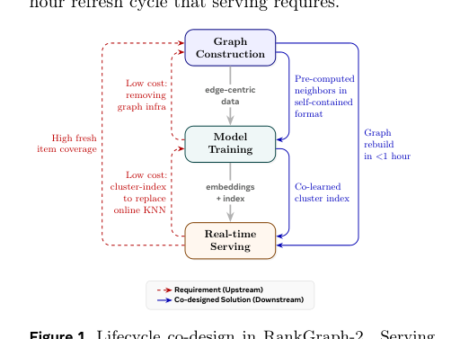
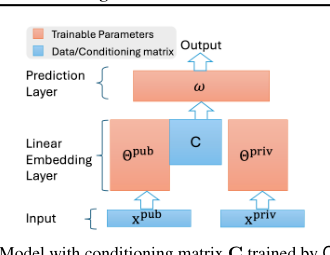

# 2026-06-18 论文日报

## 一、今日趋势与创新观察

### 1. 趋势概况

- 今天一共抓到 305 篇论文，趋势概况优先基于全量抓取结果而不是只看最后保留的候选。
- 从全量论文看，主题最集中的方向是：LLM 与语言理解、表示学习与检索排序、Agent 与多智能体。
- 进入候选池的工作里，直接广告 2 篇、强迁移 23 篇、大公司线索 1 篇，说明今天既有直接商业化问题，也有可迁移的方法论输入。

### 2. 推荐系统 / 排序相关创新点

- 《Contextualizing Biological Language Models across Modalities via Logit-Space Contrastive Alignment》：亮点信号：dit, alignment, embedding, context；主题：LLM 与语言理解、表示学习与检索排序；候选属性：强迁移论文
- 《A Human-in-the-Loop Bayesian Optimization Framework for Constraint-Aware Bioprocess Development》：亮点信号：dit, projection, constraint, robust；主题：表示学习与检索排序；候选属性：强迁移论文

### 3. 全局创新点

- 《A Technical Taxonomy of LLM Agent Communication Protocols》：亮点信号：tool, dit, robust, context；主题：LLM 与语言理解、Agent 与多智能体；公司线索：Meta；候选属性：大公司优先论文
- 《RouteJudge: An Open Platform for Reproducible and Preference-Aware LLM Routing》：亮点信号：tool, dit, constraint；主题：LLM 与语言理解、表示学习与检索排序；公司线索：Meta；候选属性：大公司优先论文

## 二、今日入选论文

### 1. RankGraph-2: Lifecycle Co-Design for Billion-Node Graph Learning in Recommendation
- 挑选理由：命中广告核心词：ctr, cvr。

### 2. Private Learning with Public Feature Conditioning
- 挑选理由：命中广告核心词：advertising。

## 三、补充关注

1. **SHIFT: Semantic Harmonization via Index-side Feature Transformation for Multilingual Information Retrieval**
   - 理由：有一定相关信号，但不足以进入正式候选：retrieval。
2. **Essential Subspace Merging for Multi-Task Learning**
   - 理由：有一定相关信号，但不足以进入正式候选：multi-task。
3. **Where Did the Variability Go? From Vibe Coding to Product Lines by Regeneration**
   - 理由：有一定相关信号，但不足以进入正式候选：matching。
4. **Bayesian Anytime Pareto Set Identification for Multi-Objective Multi-Armed Bandits**
   - 理由：有一定相关信号，但不足以进入正式候选：multi-objective。
5. **APT: Atomic Physical Transitions for Causal Video-Language Understanding**
   - 理由：有一定相关信号，但不足以进入正式候选：recall。
6. **What Does the Weight Norm Control in Grokking? Logit-Scale Mediation under Cross-Entropy**
   - 理由：有一定相关信号，但不足以进入正式候选：matching。
7. **Deep Learning-Driven Inverse Design of Doherty Power Amplifiers Using Pixelated Combiners and Dual-State Impedance Synthesis**
   - 理由：有一定相关信号，但不足以进入正式候选：matching。
8. **PACT: Preserving Anchored Cores in Task-vectors for Model Merging**
   - 理由：有一定相关信号，但不足以进入正式候选：multi-task。
9. **Signature filtering: a lightweight enhancement for statistical watermark detection in large language models**
   - 理由：有一定相关信号，但不足以进入正式候选：matching。
10. **ThousandWorlds: A benchmark for climate emulation of potentially habitable exoplanets**
   - 理由：有一定相关信号，但不足以进入正式候选：ranking。

## 四、重点论文精读

### 1. RankGraph-2: Lifecycle Co-Design for Billion-Node Graph Learning in Recommendation
- **为什么值得看：** 命中广告核心词：ctr, cvr。
- **背景：** RankGraph-2: Lifecycle Co-Design for Billion-Node Graph Learning in Recommendation 值得关注，但当前只能给保守判断。LLM 分析失败: An error occurred (ValidationException) when calling the InvokeModel operation: Access to Anthropic models is not allowed from unsupported countries, regions, or territories. Please refer to https://www.anthropic.com/supported-countries for more information on the countries and regions Anthropic currently supports.

*图示：这是 Figure 1 的完整方法总览图，直接展示了 RankGraph-2 的核心 lifecycle co-design：Graph Construction、Model Training、Real-time Serving 三阶段及其双向约束/解决关系，最能代表论文主方法。相比整页截图或正文很多的候选，这张裁剪更聚焦、噪声更少、模块关系清楚，适合做日报主图。*

- **当前状态：** llm_failed（LLM 分析失败: An error occurred (ValidationException) when calling the InvokeModel operation: Access to Anthropic models is not allowed from unsupported countries, regions, or territories. Please refer to https://www.anthropic.com/supported-countries for more information on the countries and regions Anthropic currently supports.）
- **核心技术点：** 本次精读未成功，暂不展示结构化核心点，避免误导。
- **对广告的启发：** 暂时只保留候选判断，建议稍后重试精读。

### 2. Private Learning with Public Feature Conditioning
- **为什么值得看：** 命中广告核心词：advertising。
- **背景：** Private Learning with Public Feature Conditioning 值得关注，但当前只能给保守判断。LLM 分析失败: An error occurred (ValidationException) when calling the InvokeModel operation: Access to Anthropic models is not allowed from unsupported countries, regions, or territories. Please refer to https://www.anthropic.com/supported-countries for more information on the countries and regions Anthropic currently supports.

*图示：该图最直接体现论文核心方法 Cond-DP：在基础模型中显式加入 conditioning matrix C，清楚展示了 public/private feature、线性嵌入层与输出之间的模块关系，且图本体完整、正文噪声少。相比 Figure 1 的基础架构图，Figure 3 更能代表论文的方法创新点而不只是通用模型结构。*

- **当前状态：** llm_failed（LLM 分析失败: An error occurred (ValidationException) when calling the InvokeModel operation: Access to Anthropic models is not allowed from unsupported countries, regions, or territories. Please refer to https://www.anthropic.com/supported-countries for more information on the countries and regions Anthropic currently supports.）
- **核心技术点：** 本次精读未成功，暂不展示结构化核心点，避免误导。
- **对广告的启发：** 暂时只保留候选判断，建议稍后重试精读。

## 五、候选但未完成深读的论文

- **RankGraph-2: Lifecycle Co-Design for Billion-Node Graph Learning in Recommendation**
  - 状态：llm_failed
  - 原因：LLM 分析失败: An error occurred (ValidationException) when calling the InvokeModel operation: Access to Anthropic models is not allowed from unsupported countries, regions, or territories. Please refer to https://www.anthropic.com/supported-countries for more information on the countries and regions Anthropic currently supports.
- **Private Learning with Public Feature Conditioning**
  - 状态：llm_failed
  - 原因：LLM 分析失败: An error occurred (ValidationException) when calling the InvokeModel operation: Access to Anthropic models is not allowed from unsupported countries, regions, or territories. Please refer to https://www.anthropic.com/supported-countries for more information on the countries and regions Anthropic currently supports.
