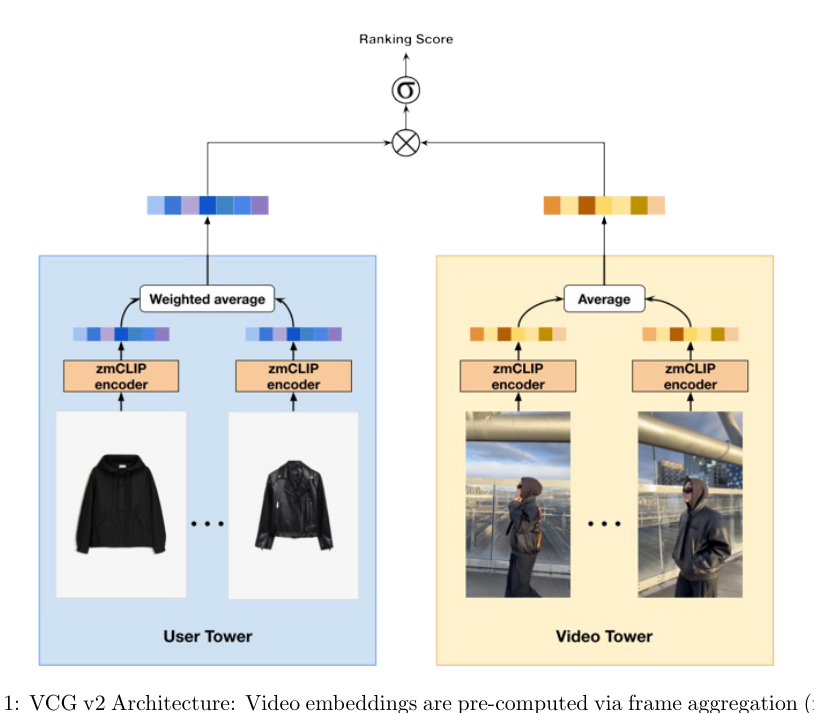
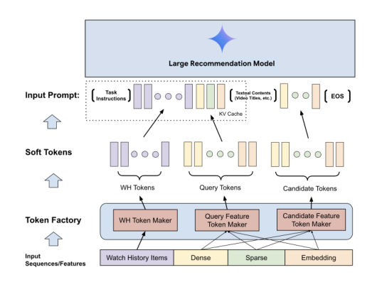

# 2026-06-19 论文日报

## 一、今日趋势与创新观察

### 1. 趋势概况

- 今日全量抓取366篇，cs.AI以212篇继续主导，LLM与语言理解134篇仍是绝对中心，但Agent与多智能体方向以81篇明显抬升，关注点从纯推理对齐转向工具使用、运行时治理与长周期跨域泛化。
- 表示学习与检索排序102篇延续过去一周的工程化趋势，重心落在多模态检索、冷启动视频feed、生成式推荐tokenization等链路细节，而非新算法范式。
- 迁移学习与跨域泛化59篇、商业化决策与资源优化19篇，显示出'通过RL或上下文选择跨任务复用能力'的共同诉求；广告直接信号仅4篇，绝大多数业务相关工作通过推荐/检索迁移渗透。
- 公司线索18篇（Meta、Google、快手等），多集中在生成式推荐、agent治理与RL训练，工业界仍主要在LRM与agent两条线上发力。

### 2. 推荐系统 / 排序相关创新点

- Google的Token Factory提出将传统数值/类别等异构信号编码为soft token直接接入大型推荐模型，避免传统'文本化'信号带来的序列膨胀和效率损失，是LRM工程化的关键一步。
- VCG面向电商沉浸式视频feed的极端冷启动场景，构建多模态检索框架并联合处理位置偏差与时长偏差，已A/B上线，将多模态embedding直接落到流量分发候选生成。
- 快手的Denoising Implicit Feedback指出冷item比热item更易受隐式反馈噪声影响，提出针对冷启动的去噪范式，把噪声建模与冷启动这两条以往独立的线合并到同一框架。

### 3. 全局创新点

- MetaResearcher在对抗式虚拟环境中以自反思RL训练深度研究agent，突破静态模拟环境与纯结果奖励的瓶颈，是把RL环境设计而非奖励函数作为核心创新的代表性工作。
- Deontic Policies for Runtime Governance提出用义务逻辑（deontic logic）形式化描述agent在工具调用、跨组织协作中的权限与合规约束，是把传统形式化方法重新嫁接到agentic AI治理上的新视角。
- PACMS把LLM agent的上下文选择问题形式化为子模优化，并做成可插拔引擎，统一处理对话历史、记忆、工具输出三类来源膨胀的上下文压缩问题。

### 4. 跨论文综合观察

- Token Factory、VCG、快手去噪冷启动三篇从不同层面在解同一个问题——如何把异构/稀疏/噪声信号高效塞进工业级推荐链路：Token Factory解'信号接入效率'、VCG解'冷启动多模态候选'、去噪方法解'隐式反馈质量'，共同勾勒出LRM时代推荐系统的三条工程化主线。
- MetaResearcher、Connect the Dots、Deontic Policies、PACMS四篇集中在agent这一层，方法论上呈现共性：都在用'外部约束（环境/策略/上下文/权限）'而非更大模型来提升agent能力，反映出研究界对'纯scaling agent'的不再迷信。
- Token Factory与PACMS存在有趣的张力——前者主张把更多信号塞进模型上下文/token空间，后者则强调用子模优化主动压缩上下文，提示'上下文该膨胀还是该收缩'本身就是当下尚未收敛的设计争议。

## 二、今日入选论文

### 1. VCG: A Multimodal Retrieval Framework for E-Commerce Video Feeds under Extreme Cold-Start Conditions
- 挑选理由：电商视频feed候选生成，处理冷启动与位置/时长偏差，A/B上线，直接属于商业化流量分发链路

### 2. Token Factory: Efficiently Integrating Diverse Signals into Large Recommendation Models
- 挑选理由：Google作者，工业级大型推荐模型中将异构信号转为soft token，直接服务排序场景，对广告大模型有高同构性

## 三、补充关注

1. **Generative Engine Optimization at Scale: Measuring Brand Visibility Across AI Search Engines**
   - 理由：测量AI搜索引擎中品牌曝光，类似SEO/营销视角，与广告生态有一定关联但非核心决策链路

## 四、重点论文精读

### 1. VCG: A Multimodal Retrieval Framework for E-Commerce Video Feeds under Extreme Cold-Start Conditions
- **为什么值得看：** 电商视频feed候选生成，处理冷启动与位置/时长偏差，A/B上线，直接属于商业…
- **背景：** VCG: A Multimodal Retrieval Framework for E-Commerce Video Feeds under Extreme Cold-Start Conditions 值得关注，但当前只能给保守判断。LLM 分析失败: Failed to connect to proxy URL: "http://127.0.0.1:7897"

*图示：这是 Figure 1 的主架构图，直接展示了 VCG 的核心双塔结构：左侧用户塔基于交互历史动态生成 user embedding，右侧视频塔基于帧聚合预计算 video embedding，并通过相似度/打分得到 ranking score，完整体现了论文的方法框架、模块关系和信息流。相比 block 版本，这个裁剪更聚焦图主体、正文噪声更少，适合作为日报主图。*

- **当前状态：** llm_failed（LLM 分析失败: Failed to connect to proxy URL: "http://127.0.0.1:7897"）
- **核心技术点：** 本次精读未成功，暂不展示结构化核心点，避免误导。
- **对广告的启发：** 暂时只保留候选判断，建议稍后重试精读。

### 2. Token Factory: Efficiently Integrating Diverse Signals into Large Recommendation Models
- **为什么值得看：** Google作者，工业级大型推荐模型中将异构信号转为soft token，直接…
- **背景：** Token Factory: Efficiently Integrating Diverse Signals into Large Recommendation Models 值得关注，但当前只能给保守判断。LLM 分析失败: Failed to connect to proxy URL: "http://127.0.0.1:7897"

*图示：这张图是论文的主方法总览图，标题即为“Token Factory Architecture”，直接展示了从输入特征到 Token Factory，再到 soft tokens 与文本 token 一起进入 Large Recommendation Model 的整体结构与信息流，最能代表论文核心贡献。相比 block 版本，这个 embedded 裁剪更干净完整，几乎无正文干扰，主体聚焦在架构本身，适合作为日报主图。*

- **当前状态：** llm_failed（LLM 分析失败: Failed to connect to proxy URL: "http://127.0.0.1:7897"）
- **核心技术点：** 本次精读未成功，暂不展示结构化核心点，避免误导。
- **对广告的启发：** 暂时只保留候选判断，建议稍后重试精读。

## 五、候选但未完成深读的论文

- **VCG: A Multimodal Retrieval Framework for E-Commerce Video Feeds under Extreme Cold-Start Conditions**
  - 状态：llm_failed
  - 原因：LLM 分析失败: Failed to connect to proxy URL: "http://127.0.0.1:7897"
- **Token Factory: Efficiently Integrating Diverse Signals into Large Recommendation Models**
  - 状态：llm_failed
  - 原因：LLM 分析失败: Failed to connect to proxy URL: "http://127.0.0.1:7897"
