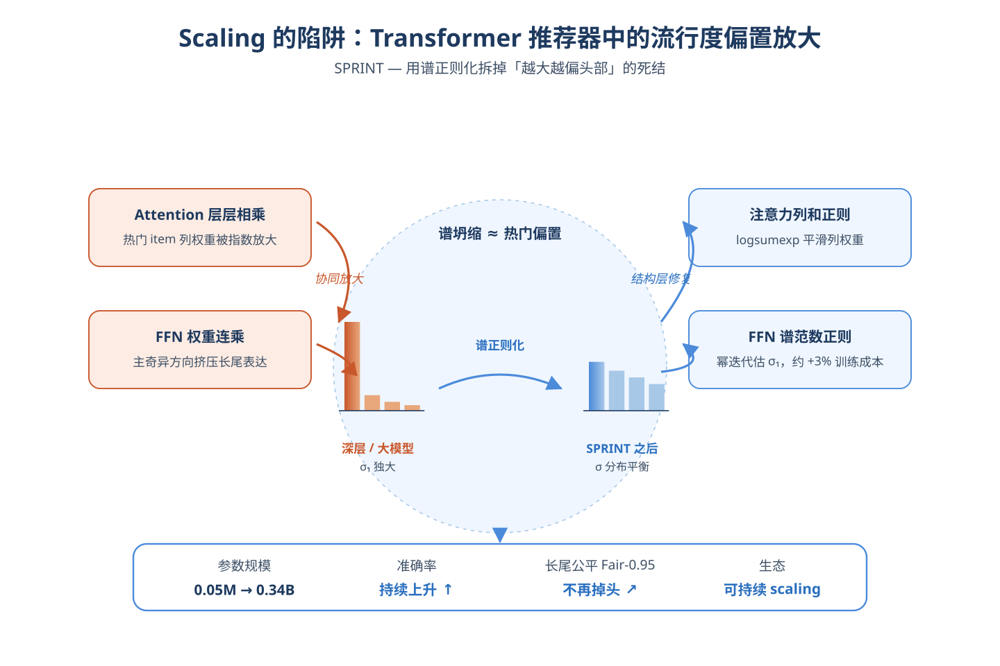
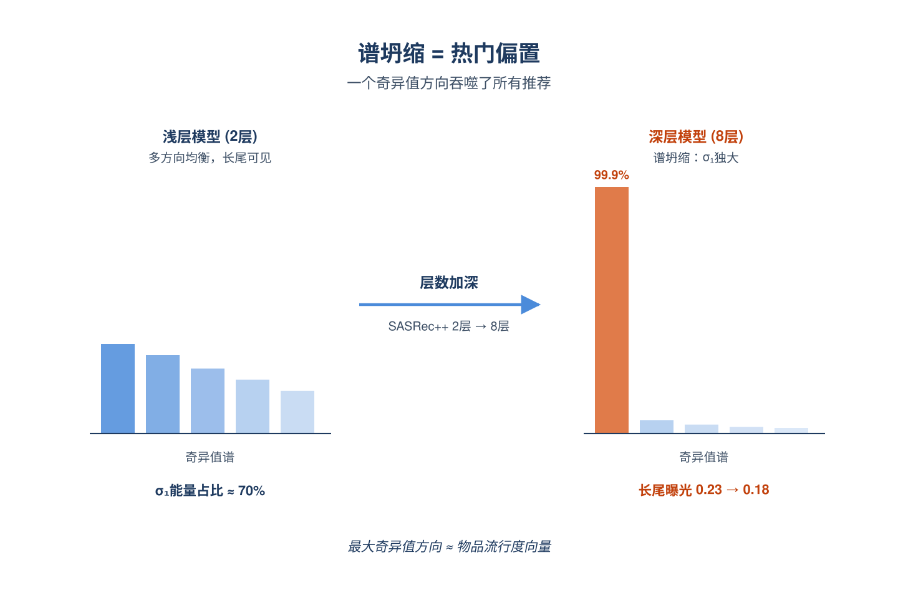
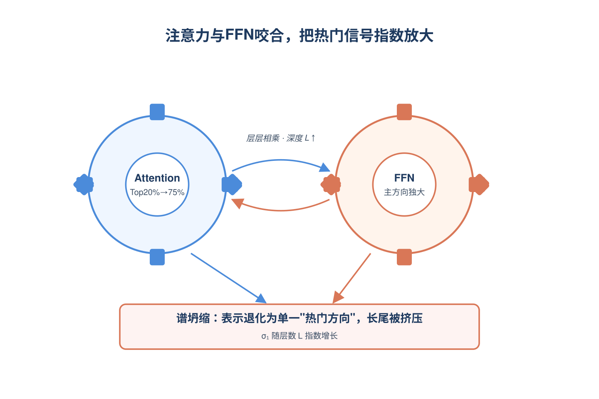
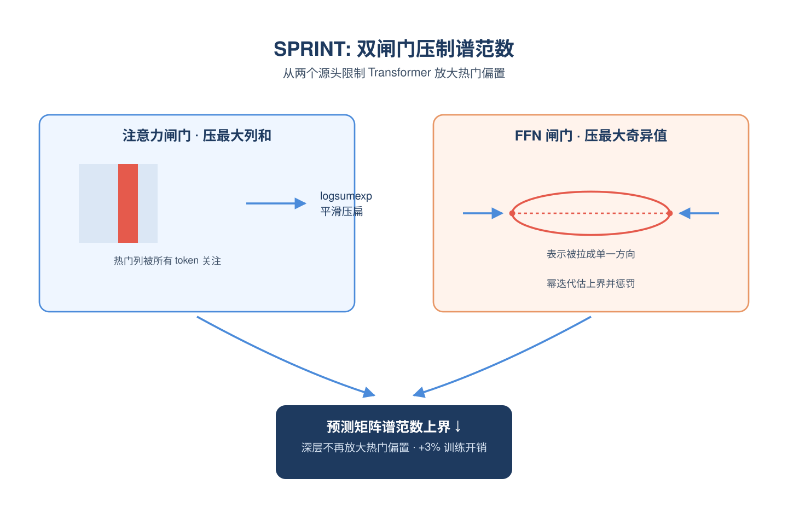
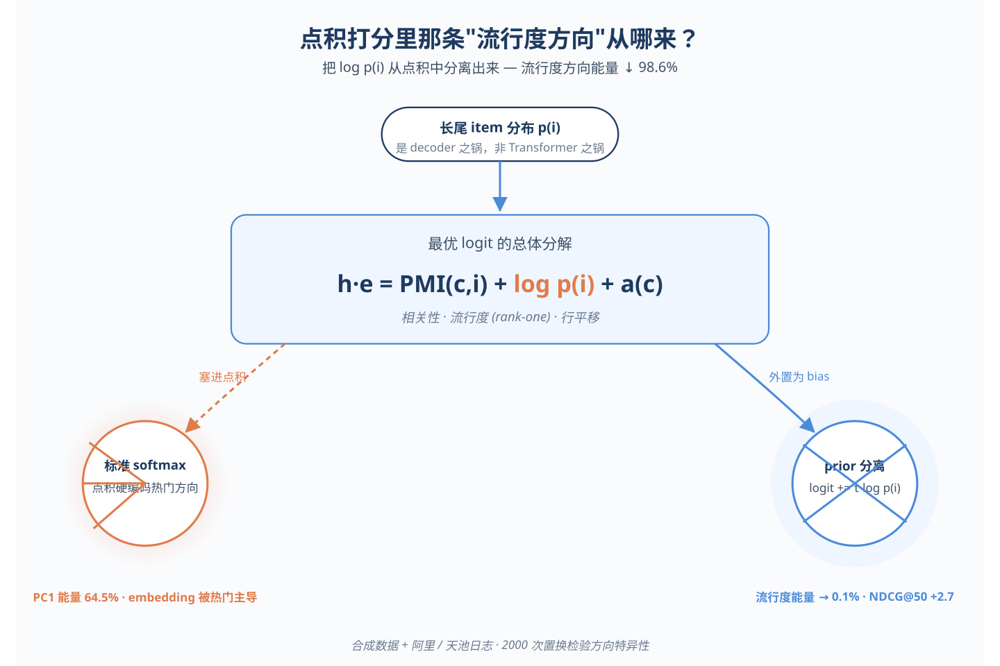
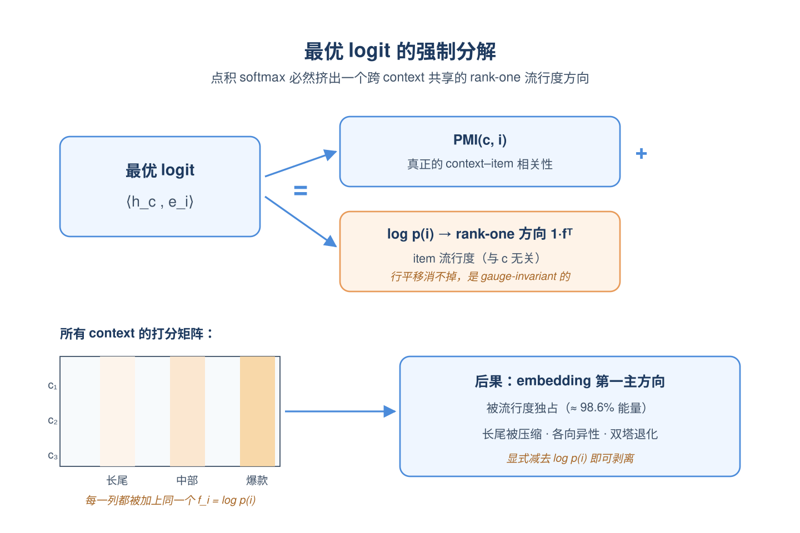
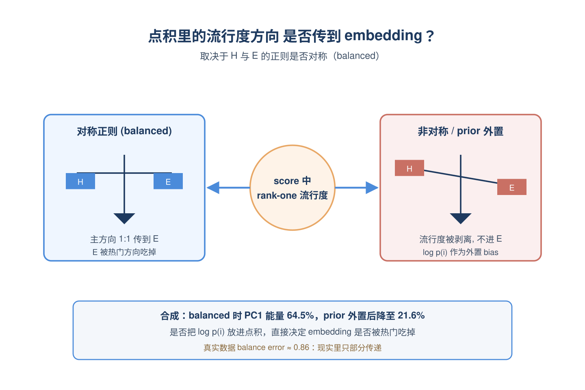
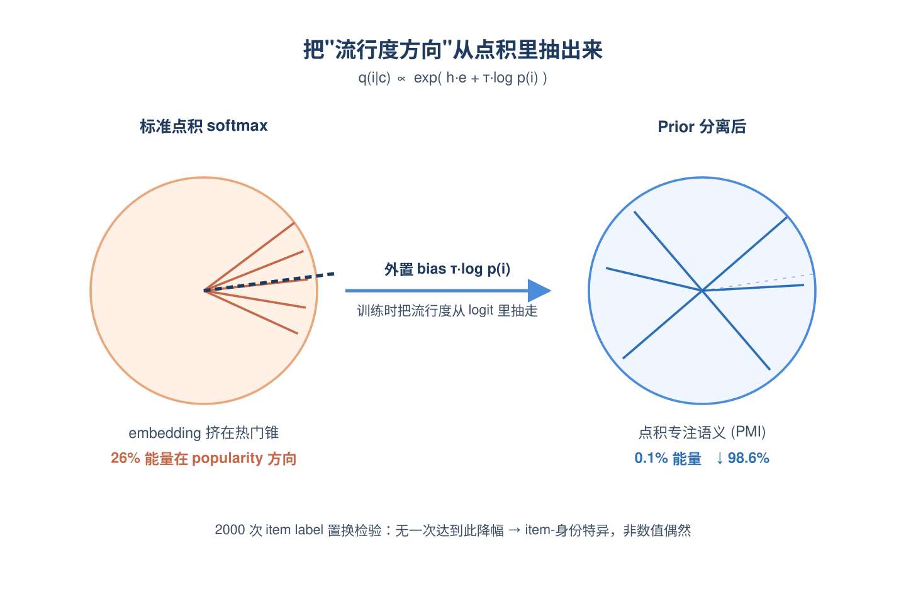

# 2026-06-23 论文日报

## 一、今日趋势与创新观察

### 1. 趋势概况

- 今日cs.IR/cs.AI/cs.LG共抓取910篇，cs.AI以561篇明显主导，LLM与语言理解350篇继续占据中心位置。
- 表示学习与检索排序260篇延续工程化趋势，重心落在长上下文检索、多模态推荐ID压缩、点积打分debias等链路细节。
- Agent与多智能体209篇热度持续，但视角从纯工具调用扩展到风险清单、人机协作协议等治理层面。
- 迁移学习与跨域泛化130篇，普遍围绕分布漂移、样本重加权和元学习展开，与LLM评测、品牌识别等应用场景结合明显。

### 2. 推荐系统 / 排序相关创新点

- 有工作系统性指出Transformer序列推荐在scaling时会放大流行度偏置，并给出在扩参同时缓解长尾被压制的方法，对广告排序scaling路线有直接警示意义。
- 另一篇基于阿里数据从理论上把点积softmax打分分解为PMI加item边际分布的秩一流行度成分，为召回/排序的debias提供了population级别的解释框架。
- URecJPQ把RecJPQ思路扩展到多模态推荐，针对工业级海量ID embedding显著降低内存，对大规模广告/推荐系统ID表征压缩有借鉴价值。

### 3. 全局创新点

- SOHET用层次化异构事件序列Transformer加自监督预训练做Booking反欺诈，事件类型专属tabular编码加时序聚合的结构与广告CTR/转化的用户行为序列建模高度同构。
- 有工作用免训练的图过滤替代GCN式协同过滤，在保留图结构信号的同时几乎消除训练成本和内存压力，为大规模召回提供轻量替代方案。
- AgentRiskBOM提出针对Agent系统的安全物料清单，把工具、记忆、外部服务等纳入风险范畴，反映Agent方向正从能力堆叠转向可治理性。

### 4. 跨论文综合观察

- Transformer推荐scaling放大流行度偏置和点积打分秩一流行度分解两篇可以连起来看：前者是scaling下的现象观测，后者从训练分布层面给出了理论解释，二者共同指向推荐/广告scaling时必须显式处理item-marginal这一项。
- URecJPQ的ID embedding压缩与免训练图过滤协同过滤都在回应同一个工业痛点——大规模推荐的内存/算力瓶颈，但一个从表征量化切入，一个从去训练化切入，体现了'省资源'方向的方法多样化。
- Agent方向今天既有Holmes这种工业级多模态崩溃诊断的能力侧工作，也有AgentRiskBOM、AI-SDLC协议这类治理侧工作，说明Agent研究正在从'能做什么'分化出'怎么安全地做'这一条平行线。

## 二、今日入选论文

### 1. The Pitfall of Scaling Up: Uncovering and Mitigating Popularity Bias Amplification in Scaling Transformer-based Recommenders
- 挑选理由：Transformer序列推荐scaling中的流行度偏置放大及缓解方法，对商业化排序scaling有参考价值

### 2. A Rank-One Popularity Component in Dot-Product Recommender Scores:Population Theory and Prior-Separation Evidence
- 挑选理由：分析点积推荐打分中的流行度成分，使用阿里数据，对广告召回/排序的debias有借鉴

## 三、补充关注

1. **URecJPQ: Memory-efficient Multimodal Recommendation Models through RecJPQ in Large-Scale Scenarios**
   - 理由：大规模多模态推荐ID embedding压缩，对工业推荐/广告系统有参考价值但非直接广告
2. **Memory Is No Longer a Bottleneck: Memory-Efficient Graph Filtering for Scalable Collaborative Filtering**
   - 理由：免训练图过滤协同过滤方法，对推荐召回有一定参考，但未直接连到广告/商业化系统
3. **SOHET: Sequence Of Heterogeneous Events Transformer with Self-Supervised Pre-Training**
   - 理由：Booking.com欺诈检测任务上的异构事件序列Transformer，工业用户行为序列建模与广告CTR/转化预测的序列建模有方法同构性，但目标是反欺诈非广告决策
4. **FeLoG: Scalable and Efficient Distributed Graph Embedding with Feedback Loop Mechanism**
   - 理由：大规模分布式图嵌入系统，提到推荐与欺诈检测应用，对工业推荐/广告系统底层有一定参考价值，但非广告核心链路

## 四、重点论文精读

### 1. The Pitfall of Scaling Up: Uncovering and Mitigating Popularity Bias Amplification in Scaling Transformer-based Recommenders
- **为什么值得看：** 揭示Transformer推荐scaling会放大热门偏置，并给出可直接套用的谱正则方案
- **背景：** Transformer序列推荐在加大模型尤其是加深层数时，准确率提升的同时长尾曝光严重下降，热门偏置被放大，反而成为继续scaling的瓶颈。已有去偏方法多面向传统协同过滤，没考虑Transformer结构本身如何放大偏置。论文从谱分析角度指出根因在于'谱坍缩'，并提出一套结构层面的正则方法SPRINT。

*图示：广告排序近年也在走Transformer scaling路线（HSTU等），但放大热门偏置会伤害长尾广告主和生态健康。这篇论文从谱分析角度解释了'为什么越深越偏头部'，并给出轻量级正则方法，对工业级排序模型扩容有直接参考价值。*

**核心技术点：**

#### 技术点 1：谱坍缩=热门偏置
- 快速理解：预测分数矩阵的最大奇异值越大，热门偏置越强，深层Transformer会让它指数增长

*图示：可以把预测打分矩阵拆成若干'方向'的叠加，其中最强的一条方向几乎就是'谁热门谁得分高'。当这条方向的能量远远盖过其他方向时，无论用户历史是什么，模型最后都会被这条热门方向带跑。论文做的是：把'热门偏置'这个抽象问题，量化成了'最大奇异值是不是太大'这一个可观测、可约束的指标。*

- 技术细节：论文借用已有结论：当物品流行度服从幂律时，预测分数矩阵做SVD后，最大奇异值对应的主成分方向几乎和物品流行度向量重合。因此最大奇异值越大、相对其他奇异值越突出（即谱坍缩越严重），模型推荐就越偏热门。实验显示8层时最大奇异值能量占比高达99.9%，长尾曝光同步崩塌。
- 通俗讲解：可以把预测打分矩阵拆成若干'方向'的叠加，其中最强的一条方向几乎就是'谁热门谁得分高'。当这条方向的能量远远盖过其他方向时，无论用户历史是什么，模型最后都会被这条热门方向带跑。论文做的是：把'热门偏置'这个抽象问题，量化成了'最大奇异值是不是太大'这一个可观测、可约束的指标。
- 例子：在ML-1M上把SASRec++从2层加到8层，最大奇异值平方占总能量比从70%涨到99.9%，同时Top-1推荐中长尾(后80%)物品的占比从约0.23掉到0.18，直接对应到'越深越只推热门'。

#### 技术点 2：注意力和FFN共同放大
- 快速理解：注意力天然偏向热门item，叠层后谱范数指数增长；FFN堆叠也让大奇异值长得比小的快

*图示：可以理解为两个机制串在一起放大热门信号：注意力每一层都把更多权重投给热门item，层层相乘后这个偏向被指数放大；FFN虽然不直接看物品，但训练动力学让它的'主方向'比'次方向'学得快得多，等于不断挤压长尾特征的表达空间。两者协同，使得加深层数时，预测矩阵几乎只剩一个'热门方向'。*

- 技术细节：作者把L层Transformer展开成'注意力分数矩阵连乘 × FFN权重矩阵连乘'两部分。一方面，实测注意力分数中Top-20%热门物品就吃掉75%以上权重，且各层主奇异方向高度对齐(余弦\>0.8)，作者证明在此条件下注意力矩阵连乘的谱范数随层数L指数增长。另一方面，引用平衡初始化下的梯度动力学结论：FFN连乘权重的第k个奇异值导数正比于L乘以该奇异值的某个幂，层数越深，最大奇异值相对其他奇异值长得越快，把表示推向极端低秩。
- 通俗讲解：可以理解为两个机制串在一起放大热门信号：注意力每一层都把更多权重投给热门item，层层相乘后这个偏向被指数放大；FFN虽然不直接看物品，但训练动力学让它的'主方向'比'次方向'学得快得多，等于不断挤压长尾特征的表达空间。两者协同，使得加深层数时，预测矩阵几乎只剩一个'热门方向'。
- 例子：论文做了一个验证实验：把若干层的注意力或FFN替换成恒等映射，谱坍缩立刻缓解，长尾曝光提升——说明罪魁祸首确实是这两个组件的堆叠，而不是embedding或loss本身。

#### 技术点 3：SPRINT两路正则
- 快速理解：对注意力做列和约束，对FFN做谱范数约束，从结构上限制谱坍缩

*图示：注意力部分的直觉是：如果某个热门item被所有位置都高分关注，它那一列的总权重就异常大，列和正则会把这种'人人都看它'的情况压下来。FFN部分的直觉是：不让权重矩阵的最大奇异值无限扩张，否则它会把表示压成只剩一个方向。两个正则都按层算、按层加，配合幂迭代和列求和，计算量很小，实测只增加约3%训练时间。*

- 技术细节：SPRINT在原推荐loss上加两项正则。第一项注意力正则：直接算每层注意力矩阵的最大列和(由于注意力是行归一化的，最大列和能给出谱范数的一个紧上界)，再用logsumexp把'取最大'平滑成可导形式，鼓励没有任何item列被全体token过度关注。第二项FFN正则：对每层FFN权重矩阵用幂迭代估出最大奇异值并惩罚之；非线性激活的Lipschitz常数有界，所以这个上界对带ReLU等的真实FFN也成立。两项分别从两个根因下手，共同限制预测矩阵谱范数的上界，作者给出了这一上界的形式化结论作为理论保障。
- 通俗讲解：注意力部分的直觉是：如果某个热门item被所有位置都高分关注，它那一列的总权重就异常大，列和正则会把这种'人人都看它'的情况压下来。FFN部分的直觉是：不让权重矩阵的最大奇异值无限扩张，否则它会把表示压成只剩一个方向。两个正则都按层算、按层加，配合幂迭代和列求和，计算量很小，实测只增加约3%训练时间。
- 例子：训练一个8层SASRec++时，每个forward算完注意力分数后顺便对每层做列求和取最大、用logsumexp平滑；同时对每层FFN权重做一步幂迭代估谱范数，作为正则项加到主loss里。结果是参数量从0.05M扩到0.34B时，准确率仍持续上升，而长尾曝光指标Fair-0.95不再像原始模型那样掉头向下。

- **对广告的启发：** 广告排序scaling Transformer时，可用列和+谱范数正则缓解头部广告主垄断曝光
- **适用边界：** 方法假设热门偏置主要由预测分数矩阵主奇异方向承载且各层注意力主方向高度对齐，这在长尾幂律数据上成立，但在item分布较均衡或强冷启场景下收益会减弱；另外两项正则的强度需要按数据集调节，过强会同时压制有用的强信号。
- **实践建议：** 在你们的Transformer排序模型里加两行：每层注意力分数按列求和取最大(可用logsumexp平滑)做正则，每层FFN权重用一步幂迭代估谱范数做正则，先用小系数试跑，观察长尾广告主曝光占比和最大奇异值能量占比是否同步改善。

### 2. A Rank-One Popularity Component in Dot-Product Recommender Scores:Population Theory and Prior-Separation Evidence
- **为什么值得看：** 用阿里数据证明点积推荐分里藏着一个rank-one流行度成分，对广告召回去偏有直接启发
- **背景：** 在SASRec、BERT4Rec这类用点积softmax做召回的模型里，学到的item embedding常表现出严重各向异性：奇异值集中在头部、大量item向量挤在同一锥形里。以往把这归咎于Transformer结构，但作者指出这其实是点积softmax+长尾item分布的必然结果，而不是encoder的锅。对广告召回排序来说，热门商品方向吃掉embedding容量、长尾被压抑，是日常工程痛点，所以这篇值得看。

*图示：论文从理论上证明：点积softmax推荐打分在最优点必然分解出一个跨上下文共享的rank-one流行度方向，并用阿里/天池真实点击日志验证把log p(i)从点积里分离出来能消掉98.6%的流行度方向能量。这对广告召回/排序里‘embedding被热门item主导’、‘去popularity bias’、‘双塔ANN退化’等问题有非常直接的迁移价值。*

**核心技术点：**

#### 技术点 1：最优logit的PMI+log p(i)分解
- 快速理解：证明任何点积softmax最优解=PMI(c,i)+log p(i)+行偏置，流行度天然占一个方向

*图示：想象模型要同时学两件事：一是这个item和这个context有多相关（PMI），二是这个item本身有多热门（log p(i)）。如果decoder只有一个点积通道，那它就被迫把热门度也塞进h和e的内积里。因为热门度只跟item有关、跟context无关，所以它在打分矩阵里表现为‘所有行都加同一个向量f’，数学上就是秩1。长尾越严重，f的方差越大，这个rank-one方向就越突出，最终在SVD里变成第一主方向。*

- 技术细节：对任何encoder产出的上下文向量h-c和item向量e-i，只要用点积+softmax拟合条件分布策略(i\|c)，在population意义下最优logit必然等于log 策略(i\|c)+a-c，进一步拆成PMI(c,i)+log p(i)+a-c。把所有(c,i)的logit拼成矩阵后，log p(i)这一项就是1·f T的rank-one结构，其中f-i=log p(i)，做行中心化后这一项不会被softmax的行平移自由度消掉，是gauge-invariant的。
- 通俗讲解：想象模型要同时学两件事：一是这个item和这个context有多相关（PMI），二是这个item本身有多热门（log p(i)）。如果decoder只有一个点积通道，那它就被迫把热门度也塞进h和e的内积里。因为热门度只跟item有关、跟context无关，所以它在打分矩阵里表现为‘所有行都加同一个向量f’，数学上就是秩1。长尾越严重，f的方差越大，这个rank-one方向就越突出，最终在SVD里变成第一主方向。
- 例子：假设词表里item A是爆款log p(A)=-1，item Z是长尾log p(Z)=-8。对任意用户c，最优打分z-(c,A)-z-(c,Z)里恒定包含-1-(-8)=7这部分跟用户无关的偏移。模型为了表达这7，就必须让所有e-A大致沿某个方向比e-Z长一截，于是这条方向就在所有item embedding里被共享出来，变成PC1。

#### 技术点 2：Rank-one传到embedding的条件
- 快速理解：只有在balanced最小范数分解下，分数的rank-one才一定变成embedding的rank-one

*图示：也就是说，‘分数有rank-one’不等于‘embedding一定塌成一根线’，中间要看正则和优化把分解推到什么形状。如果用对称weight decay，H和E会被推成对称的平方根分解，分数的主方向就一比一传到embedding。如果不是balanced（比如user塔和item塔正则不一样），则不一定。作者在合成实验里验证了balanced条件下传递误差很小，但在真实Alibaba数据上balance error高达0.86，说明现实里这个传递只是部分成立。*

- 技术细节：HE T=Z的分解不唯一（任何可逆A都能换分解）。作者证明：在对H、E做对称L2正则得到的balanced最小范数分解下，E的奇异值等于打分矩阵奇异值的平方根，因此打分矩阵的第一主能量比直接传到item embedding上。论文还用spectral gap给出充分条件：当√m·\|\|f中心化\|\|₂ \> 2·\|\|中心化PMI矩阵\|\|₂时，rank-one项会主导第一奇异值。
- 通俗讲解：也就是说，‘分数有rank-one’不等于‘embedding一定塌成一根线’，中间要看正则和优化把分解推到什么形状。如果用对称weight decay，H和E会被推成对称的平方根分解，分数的主方向就一比一传到embedding。如果不是balanced（比如user塔和item塔正则不一样），则不一定。作者在合成实验里验证了balanced条件下传递误差很小，但在真实Alibaba数据上balance error高达0.86，说明现实里这个传递只是部分成立。
- 例子：合成实验里α=2时，standard softmax的E首奇异值能量占64.5%，effective rank从8掉到3.87，PC1和log p(i)相关性0.965；而把log p(i)显式作为bias加到logit外面（prior-adjusted），同样拟合同一分布，PC1能量只占21.6%，相关性掉到0.17。这就说明：是不是把prior放进点积里，直接决定了embedding会不会被热门方向吃掉。

#### 技术点 3：Prior分离干预与实测98.6%能量下降
- 快速理解：训练时把log p(i)作为外置bias加进softmax，可消掉98.6%上下文共享的流行度方向能量

*图示：做法非常工程友好：训练时给每个item加一个固定bias=log p(i)，模型就不用再用点积去硬编码热门度了，点积可以专心学PMI（相关性）。推理时再决定要不要把β·log p(i)加回来——加回来就是普通排序，不加就是debiased召回。结果显示：标准模型里26%的中心化打分能量打在popularity方向上，其中73%是context-shared；prior分离后popularity方向能量降到0.1%，shared分量降到0.03%，相对下降96%/98.6%，而2000次置换里没有任何一次能达到这种下降，说明这种下降是item身份特异的，不是数值上的偶然。*

- 技术细节：提出连续prior-adjusted softmax：q-τ(i\|c) ∝ exp(h·e + τ log p(i))，τ=1时把流行度完全从点积里抽出来；推理需要按业务目标决定是否再加回β·log p(i)。在Alibaba/Tianchi日志上做matched intervention：同结构、同优化、同seed，只是一个把log p(i)放进logit外、一个不放。用打分矩阵在popularity方向ℓ=normalize(P-n log p̂)上的投影能量来度量，并设计了context-shared分量（行均值在ℓ上的投影）和direction-specific分量两个指标。用2000次item label置换检验方向特异性。
- 通俗讲解：做法非常工程友好：训练时给每个item加一个固定bias=log p(i)，模型就不用再用点积去硬编码热门度了，点积可以专心学PMI（相关性）。推理时再决定要不要把β·log p(i)加回来——加回来就是普通排序，不加就是debiased召回。结果显示：标准模型里26%的中心化打分能量打在popularity方向上，其中73%是context-shared；prior分离后popularity方向能量降到0.1%，shared分量降到0.03%，相对下降96%/98.6%，而2000次置换里没有任何一次能达到这种下降，说明这种下降是item身份特异的，不是数值上的偶然。
- 例子：对一个热门item‘iPhone充电线’，标准模型的e向量里有一大块沿‘热门方向’的分量，导致它和很多无关上下文的内积都偏高；prior分离后，这块热门偏置被外置bias承担，e-‘充电线’就更专注表达它真正的语义。代价是held-out NLL升高0.049 nats(0.55%)，Recall@50基本持平甚至略升，NDCG@50涨2.7个点，但catalog coverage从98%掉到73%——说明热门度信号确实有用，需要通过β显式控制要补回多少。

- **对广告的启发：** 广告召回/排序可以把log p(i)从双塔点积里抽出来做外置bias，显式控制热门度
- **适用边界：** 理论的传递结论需要balanced最小范数分解，真实双塔/采样softmax/tied embedding下balance条件未必满足；popularity里混合了曝光、可得性、重复浏览，无法identify真实偏好；实验在中等规模子集、repeat-view任务上跑，仅3个seed，未覆盖Transformer序列模型和冷启动新item。
- **实践建议：** 在广告双塔/序列召回里试一下：训练时给item塔logit加一个固定偏置log p(item)（或log p(广告主)），推理时把β·log p(i)作为可调超参，监控‘打分矩阵第一主方向与log p(i)的相关性’以及Recall分头/中/尾分桶，观察是否能在长尾覆盖和Top指标间拿到更好的可控trade-off。
