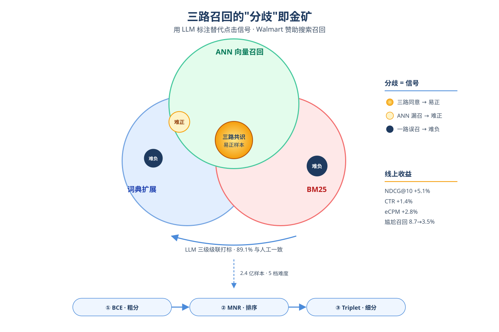
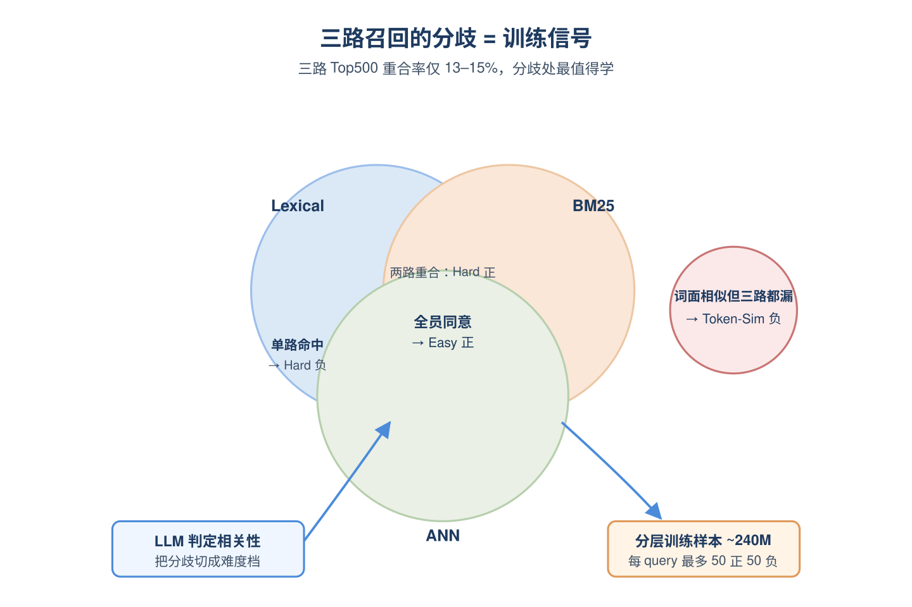
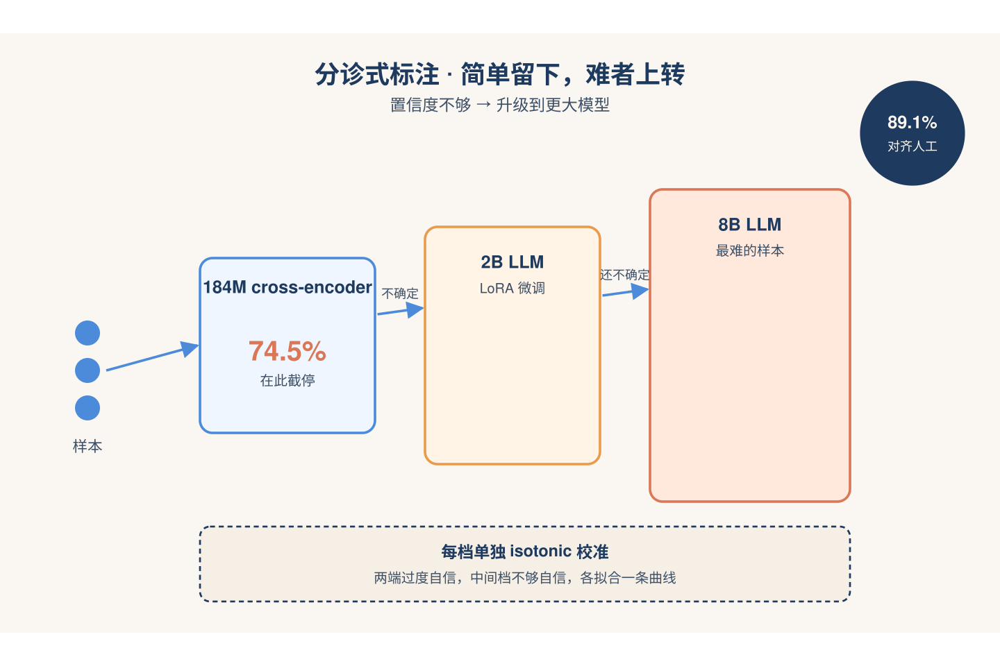
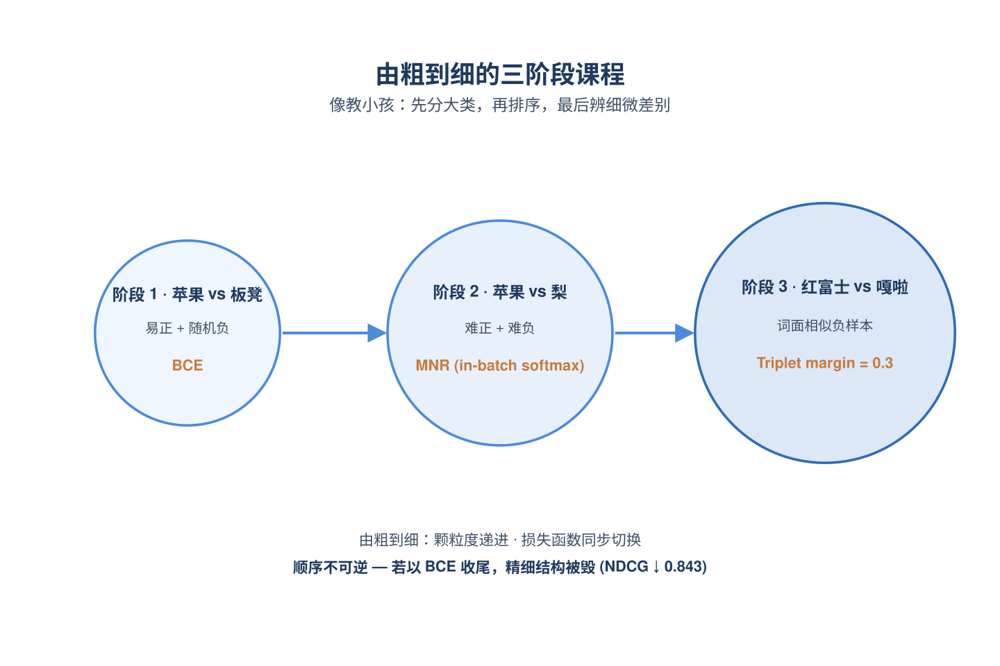
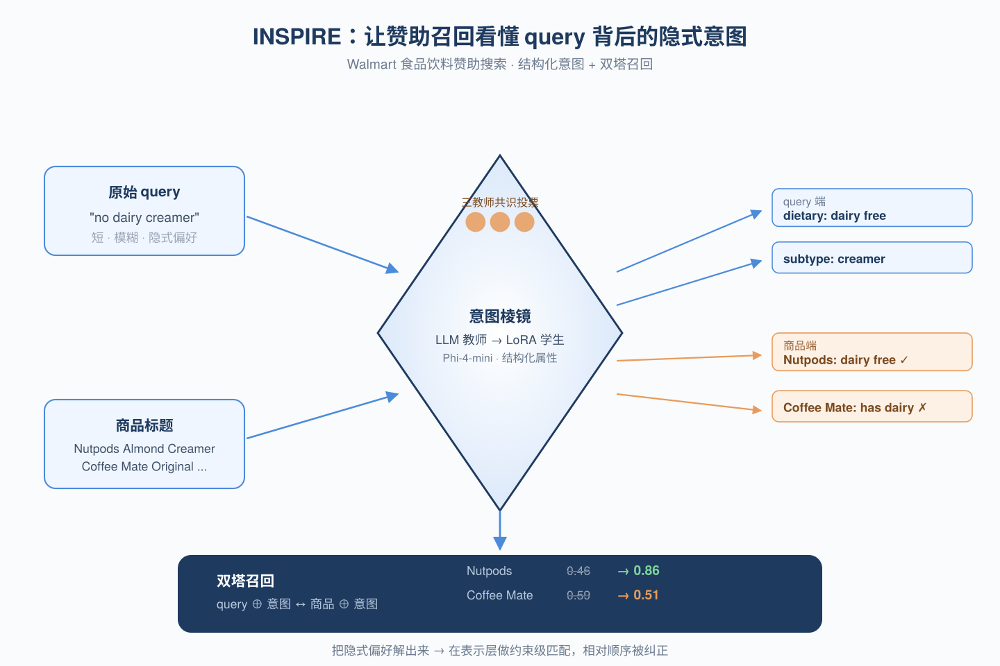
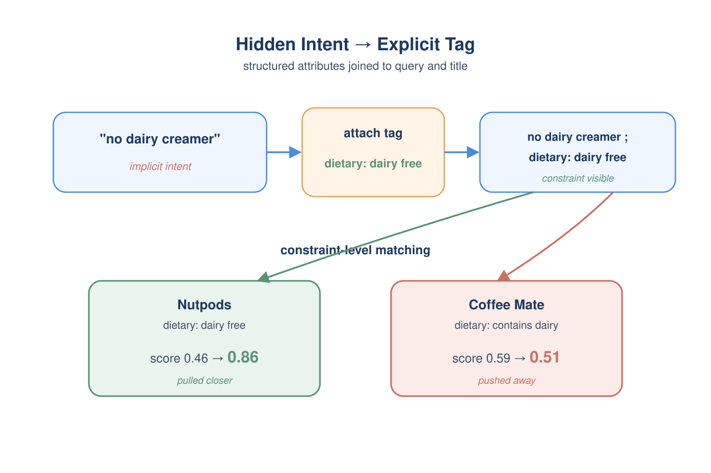
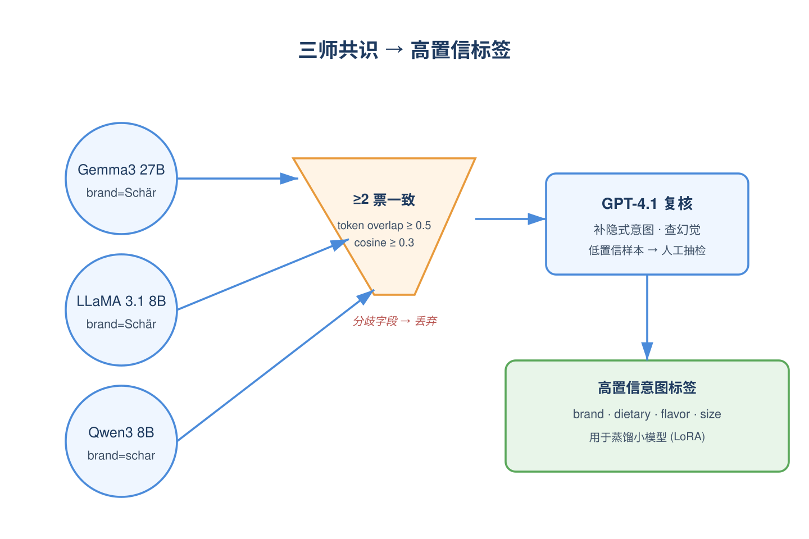
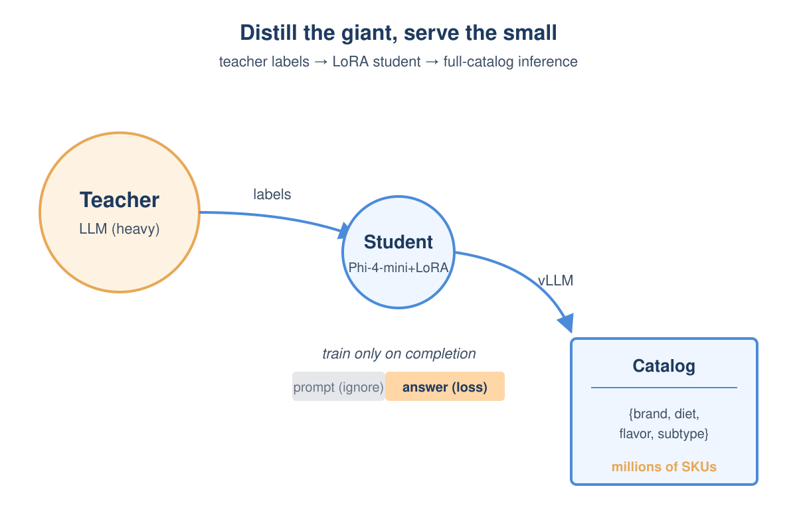
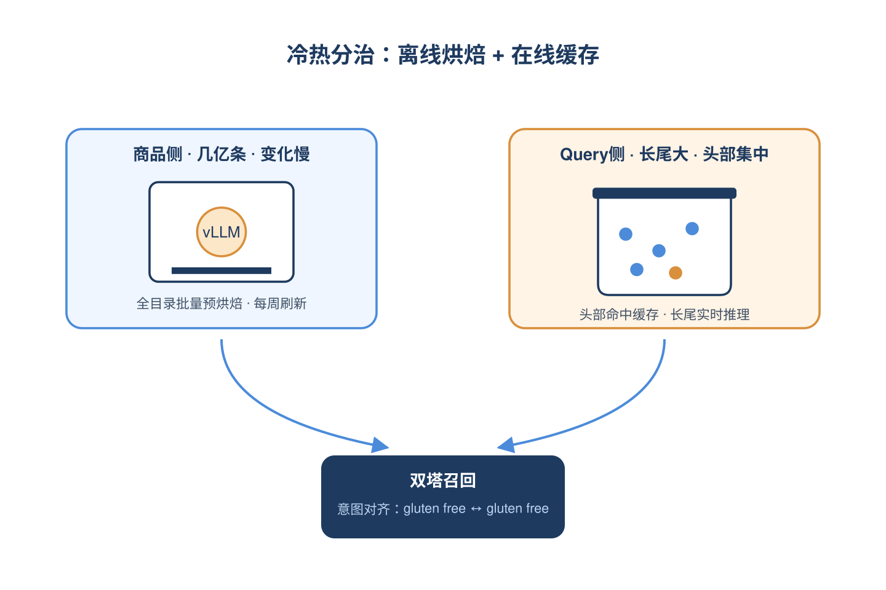
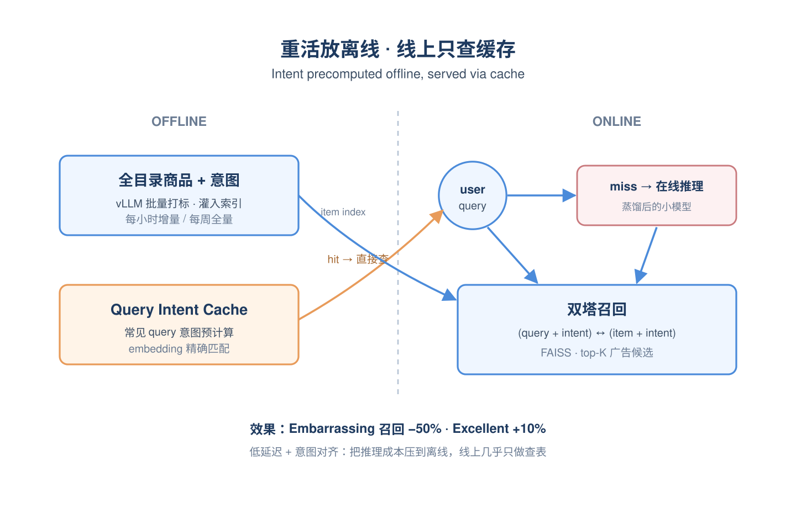

# 2026-06-24 论文日报

## 一、今日趋势与创新观察

### 1. 趋势概况

- 今日全量抓取282篇，cs.AI 196与cs.LG 69延续主导，cs.IR收缩到17篇但工业级电商搜索论文密集出现（Walmart赞助搜索两篇、对话式商品搜索、统一多任务相关性）。
- LLM与语言理解仍是最大主题(113篇)，但研究重心从生成转向长上下文推理基建——KV-cache压缩/量化、RAG先验度量、推理轨迹形式化验证成为高频议题。
- Agent与多智能体回落至51篇，更多聚焦故障归因、记忆系统、隐私重写等工程化方向，而非纯多智能体协议。
- 迁移学习与跨域泛化达42篇且transfer\_signal\_count高达84，LLM作为数据标注器、语义特征抽取器、领域适配桥梁的范式被广泛复用。

### 2. 推荐系统 / 排序相关创新点

- Walmart的Scaling Dense Retrieval用LLM标注+结构化挖掘+渐进课程替代点击信号，解决赞助搜索中位置偏差与长尾查询稀疏问题，并跑通线上A/B广告收益。
- ScaleToT把LLM结构化推理(Tree-of-Thought)蒸馏迁移到十亿级低活用户LTV预测，解决了profile稀疏下LLM推理不稳与算力不可承受的双重瓶颈。
- INSPIRE在Walmart赞助商品召回中显式建模查询意图分布，把意图感知作为召回阶段的一等公民而非排序后处理。

### 3. 全局创新点

- CompressKV用语义检索信号指导KV-cache逐头逐token差异化压缩，跳出了对所有注意力头一视同仁的启发式打分，为长上下文推理给出新的压缩范式。
- Reasoning as Attractor Dynamics把LLM重新解释为高维稠密联想记忆，用Gibbs加权能量最小化刻画数学推理的潜在吸引子，给出了推理可解释性与稳健性的全新视角。
- VeryTrace把自然语言CoT编译为可执行形式化表示并结构化验证+修复，把推理链质量问题从prompt工程层抬到了编译器层。

### 4. 跨论文综合观察

- Walmart的Scaling Dense Retrieval、INSPIRE与统一多任务相关性建模实际上覆盖了电商搜索同一链路的不同层：数据生产→意图感知召回→多任务相关性融合，呈现出工业搜索栈端到端用LLM重写的清晰图景。
- ScaleToT、Reasoning as Attractor Dynamics、VeryTrace虽然分属推荐与通用推理，但共同指向'LLM推理结构化与可迁移化'：前者把推理蒸馏到下游业务，后两者从能量与形式化两个角度试图让推理本身更可控。
- CompressKV、RoPE-Aware量化与SAFARI从不同方向回应了同一痛点——长轨迹/长上下文导致的内存与定位失效，分别给出了语义压缩、位置感知量化、主动调查三条互补路径。

## 二、今日入选论文

### 1. Scaling Dense Retrieval with LLM-Annotated Training Data: Structured Mining and Progressive Curriculum for E-Commerce Sponsored Search
- 挑选理由：Walmart赞助搜索的稠密召回训练数据生产，含线上A/B广告收益指标，直接属于广告召回。

### 2. INSPIRE: Intent-aware Neural Sponsored Product Retrieval for E-commerce
- 挑选理由：Walmart赞助搜索的意图感知召回框架，直接广告业务链路工作。

## 三、补充关注

1. **Breaking the Filter Bubble: A Semantic Pareto-DQN Framework for Multi-Objective Recommendation**
   - 理由：多目标推荐框架(参与度/多样性/公平性)，与广告排序多目标优化有一定同构性，但实验仅在MovieLens小数据上，工业相关性弱
2. **Paying to Know: Micro-Transaction Markets for Verified Product Information in Agentic E-Commerce**
   - 理由：讨论agentic电商下的信息市场与定价机制，触及商业化分发的未来形态，但属于愿景性论文，没有广告/排序/出价的具体建模

## 四、重点论文精读

### 1. Scaling Dense Retrieval with LLM-Annotated Training Data: Structured Mining and Progressive Curriculum for E-Commerce Sponsored Search
- **为什么值得看：** 沃尔玛广告召回用LLM标注+多路挖掘替代点击训练，线上A/B涨2.8%广告花费
- **背景：** 广告召回是赞助搜索漏斗的第一关，直接决定后续排序和收入。但用点击日志做训练有两个老问题：头部位置偏差让模型学的是'排序结果'而不是'真相关性'，长尾query又几乎没点击信号；而要给4M query×几百候选打标，人工一次刷新就要几千万美元，根本支撑不了周级别重训。这篇论文的价值在于给出一套在Walmart真实生产环境跑起来、并通过线上A/B验证有钱赚的替代方案。

*图示：这是Walmart赞助搜索召回层的真实落地工作，直接回答…*

**核心技术点：**

#### 技术点 1：多路检索分歧挖训练样本
- 快速理解：用词典/BM25/ANN三路召回的分歧，自动切出5档难度的正负样本

*图示：直觉是：三个生产中的召回系统已经各自对'什么是相关'有自…*

- 技术细节：对每个query取三路召回的Top500，三路在Top500的两两重合率只有13-15%，这种分歧被当作信号而不是噪声。三路都召回且LLM判为相关的是Easy正样本；只有词典或BM25召回、ANN漏掉且被判相关的是Hard正样本（正是当前模型的失败case）；只被单一通道召回到Top100但被判不相关的是Hard负样本；通过TF-IDF在0.2-0.6之间但三路都没召回到的是Token-Similar负样本；剩下随机采的是Easy负样本。再叠加去重、每query最多50正50负的限制，最终得到约240M训练样本。
- 通俗讲解：直觉是：三个生产中的召回系统已经各自对'什么是相关'有自己的理解，它们一致同意的东西基本不会错，它们打架的地方才最值得学。论文把'谁召回了、排第几、LLM怎么判'这三件事拼成一张表，按规则一档档切：全员同意=容易题，只有词典找到=补课题，单系统犯错=陷阱题，词面像但其实无关=难分辨题。
- 例子：比如query='iPhone charger'：三路都召回的Lightning线被打4分→Easy正；只有词典系统召回的'MagSafe充电器'被打3分但ANN漏了→Hard正，正好用来纠ANN；只被BM25召到Top50的'手机壳'被打1分→Hard负；目录里词面相似的'iPhone case'三路都没召但被判不相关→Token-Sim负。这样一个query就能产出十几个不同难度的训练对。

#### 技术点 2：三级级联LLM打标+逐类校准
- 快速理解：184M小模型→2B→8B级联打分，每类单独做单调回归校准，省一半算力

*图示：想象一个分诊台：简单case交给实习医生，模棱两可的转给…*

- 技术细节：标注引擎是三个域内微调模型的级联：184M cross-encoder、LoRA微调的2B LLM、LoRA微调的8B LLM，输出0-4五档相关性。每个模型给出预测+置信度，超过阈值就接受、否则下传到更大模型；三个都不确定就用多数投票+最高概率破平。关键技巧是按类做isotonic校准（不是全局校准、不是temperature scaling、不是Platt），因为模型在两端（0和4）容易过度自信、在中间档（1-3）容易不自信。最终cross-encoder处理了74.5%的样本，整体与人工标注的agreement达89.1%，比直接全跑8B省约一半算力。
- 通俗讲解：想象一个分诊台：简单case交给实习医生，模棱两可的转给主治，最难的才给主任，但每个医生都先用历史数据校准过自己'说几分把握时其实有几分把握'。论文发现不同档位的'把握-真实正确率'曲线形状差很多，所以每档单独拟合一条校准曲线，比全局一条曲线靠谱得多。
- 例子：比如(query='红色连衣裙', item='红色长裙')经过cross-encoder，输出class=4置信0.95，校准后仍在阈值之上，直接接受为Excellent；而(query='红色连衣裙', item='红色裤装')可能cross-encoder给class=2置信0.55，校准后置信掉到0.4不达标，转交2B LLM；2B还是不确定再转8B LLM，最终8B判为class=1并接受。这样大部分样本被便宜的模型处理掉，难的才花大模型的钱。

#### 技术点 3：三阶段课程：BCE→MNR→Triplet
- 快速理解：先用BCE学粗粒度相关，再用MNR对抗硬负，最后用Triplet抠词面相似难题

*图示：思路就是给模型上小学→中学→大学。小学先学'相关 vs …*

- 技术细节：240M样本不是一次塞进去，而是分三阶段、每阶段配不同损失。S1只用最高分Easy正（rating=4）+随机负，用二分类交叉熵BCE+可学温度（初始20）学基础相关性判别，故意排除rating=3避免早期模糊。S2加载S1 checkpoint，用Hard正+Hard负，换成Multiple Negatives Ranking损失（in-batch对比，让正样本cos相似度高于一个batch内所有负），靠大batch缓解假负问题。S3再加载，用Token-Similar负，换成margin=0.3的Triplet损失，直接在embedding空间硬拉开'词面像但语义无关'的pair。消融显示三阶段比单阶段直接+9.5% NDCG，而且顺序很关键——以BCE收尾会把ranking loss学到的细粒度结构毁掉。
- 通俗讲解：思路就是给模型上小学→中学→大学。小学先学'相关 vs 完全不相关'这种黑白题，用最简单的二分类loss；中学开始做排序题，让正样本得分要高于一整批负样本；大学专门做词面接近但意思不同的辨析题，用带margin的triplet强行把它们在向量空间拉开。每升一级都继承上一级的权重，loss跟着难度切换。
- 例子：S1阶段模型学会'iPhone charger'和'Lightning线'近、和随机采的'狗粮'远；S2阶段塞进'iPhone charger'-'手机壳'这种被BM25误召的硬负，模型被迫学到'充电'这个语义而不只是'iPhone'品牌词；S3阶段再喂'iPhone charger'-'iPhone case'这种词面高度重叠的对，triplet强制把case在embedding里推到至少0.3 margin之外。最终离线NDCG@10从0.878涨到0.923，尾部query涨6.8%最多。

- **对广告的启发：** 广告召回完全可以用'多路分歧+LLM级联标注+课程训练'替代点击监督
- **适用边界：** 方法依赖多路异构召回共存来产生'结构化分歧'，单通道场景需要自造差异；中间档（1-3分）标签噪声较大，且ANN本身参与挖样本形成弱反馈环，需要监控漂移。
- **实践建议：** 可以先在自家广告召回上做一件小事：拉出现有2-3路召回Top-K，统计两两重合率和分歧区，用一个微调过的中小模型对分歧区样本做5档打标，看能否直接产出一批Hard正/Hard负，再决定是否上完整课程训练。

### 2. INSPIRE: Intent-aware Neural Sponsored Product Retrieval for E-commerce
- **为什么值得看：** Walmart赞助搜索：用LLM蒸馏结构化意图增强双塔召回，离线指标全面提升
- **背景：** Walmart在美国电商杂货市场份额最大，食品饮料类查询贡献了大量赞助搜索收入，但用户query通常很短而且大量隐含约束，比如'schar白面包'其实暗含无麸质需求、'paella米'要求专门的Bomba米而不是Arborio米。传统稠密召回只能抓字面/语义相似，常召回看起来像但违反饮食约束的商品，既伤用户也让广告主错失高意图流量。赞助搜索广告位有限，这种错配代价被进一步放大，所以作者要做一个显式建模意图的召回框架。

*图示：这是Walmart Global Tech团队针对杂货赞…*

**核心技术点：**

#### 技术点 1：结构化意图作为召回特征
- 快速理解：把品牌、口味、饮食偏好等8类属性显式拼到query和商品文本上参与召回

*图示：可以理解成给query和商品都贴一组'标签卡片'，召回时…*

- 技术细节：INSPIRE把意图定义成一组结构化多维属性：品牌、口味、饮食偏好、成分、商品子类、菜系、size value、size unit，既包括query里明说的显式信号，也包括从品牌/成分推断的隐式信号（比如Schär=无麸质、鹰嘴豆=天然无麸质）。这些属性会以key:value文本形式拼到原始query和商品title后面，再喂给双塔编码器，让模型在表示层就能对齐'饮食偏好:无麸质'这种约束。
- 通俗讲解：可以理解成给query和商品都贴一组'标签卡片'，召回时模型不再只看名字像不像，而是能看到双方在'是否无麸质''是不是西班牙菜系'这种维度上是否一致。一次召回时，query'gluten free bread'会被扩成'gluten free bread ; dietary preference: gluten free'，商品Schär面包扩成'... ; dietary preference: gluten free'，而Pepperidge面包扩成'... ; dietary preference: contains gluten'，于是双塔的cosine分数会拉开差距。
- 例子：论文Table 7里'sugar free chocolate'的例子：不加意图时Hershey牛奶巧克力得0.61、Lily's黑巧克力只有0.44，相关商品被压在下面；加上'dietary-preference: contains sugar / sugar free'之后，Hershey降到0.45，Lily's升到0.84，相关商品反超。

#### 技术点 2：Teacher LLM共识打标
- 快速理解：用三个大模型分别打意图标签，靠交叉一致和GPT-4.1复核生成弱监督数据

*图示：核心思路是'多模型投票+大模型复核+人工兜底'来低成本造…*

- 技术细节：意图标签的真值由Gemma3 27B、LLaMA 3.1 8B、Qwen3 8B三个teacher独立产出结构化JSON，然后两两比对：token级重叠阈值0.5、embedding cosine相似度阈值0.3，只要至少两个模型在同一字段上达成一致就保留为高置信标签，分歧字段直接丢弃。之后再用GPT-4.1对(query/item, 共识标签, 冲突标签)做一遍校验，识别幻觉、补缺失的隐式意图，最后对低置信样本做人工抽检；输入端还做了大小写、词形、单位（grams→g）和同义词（unsweetened→sugar free）的归一化。
- 通俗讲解：核心思路是'多模型投票+大模型复核+人工兜底'来低成本造高质量标签。一条样本进来先被三个teacher各打一份属性，然后系统逐字段比对：比如三家都说品牌是Schär就留，口味字段两家说vanilla一家说sweet就只留vanilla，全部不一致就这个字段判空；最后再让GPT-4.1看一眼有没有漏掉'其实也是无麸质'这种隐式属性。
- 例子：对'Skinnygirl Fat-Free Sugar-Free Raspberry Vinaigrette 8 fl oz'，teacher们最终一致输出brand=skinnygirl、dietary preference=sugar free/vegan/fat free、flavor=raspberry、subtype=raspberry vinaigrette、size=8 fl oz，这条就作为蒸馏训练样本。

#### 技术点 3：LoRA蒸馏到小模型上线
- 快速理解：用LoRA SFT把共识标签蒸馏到Phi-4-mini，靠vLLM做全目录批量意图预测

*图示：大teacher贵到不能在线跑全目录，所以把它们的输出当…*

- 技术细节：学生模型选Phi-4-mini-instruct，用LoRA做参数高效微调，训练目标是标准的token级交叉熵，但只在completion部分计算loss，prompt token设ignore-index=-100避免模型学会复读prompt；3个epoch、有效batch size 16（实际bs=1+梯度累积）、学习率4e-4、最大长度4096、单卡H100。评估时把预测属性和真值都过MiniLM编码，cosine\>0.6算命中，item侧整体precision 0.95/recall 0.97，query侧0.91/0.93。上线用vLLM做高吞吐推理服务，目录全量每周刷一次、增量每小时刷。
- 通俗讲解：大teacher贵到不能在线跑全目录，所以把它们的输出当训练数据去教一个小模型，让小模型学会'看一段商品文本，直接吐出结构化属性JSON'。训练时关键是只让小模型为'答案部分'负责，不要它去拟合问题本身；上线后用vLLM批量跑几千万SKU，再把结果灌进商品索引。
- 例子：输入'Silk Vanilla Almond Milk'，学生模型直接输出(brand: silk, dietary preference: （lactose free, vegan）, flavor: vanilla, subtype: almond milk)，这条JSON会作为该SKU的结构化意图存到Item Intent Store里。

#### 技术点 4：意图增强的双塔召回训练
- 快速理解：把相关性打分和归一化用户行为合成一个连续监督分，训练意图增强双塔

*图示：想让召回既'相关'又'用户爱点'，所以监督信号同时融合了…*

- 技术细节：训练样本是约1000万条query-item对(QIP)。每条先由Gemma-1B/2B/LLaMA-3 8B级联relevance模型打0-4分，归一化到（-1,1）作为rel-score；再叠加聚合行为信号（订单、加购、点击、浏览）做对数压缩+按query归一化得到engagement，但只对rel\>=2的样本生效，避免把'相关性差但热门'的商品推上去；最终监督分y = clip(μ·rel-score + λ·engagement, 0, 1)。模型是MiniLM双塔，query和item分别编码后cosine相似，损失=Multiple Negatives Ranking损失 + λ·cosine回归损失，前者拉开正样本和batch内负样本，后者把cosine回归到连续监督分y。
- 通俗讲解：想让召回既'相关'又'用户爱点'，所以监督信号同时融合了relevance模型打分和真实行为，但加了护栏：行为只在已经相关的商品上起作用。训练时MNR负责'正样本要比一批随机负样本分高'，cosine回归负责'分数大小要对得上人工/模型打分'，两者一起避免模型只会排序不会校准。
- 例子：query 'gluten free pasta'+Banza鹰嘴豆面（rel=4，行为也好）的目标分接近1；同query+Barilla普通面（rel=0/1）目标分接近0；意图增强后Banza的cosine从0.37涨到0.88，Barilla从0.56降到0.51，正好对齐这个监督分。

#### 技术点 5：离线指标和线上服务架构
- 快速理解：Top1精度+4.2%、Excellent占比+10%，靠离线全目录打标+在线query意图缓存上线

*图示：工程上把'重的活'全部放到离线：商品意图预生成存进索引…*

- 技术细节：离线评测12000条query（含头部流量、高营收、长尾、历史badcase），FAISS全量索引，每query取top25，由人工+DeBERTa cross-encoder混合打0-4分。结果：avg relevance@25从3.01→3.08，Precision@1 +4.2%，NDCG@10 +2.64%，Excellent(4分)占比+10%，Embarrassing(0分)直接-50%。线上架构是离线vLLM全目录跑item意图灌索引（每小时增量、每周全量），query侧维护Query Intent Cache做embedding精确匹配查找，未命中走在线推理，再把(query+intent, item+intent)送入双塔召回。
- 通俗讲解：工程上把'重的活'全部放到离线：商品意图预生成存进索引，常见query的意图也提前算好缓存住；线上只在缓存miss时才跑小模型推理，再去意图增强的索引里召回，从而兼顾延迟和效果。
- 例子：用户搜'no dairy creamer'，缓存里查到对应意图dietary preference:dairy free，召回阶段Nutpods（已标dairy free）cosine升到0.86，Coffee Mate（标contains dairy）降到0.51，Nutpods被正确召回到广告位上。

- **对广告的启发：** 广告召回可以用'LLM蒸馏出的结构化属性'做query-item硬约束对齐，显著降低badcase
- **适用边界：** 方法依赖一套预定义的结构化属性schema，对开放域、跨品类或新兴需求覆盖有限；teacher LLM的标注偏差会经由蒸馏传递给学生模型；论文目前只有离线评测，线上A/B尚未完成。
- **实践建议：** 可以先在一个有硬约束的广告垂类（如医药合规、食品过敏原、3C参数）试点：用大模型对query和SKU各打一份结构化属性，再把这些key:value文本直接拼到现有双塔输入里重训一版，观察top-K相关性和badcase率变化，再决定是否上LoRA蒸馏小模型做全库落地。
