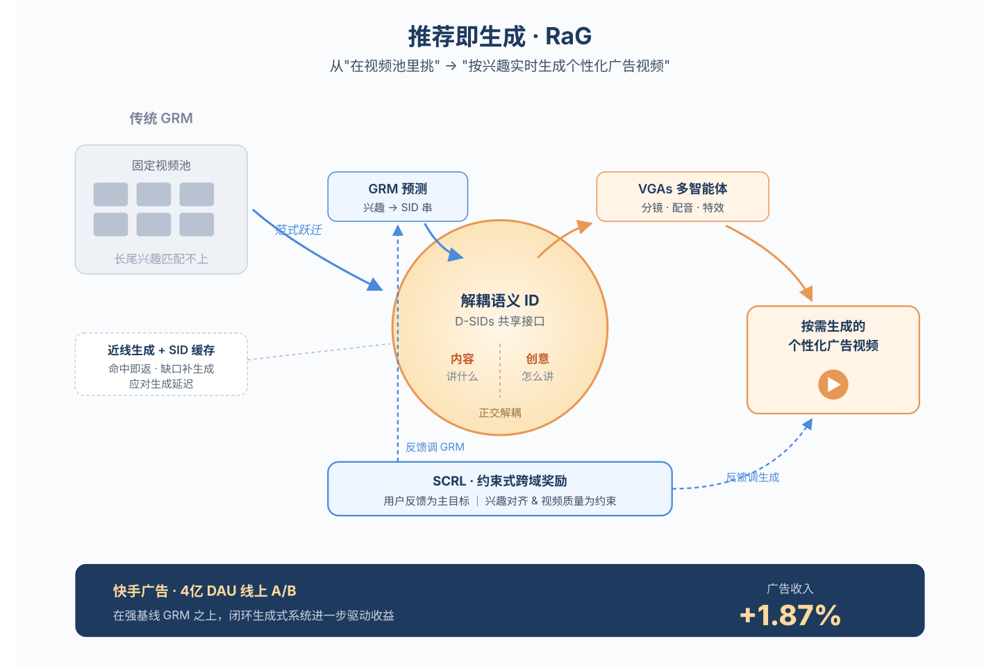
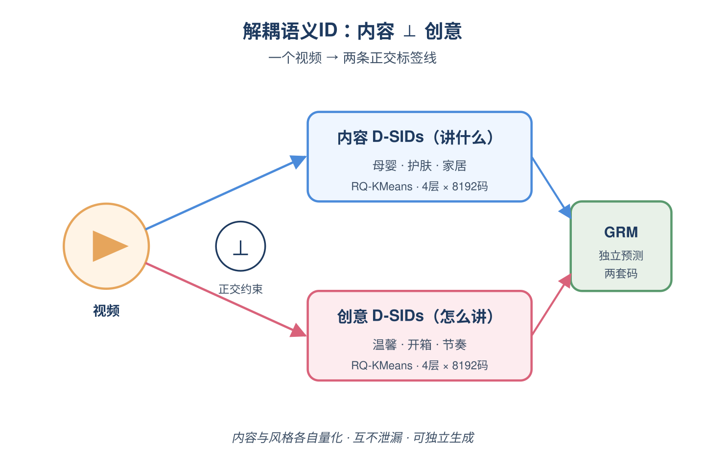
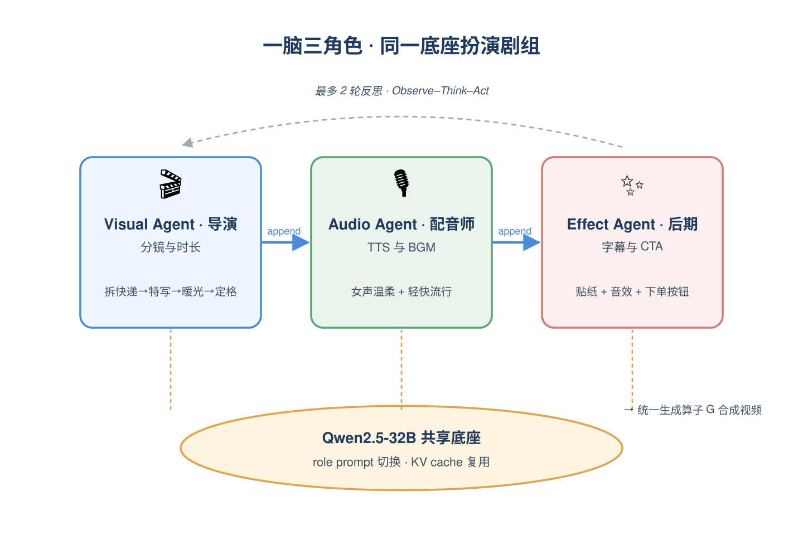
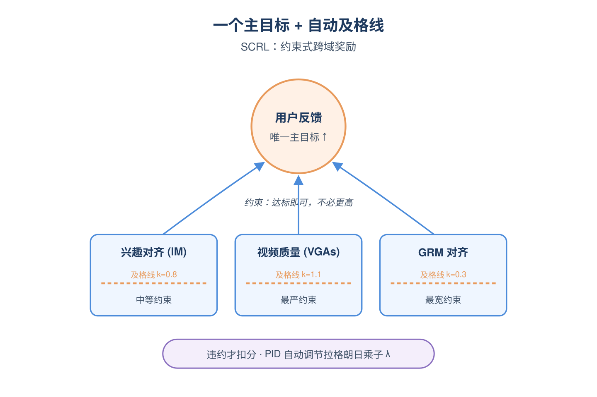
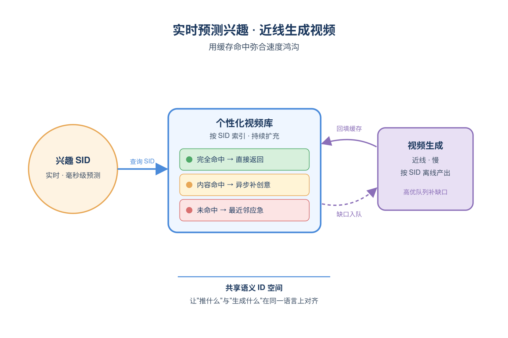
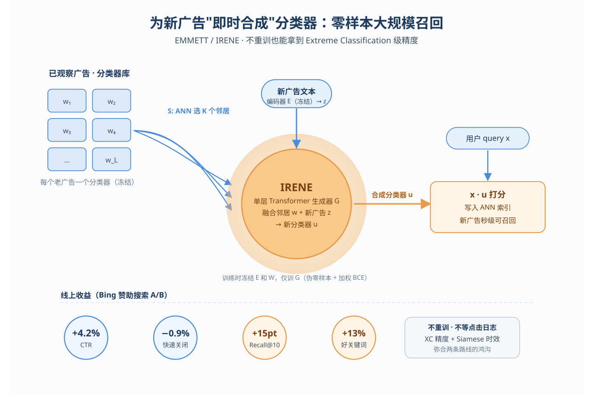
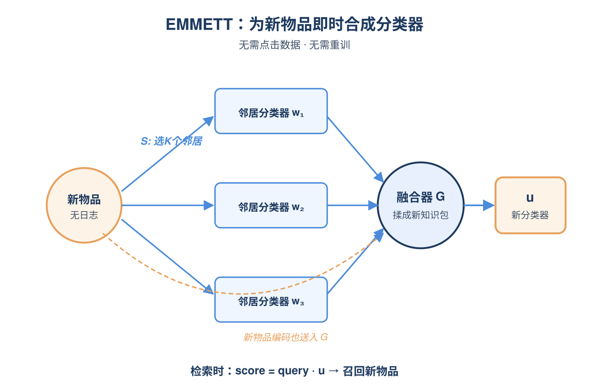
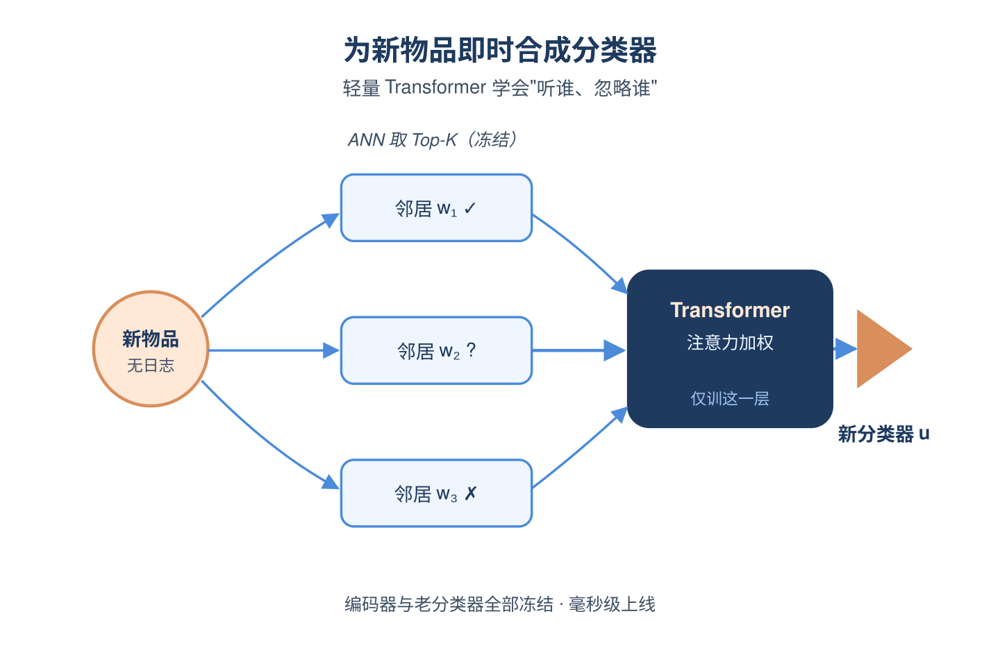
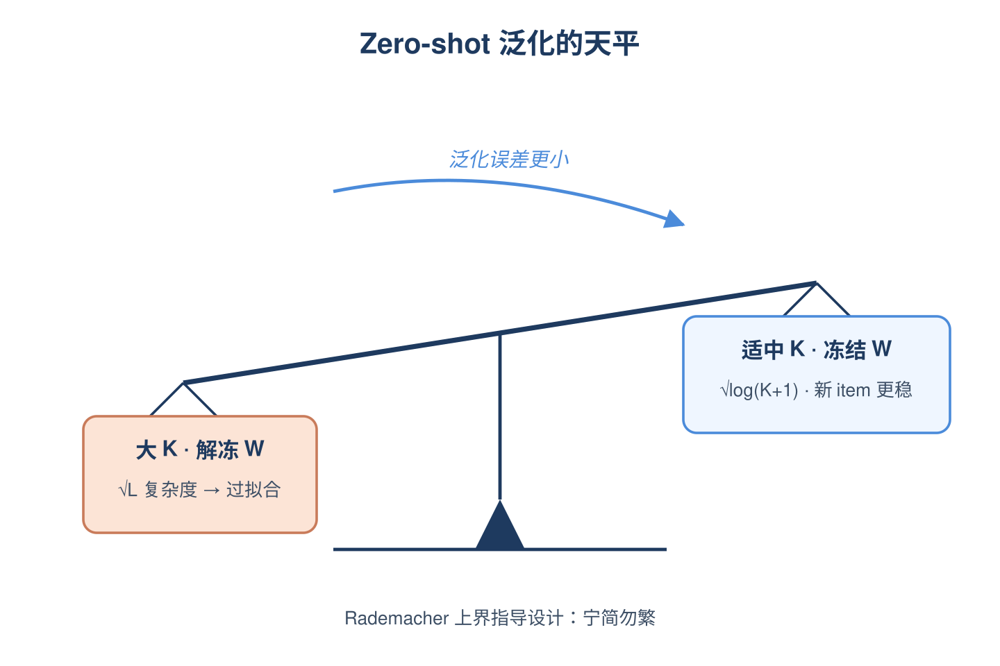
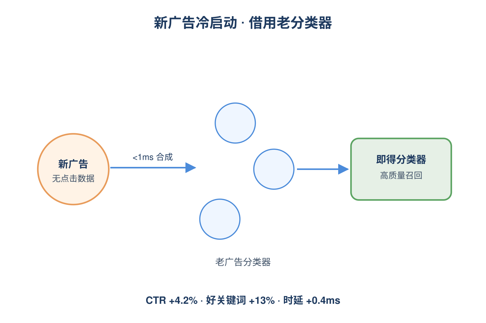

# 2026-06-25 论文日报

## 一、今日趋势与创新观察

### 1. 趋势概况

- 今日cs.IR/cs.AI/cs.LG共抓取300篇，cs.AI以176篇延续主导，LLM与语言理解112篇仍是绝对中心。
- 表示学习与检索排序88篇延续工程化趋势，重心从纯embedding转向生成式推荐、零样本召回、用户token化等链路改造。
- Agent与多智能体55篇继续抬升，关注点从能力评测转向系统级压缩、合规审计、工具调度等结构化议题。
- 迁移学习与跨域泛化49篇活跃，跨域用户表征、表格基础模型分布偏移鲁棒性等成为新增长点。

### 2. 推荐系统 / 排序相关创新点

- 快手 Recommendation-as-Generation 把传统的'用户-物品匹配'重写成'按用户兴趣按需生成个性化视频'的闭环范式，并在广告场景A/B拿到1.87%收入提升，是把生成式模型真正接入推荐分发主链路的工业级尝试。
- Extreme Meta-Classification 把大规模零样本检索从'query-item双塔近邻'改造为'标签到标签'的极端元分类，解决新物品快速涌入下的召回冷启动，并在搜索广告召回上线A/B拿到4.2% CTR。
- YouTube TokenMinds 用预训练用户token+embedding替代单一固定维度的稠密用户向量，让用户表征同时具备离散语义和稠密判别能力，对广告排序的用户塔结构有直接借鉴价值。

### 3. 全局创新点

- Agentic System as Compressor 提出'压缩即智能'的分析视角，把工具调用、检索、验证等agent行为统一用bit数量化，给多智能体系统提供了一个跨任务可比的能力度量框架。
- BitNet Text Embeddings 把低比特量化思路下推到文本嵌入层，目标是在大规模索引下同时压缩推理算力和存储带宽，对任何向量检索系统都是直接的工程红利。
- 京东订单履约场景的 Learning Optimization Proxies 把顺序上下文随机规划用学习代理来近似实时决策，为电商履约、预算分配等需要快速响应的运筹场景提供了可复用的代理建模思路。

### 4. 跨论文综合观察

- RaG、Extreme Meta-Classification、TokenMinds 三篇都在重写推荐/广告链路的基础单元：RaG重写'被推荐对象'（从固定库到按需生成），元分类重写'召回方式'（从近邻到标签映射），TokenMinds重写'用户表示'（从稠密向量到离散token），共同指向'生成式+离散化'的下一代推荐架构。
- TokenMinds 的用户token化与 BitNet Text Embeddings 的低比特嵌入构成互补的两条压缩路径：前者在语义粒度上做离散化以增强表达，后者在比特宽度上做压缩以降低部署成本，二者结合可能是未来工业级表征的主流形态。
- Agentic System as Compressor 提供的'系统智能=压缩bit'度量与 AutoRelAnnotator 的级联模型成本-质量校准在方法论上呼应：都试图把复杂系统的能力/成本折算到可量化的统一标尺上，反映出今天的论文开始关注'系统级效率'而非单模型指标。

## 二、今日入选论文

### 1. Recommendation as Generation: Unifying Personalized Video Generation and Recommendation at Industrial Scale
- 挑选理由：快手工业级生成式推荐系统，在广告场景A/B测试提升1.87%广告收入，直接关联商业化分发。

### 2. Extreme Meta-Classification for Large-Scale Zero-Shot Retrieval
- 挑选理由：在大型搜索引擎广告召回任务做了在线A/B测试，CTR提升4.2%，直接作用于广告召回。

## 三、补充关注

1. **Learning Optimization Proxies for Sequential Contextual Stochastic Programs: An Order Fulfillment Application**
   - 理由：京东订单履约场景的实时决策代理，虽非广告但属于电商运营优化，决策链路上有一定参考意义

## 四、重点论文精读

### 1. Recommendation as Generation: Unifying Personalized Video Generation and Recommendation at Industrial Scale
- **为什么值得看：** 快手把生成式推荐升级为'按需生成个性化视频广告'，A/B提升广告收入1.87%
- **背景：** 传统短视频/广告推荐都是先把视频素材生产好，再用DLRM或GRM从固定池里召回排序，用户兴趣一旦落在池外就匹配不好，长尾、细粒度兴趣尤其吃亏。同时AIGC视频生成质量已经够用，但延迟和成本让它难以直接进推荐系统。这篇论文提出'推荐即生成'(RaG)，把兴趣预测和视频生成用一套语义ID串起来，并在快手广告线上验证收入正向，是目前少见的把生成式视频真正塞进工业广告闭环的工作。

*图示：这是快手在4亿日活广告场景上线的工业级系统，首次把生成式推荐(GRM)和个性化视频生成端到端打通，相对已经很强的GRM基线再涨1.87%广告收入，对广告分发与素材生成两端都有直接借鉴价值。*

**核心技术点：**

#### 技术点 1：解耦语义ID做桥梁
- 快速理解：用一套同时编码'内容'和'创意风格'的离散ID,把推荐和视频生成打通

*图示：可以理解成给每个视频打两套'条形码':一套描述'讲了什么'(比如奶茶、自拍、化妆),一套描述'怎么讲的'(温柔风、快节奏、情绪BGM)。推荐模型不再预测'下一个视频ID',而是预测用户接下来想看的这两套条形码;有了条形码,既能去库里查,也能交给生成模型现做一个视频。正交约束保证两套码不会互相串味,量化压缩率1.02、碰撞率2.62%,比QARM明显更紧凑。*

- 技术细节：对每个视频用多模态大模型(Qwen2.5-VL)在两类提示下分别抽出'内容向量'(实体/话题)和'创意向量'(风格/节奏/氛围),两路向量各自用残差K-means量化成4层、每层8192码的离散ID,合起来叫D-SID。训练时对两路分别做对比学习,并加一个正交约束让两类向量尽量解耦。GRM在用户上下文条件下自回归地预测这串D-SID,既可以当召回key,也可以直接喂给下游生成模块当生成条件。
- 通俗讲解：可以理解成给每个视频打两套'条形码':一套描述'讲了什么'(比如奶茶、自拍、化妆),一套描述'怎么讲的'(温柔风、快节奏、情绪BGM)。推荐模型不再预测'下一个视频ID',而是预测用户接下来想看的这两套条形码;有了条形码,既能去库里查,也能交给生成模型现做一个视频。正交约束保证两套码不会互相串味,量化压缩率1.02、碰撞率2.62%,比QARM明显更紧凑。
- 例子：对一位18岁女性、喜欢自拍/情歌/化妆的用户,GRM自回归输出一段D-SID,内容ID解码出'漂亮女孩+化妆教程',创意ID解码出'情感音乐+高级感氛围',这串ID既可作为召回信号,也直接作为后续指令模型和视频生成Agent的条件输入。

#### 技术点 2：分层多Agent生视频
- 快速理解：用共享底座的三个角色Agent依次做画面、音频、特效,带最多两轮反思

*图示：把'做一条广告视频'拆成导演变成配音师变成后期三个角色,但三个角色其实是同一个大模型,只是换个提示词和能调用的工具集。第一个Agent先排镜头脚本,第二个Agent在它的输出基础上配语音和BGM,第三个Agent再叠字幕、特效、转化按钮。因为状态是只增不减的前缀,KV缓存可以一路复用,显著降延迟;两轮反思上限避免无限打磨。*

- 技术细节：D-SID先经一个Qwen3-8B的指令模型(IM)翻译成镜头级生产脚本(场景、镜头、时长、风格),再交给VGAs:同一个Qwen2.5-32B底座,通过不同role prompt和工具mask扮演视觉规划Agent(VPA)、音频对齐Agent(AAA)、艺术特效Agent(AEEA),按顺序生成各自的指令并调用文生视频/TTS/BGM/字幕等工具,中间状态以append-only方式拼接,可复用KV-cache。最后用最多两轮Observe-Think-Act反思循环修正跨模态一致性,再由统一的合成算子G拼出最终视频。
- 通俗讲解：把'做一条广告视频'拆成导演变成配音师变成后期三个角色,但三个角色其实是同一个大模型,只是换个提示词和能调用的工具集。第一个Agent先排镜头脚本,第二个Agent在它的输出基础上配语音和BGM,第三个Agent再叠字幕、特效、转化按钮。因为状态是只增不减的前缀,KV缓存可以一路复用,显著降延迟;两轮反思上限避免无限打磨。
- 例子：广告场景中,IM先生成镜头1'年轻妈妈拆快递,展示美妆礼盒,5.2秒'等结构化指令;VPA据此调文生视频工具产出画面;AAA加女声TTS'护肤品必须正品'+欢快流行BGM;AEEA再叠字幕、惊喜音效和'立即下单'按钮,最终合成一条完整的带货短视频。

#### 技术点 3：约束式多奖励RL
- 快速理解：把用户反馈当主目标,兴趣对齐和视频质量当硬约束,用GDPO+PID稳住训练

*图示：多个奖励直接加权很容易被某一路带偏,这里把'用户真的喜欢'当成必须最大化的主目标,而'生成的东西要像用户想看的、画面别崩'写成不能违反的红线。每一步采样一组候选视频,按各自维度打分、标准化后比较谁更好,违反约束就由PID调节惩罚力度,避免乘子忽大忽小震荡。阈值不是拍脑袋,而是按基线模型的分布自动卡线,不同模块松紧不同。*

- 技术细节：奖励分三组:视频质量(画面、音画一致、特效一致)、兴趣对齐(D-SID与生成指令/视频的语义相似度)、用户反馈(真实点击/转化等稀疏信号+排序模型预估的稠密反馈)。优化时把用户反馈作为主目标,其余两类做不等式约束,阈值按SFT基线分布的均值加k倍标准差自动校准(VGA最严k=1.1,GRM最松k=0.3),用PID控制的拉格朗日乘子动态调节;每路奖励先组内标准化再算组相对优势,最后按GDPO目标更新策略并对参考SFT策略做KL正则。
- 通俗讲解：多个奖励直接加权很容易被某一路带偏,这里把'用户真的喜欢'当成必须最大化的主目标,而'生成的东西要像用户想看的、画面别崩'写成不能违反的红线。每一步采样一组候选视频,按各自维度打分、标准化后比较谁更好,违反约束就由PID调节惩罚力度,避免乘子忽大忽小震荡。阈值不是拍脑袋,而是按基线模型的分布自动卡线,不同模块松紧不同。
- 例子：训练VGA时,采样K条候选视频,各自打三类分;若某条画面分低于SFT基线均值+1.1σ的阈值,就被惩罚项扣分,组内标准化后算相对优势,优势高的轨迹被强化。消融显示加入对齐奖励后兴趣对齐分从0.707升到0.828,三类质量奖励合并训练胜率从37%升到56%。

#### 技术点 4：工业级解耦部署
- 快速理解：GRM实时跑,视频生成走nearline+SID索引缓存,延迟敏感请求降级到近邻视频

*图示：视频生成比兴趣预测慢几个量级,不可能每次请求都现做。所以把'预测兴趣'放在实时链路,把'生成视频'放在后台慢慢做,做出来的视频按其D-SID编号存进一个不断扩大的素材库。线上来请求时,先看库里这串ID有没有现成的,有就直接返回,没有就退一步用最接近的视频顶上,同时把这条ID丢进生成队列,下次就有了。*

- 技术细节：整体拆成三块:GRM在流式日志上持续更新,实时自回归出D-SID;IM和VGAs离线/近线全量更新,生成的视频按D-SID写入缓存池不断扩库;在线服务按缓存命中分两种情况——内容SID命中且创意SID也命中,直接返回缓存视频;内容命中但创意没命中,先回一个同内容的缓存视频,异步去补缺失创意,高频创意优先排队;内容SID完全miss,则用最近邻SID的视频兜底,同时把该SID入队待生成。
- 通俗讲解：视频生成比兴趣预测慢几个量级,不可能每次请求都现做。所以把'预测兴趣'放在实时链路,把'生成视频'放在后台慢慢做,做出来的视频按其D-SID编号存进一个不断扩大的素材库。线上来请求时,先看库里这串ID有没有现成的,有就直接返回,没有就退一步用最接近的视频顶上,同时把这条ID丢进生成队列,下次就有了。
- 例子：用户A请求广告,GRM输出D-SID=（内容码X,创意码Y）;若X+Y在缓存中,毫秒级返回该视频;若只有X匹配但Y不匹配,先返一条X内容的旧素材,同时排队生成Y风格版本;若X都没匹配,用最相似的X'素材兜底并触发新生成,实现库存的滚动扩展。

- **对广告的启发：** 广告召回可从'选素材'升级为'按兴趣生素材',并用语义ID统一兴趣预测和创意生成
- **适用边界：** 目前只服务nearline,VGAs仍是延迟瓶颈,难以做真正的请求级实时生成;且依赖广告侧可获取的产品元数据和Kuaishou级别的反馈数据规模,在缺乏稠密反馈或素材审核严格的行业(金融、医疗)直接落地风险较高。
- **实践建议：** 可以先在创意自动化链路试点'解耦语义ID':把现有视频/图片素材用多模态模型抽出'内容'和'风格'两路embedding并量化,作为召回特征和生成模型条件,验证是否能用同一套ID既改召回又驱动AIGC素材生产。

### 2. Extreme Meta-Classification for Large-Scale Zero-Shot Retrieval
- **为什么值得看：** 在大型搜索广告召回做了在线A/B，CTR提升4.2%，解决新广告冷启召回
- **背景：** 大规模检索（如搜索广告召回）一边要面对几亿候选 item，一边每天还会涌入海量新广告/新关键词。传统 Siamese 双塔编码器小、推不动复杂语义；而极端分类（XC）方法给每个训练期见过的 item 学一个专属分类器，效果好但对‘没出现过的新 item’完全无能为力，因为没有点击数据也来不及重训。这篇论文要回答的就是：怎样在不重训、毫秒级时延内，为新 item 直接合成一个高质量分类器，把 XC 的精度优势带到 zero-shot 场景。

*图示：这篇论文直接面向广告召回中的‘新广告/新关键词冷启动’问题，提出 IRENE 方法，能在不重训大模型的情况下，为新上线的 item 实时生成高质量分类器，并在某主流搜索引擎的赞助搜索上做了在线 A/B，广告点击率提升 4.2%，quick-back 率下降 0.9%，是少见的‘有线上结果 + 有理论分析 + 有开源代码’的工业级广告召回论文。*

**核心技术点：**

#### 技术点 1：EMMETT 元分类框架
- 快速理解：用已有 item 的分类器拼出新 item 的分类器，避免为新 item 重训

*图示：直觉是：老 item 的分类器里已经沉淀了大量‘世界知识’，新 item 只要找几个相似的老 item，把它们的分类器‘借过来重新组合’，就能近似得到自己的分类器，而不必从零再学。所以一次推断过程是：新 item 文本 变成 编码器得到向量 变成 在老 item 向量空间里 ANN 找 K 个邻居 变成 把对应分类器拉出来 变成 喂给 G 变成 输出新 item 的分类器，然后参与召回打分。*

- 技术细节：EMMETT 把 zero-shot 检索建模成‘元分类器合成’问题：已经训练好的编码器 E 和 L 个老 item 的一对多分类器 W 全部冻结。对一个新 item z，先用 Classifier Selector S 从老 item 的分类器集合里挑出 K 个最相关的分类器，再用 Meta-classifier Generator G 把这些被选中的分类器以及新 item 自身的编码表示融合成一个新的分类器 u。检索时，查询 x 与所有 item（含新 item 的合成分类器 u）做内积，走 ANNS 召回。
- 通俗讲解：直觉是：老 item 的分类器里已经沉淀了大量‘世界知识’，新 item 只要找几个相似的老 item，把它们的分类器‘借过来重新组合’，就能近似得到自己的分类器，而不必从零再学。所以一次推断过程是：新 item 文本 变成 编码器得到向量 变成 在老 item 向量空间里 ANN 找 K 个邻居 变成 把对应分类器拉出来 变成 喂给 G 变成 输出新 item 的分类器，然后参与召回打分。
- 例子：比如新上线一个广告‘某品牌降噪耳机 Pro2 蓝牙 5.3’，S 在老广告里 ANN 找出‘XX 降噪耳机’、‘YY 蓝牙耳机 5.3’、‘ZZ 头戴耳机’这 3 个老分类器，G 把它们和新广告自身编码一起做 self-attention，输出一个综合的‘耳机+降噪+蓝牙5.3’新分类器，对用户 query‘通勤降噪耳机推荐’能立刻打出高分。

#### 技术点 2：IRENE 具体实现
- 快速理解：选 K=3 个邻居分类器，单层 Transformer 融合，毫秒级生成新 item 分类器

*图示：可以把 G 看成一个‘分类器搅拌机’：输入是几个相关老分类器加新 item 自己的语义向量，self-attention 学会判断哪个邻居更靠谱、哪些信息要保留，最终输出一个融合后的分类器。训练时通过‘把老 item 当新 item 用’，强行让 G 学会在‘没自己分类器可用’时也能合成出好分类器，避免它偷懒只看自身向量。*

- 技术细节：IRENE 是 EMMETT 的轻量实现。选择器 S 直接复用 base 编码器表示，在老 item 上做 MIPS/ANNS 搜索取 top-K（论文经验 K≈3）。生成器 G 是一层 Transformer：输入序列是 （新 item 编码+类型embedding ENC, 选中分类器1+类型embedding CLF, 分类器2+CLF, …），经过 self-attention 和 linear 层输出新分类器向量 u。训练时编码器和老分类器全部冻结，只训 G，损失用带正样本加权 C 的二分类交叉熵（一对多 BCE），并且关键技巧是：训练阶段对老 item 也‘假装它是新的’——不用它自己的分类器，而是用 S 选出的邻居合成 u，再去拟合点击标签，模拟 zero-shot。
- 通俗讲解：可以把 G 看成一个‘分类器搅拌机’：输入是几个相关老分类器加新 item 自己的语义向量，self-attention 学会判断哪个邻居更靠谱、哪些信息要保留，最终输出一个融合后的分类器。训练时通过‘把老 item 当新 item 用’，强行让 G 学会在‘没自己分类器可用’时也能合成出好分类器，避免它偷懒只看自身向量。
- 例子：训练阶段对老广告‘XX 降噪耳机’，故意不给它用自己的分类器 w，而是 ANN 找出 3 个邻居分类器喂给 G，让 G 输出 u，再用这条广告历史上被点击的 query 做正样本、其它做负样本算 BCE。这样上线遇到真正没分类器的新广告时，G 也能输出可靠的 u。

#### 技术点 3：Zero-shot 泛化理论
- 快速理解：把 zero-shot 检索看作二分类，证明冻分类器+控制 K 能稳住泛化

*图示：通俗地讲，理论在告诉工程师两件事：第一，别贪心把 K 调很大，邻居越多模型越复杂、对新 item 反而越不稳；第二，别让老分类器在元分类器训练阶段继续更新，否则相当于又重新拟合训练集，新 item 表现会变差。这两条直接指导了 IRENE 的设计选择。*

- 技术细节：论文把 query-item 对当成二分类样本（相关/不相关），从而把 zero-shot 检索泛化误差套进经典 Rademacher 复杂度框架，并针对正负极度不均衡（正样本概率 p 极小）改造了 McDiarmid 不等式，给出真实风险 R 与经验风险的差距上界。结论包含三点：1）用一对多 BCE 损失（取笛卡尔积构造样本）比随机配对样本方差更小、泛化更好；2）冻结老 item 分类器时复杂度与 L 无关、随 K 只是对数增长 sqrt(d·log(K+1))，若让分类器也跟着训则复杂度会带 sqrt(L) 项、容易过拟合；3）训练样本越多、K 适中，新 item 上的泛化越稳。
- 通俗讲解：通俗地讲，理论在告诉工程师两件事：第一，别贪心把 K 调很大，邻居越多模型越复杂、对新 item 反而越不稳；第二，别让老分类器在元分类器训练阶段继续更新，否则相当于又重新拟合训练集，新 item 表现会变差。这两条直接指导了 IRENE 的设计选择。
- 例子：实验里 K 从 1 升到 3 时 Recall 提升明显，再继续加 K 收益变小甚至下降；以及如果在训练 G 时解冻 W，离线指标在老 item 上更好，但 zero-shot 上掉点，与理论里 sqrt(L) 项预测一致。

#### 技术点 4：广告召回线上效果
- 快速理解：搜索广告 A/B：CTR+4.2%、quick-back-0.9%、新关键词编码\<1ms

*图示：线上含义是：原本新广告刚上线时没分类器、只能靠双塔小模型表示，召回质量差；接入 IRENE 后，新广告一上架就被‘借’了几个相似老广告的分类器，召回质量立刻接近老广告水平，所以用户点广告更多、点了不立刻退出的也更多。*

- 技术细节：在 KeywordPredict-10M 数据集上训练 IRENE，用于给约 1 亿条新广告关键词生成表示，离线 Recall@100 相对线上 dense retriever 提升 4%；上线某主流搜索引擎做真实流量 A/B，广告 CTR +4.2%，quick-back 率 -0.9%，专家判定下‘好关键词’比例 +13%。每条新关键词的表示生成时间小于 1ms，对在线时延几乎无损（相比 NGAME 仅多 0.4ms）。同时为应对分布漂移，可以把新拿到点击的 item 不断追加进 base 分类器集合里持续生长。
- 通俗讲解：线上含义是：原本新广告刚上线时没分类器、只能靠双塔小模型表示，召回质量差；接入 IRENE 后，新广告一上架就被‘借’了几个相似老广告的分类器，召回质量立刻接近老广告水平，所以用户点广告更多、点了不立刻退出的也更多。
- 例子：用户搜‘通勤降噪耳机推荐’，新上线广告‘某品牌降噪耳机 Pro2’原本因没有分类器只能靠双塔向量勉强召回，接入 IRENE 后基于‘XX 降噪耳机’等老分类器合成新分类器，与该 query 的打分显著提高，直接进入广告召回结果，从而贡献 CTR 提升。

- **对广告的启发：** 为广告召回的新广告/新关键词冷启动提供了一种‘借用老分类器’的低成本方案
- **适用边界：** 方法假设‘老 item 分类器池足够大且覆盖语义’，对完全新领域、新语种或与历史 item 分布显著漂移的新广告，邻居检索可能失效；同时它依赖一个已经训练好的 XC 基座（编码器+老分类器），不适合冷启的小规模系统直接套用。
- **实践建议：** 如果你的广告召回已经在用双塔或极端分类，可以试着加一层轻量 Transformer 做‘新广告分类器合成’：训练时对老广告也用其邻居分类器代替自身分类器来拟合点击，预计能显著改善新广告/新关键词上线初期的召回质量，而几乎不增加在线时延。
