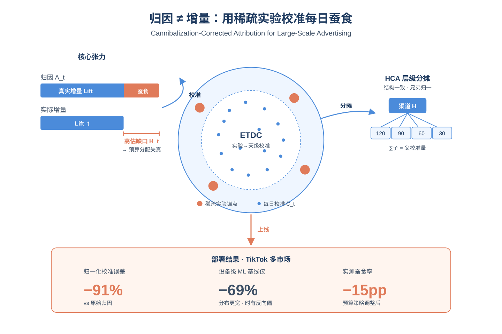
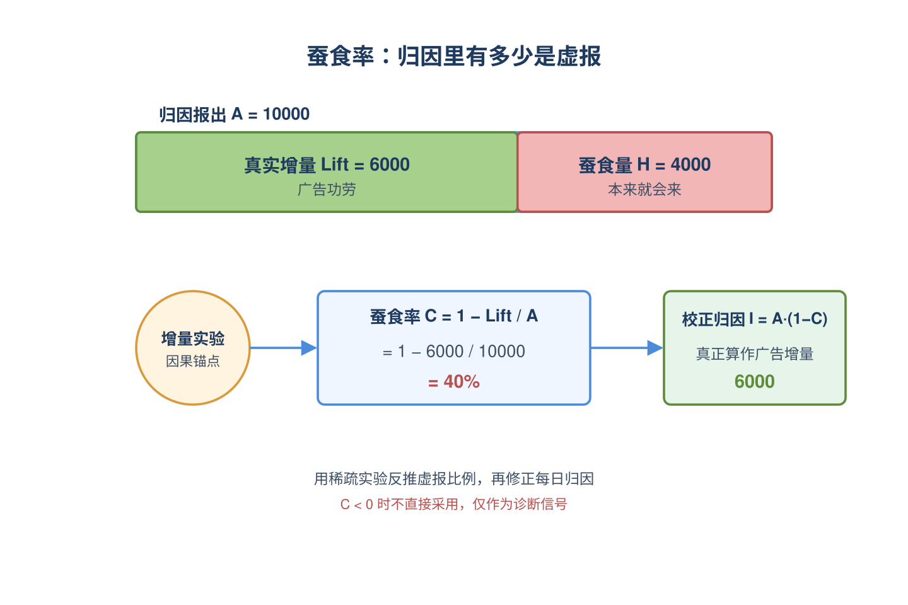
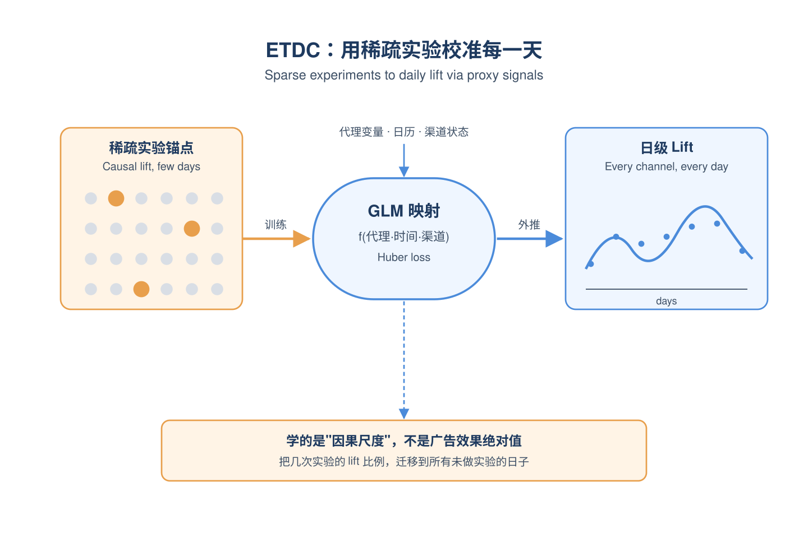
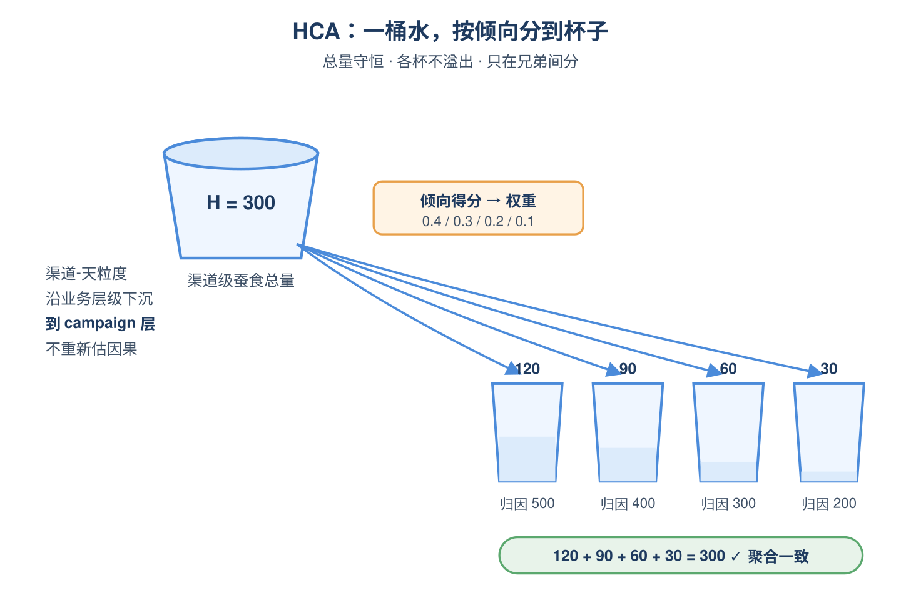
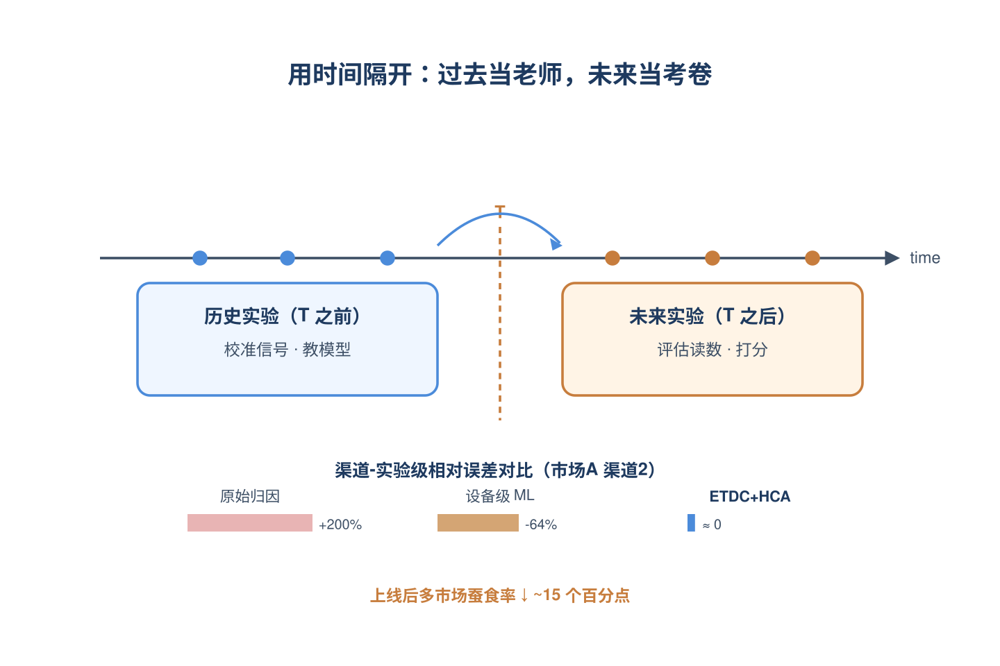
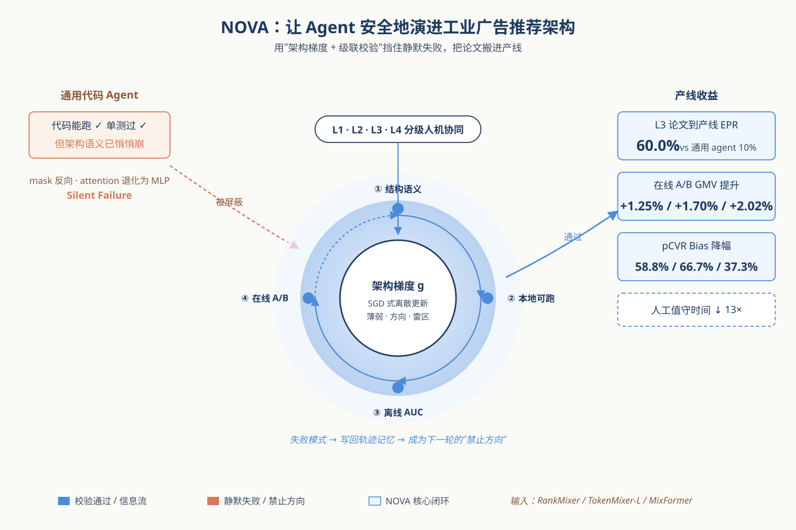
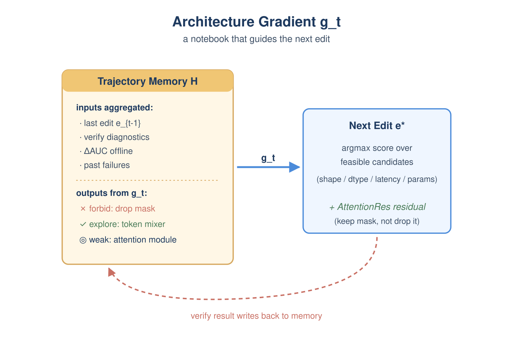
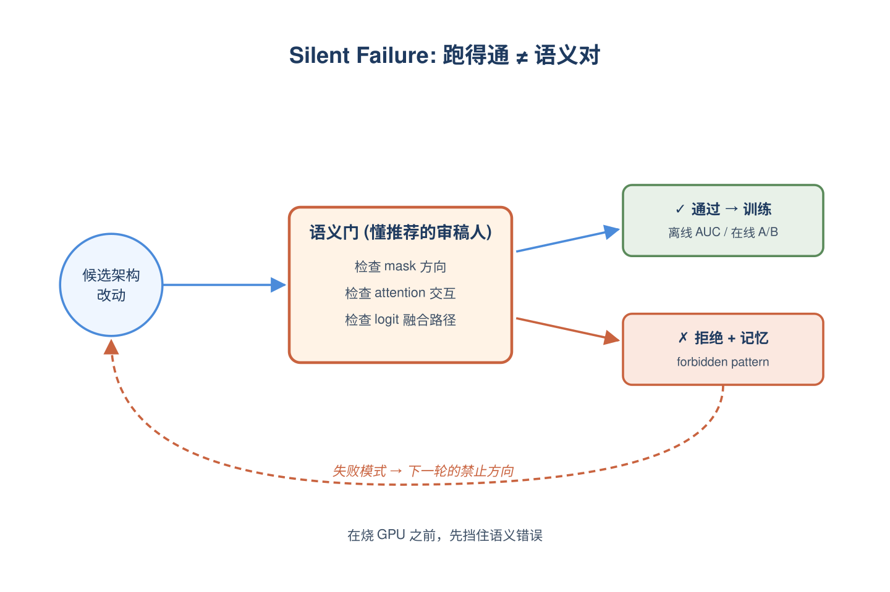
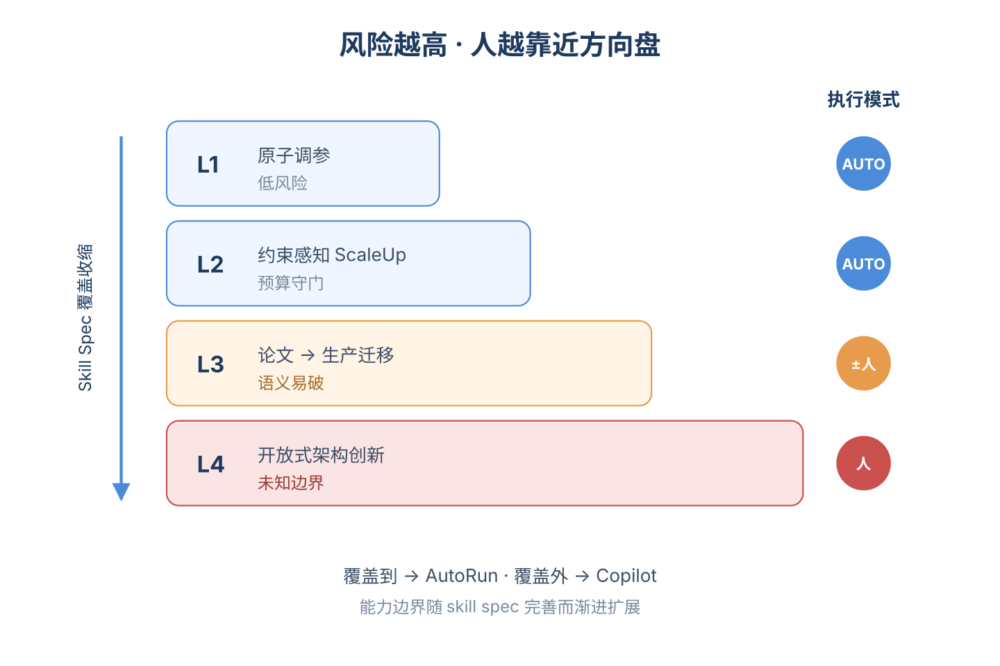

# 2026-06-26 论文日报

## 一、今日趋势与创新观察

### 1. 趋势概况

- 今日cs.IR/cs.AI/cs.LG共抓取325篇，cs.AI以199篇延续主导，LLM与语言理解135篇仍是绝对中心，但其中明显有更多工作把LLM落到推荐、检索、电商定价等工业链路。
- 表示学习与检索排序86篇延续工程化趋势，重心从模型结构本身转向GPU加速稀疏检索、MaxSim打分IO优化、跨平台session embedding等系统与链路细节。
- Agent与多智能体73篇里出现多篇瞄准工业推荐架构演进和算法迭代闭环的Agent harness，从纯推理任务转向研发流程自动化。
- 商业化决策与资源优化16篇明显高于近期均值，涵盖广告归因cannibalization校正、Uplift因果debias、长周期GMV/ROI对齐定价等核心问题。

### 2. 推荐系统 / 排序相关创新点

- NOVA提出面向工业广告推荐的verification-aware Agent harness，把RankMixer/MixFormer这类架构升级流程交给Agent闭环搜索并通过线上验证，把架构演进从专家手工迭代推向自动化。
- CHAUN在Uplift建模中用Cross-Head Attention显式建模组间相似性，并结合鲁棒对抗式IPS处理未观测混淆，直接面向CRITEO-UPLIFT和Lazada等广告增量效果估计场景。
- TikTok那篇广告归因工作指出付费归因会系统性高估真实增量DNU，提出cannibalization-corrected attribution来分离付费和自然渠道，把归因输出从相关性纠正到增量性。

### 3. 全局创新点

- AIGP把LLM、离线RL和DPO拼成电商动态定价框架，用偏好对齐把短期价格决策与累计GMV、ROI、里程碑这类长期业务目标显式对齐，给商业化决策提供了一个可落地的LLM对齐范式。
- AgentX把推荐算法迭代本身视作待自动化的研发流水线，让多Agent接管从假设生成、代码修改到A/B实验闭环，是把agentic workflow真正落到工业系统迭代上的一次尝试。
- GPUSparse和TileMaxSim这两篇分别针对学习式稀疏检索和MaxSim打分，用并行倒排索引、维度tiling和fused乘积量化把检索系统的GPU IO和算力利用率重做了一遍，代表检索基础设施层的硬件感知优化方向。

### 4. 跨论文综合观察

- NOVA和AgentX其实是在同一问题的不同层面：前者聚焦广告推荐模型架构本身的自动演进，后者聚焦整个算法迭代研发流程的Agent化，两者共同指向工业推荐进入'Agent驱动自迭代'阶段。
- AIGP（长期GMV/ROI对齐定价）、cannibalization-corrected归因和CHAUN（未观测混淆下的Uplift）从决策、度量、因果三个角度同时纠正一件事：业务目标必须是真实增量而非表面相关，且需要LLM对齐与因果debias共同保障。
- UniFormer的统一模型扩展、GPUSparse/TileMaxSim的检索系统优化与NOVA的架构搜索形成互补：一边在模型结构和算子层榨性能，一边用Agent在更高层自动探索结构组合，整体呈现'底层系统硬优化+上层架构自动化'的双线推进。

## 二、今日入选论文

### 1. Attributed, But Not Incremental: Cannibalization-Corrected Attribution for Large-Scale Advertising
- 挑选理由：直接研究广告归因、增量与预算分配，TikTok全球部署

### 2. NOVA: A Verification-Aware Agent Harness for Architecture Evolution in Industrial Recommender Systems
- 挑选理由：直接面向工业广告推荐系统的架构演进，含pCVR目标和GMV在线A/B提升

## 三、补充关注

1. **Generative Retrieval via Diffusion Transformer with Metric-Ordered Sequence Training and Hybrid-Policy Preference Optimization**
   - 理由：生成式检索+偏好优化，提到生产环境的pattern-preserving属性检索，与召回有一定同构性但未明确广告场景
2. **EMA-FS: Accelerating GBDT Training via Gain-Informed Feature Screening**
   - 理由：GBDT训练加速，明确测试广告CTR预测和欺诈检测数据集，对广告系统训练效率有一定参考意义，但属通用工程优化。

## 四、重点论文精读

### 1. Attributed, But Not Incremental: Cannibalization-Corrected Attribution for Large-Scale Advertising
- **为什么值得看：** TikTok实盘部署，把归因和增量实验结合，降15个点蚕食率
- **背景：** 大型增长广告系统里，预算分配和渠道诊断高度依赖归因系统输出的'付费带来的新用户(DNU)'，但当付费渠道和自然流量、品牌流量重叠时，归因会把本来就会来的用户也算成广告功劳，造成系统性高估真实增量。增量实验虽然能给出因果可信的lift，但稀疏、延迟、贵，不能天天跑、不能覆盖所有渠道，所以问题不是'用实验替换归因'，而是'怎么用稀疏的实验信号去校准每天都在跑的归因输出'，这正是论文要解决的核心矛盾。

*图示：这是字节TikTok广告团队的实战论文，直接面对'付费归因高估真实增量'这个所有广告平台都头疼的问题，给出了一个已经在多个海外市场上线的可落地框架，并报告了蚕食率下降约15个百分点的业务结果，对做投放、预算分配和增量度量的同学有直接参考价值。*

**核心技术点：**

#### 技术点 1：蚕食率的因果定义
- 快速理解：把'归因数 vs 真实增量'的差距形式化成一个可估的蚕食率

*图示：可以把归因系统想成一个会给广告'记功'的账房，但这个账房不知道有些用户本来就会自己来。论文先把'记多了多少'这件事写成一个具体比例：蚕食率。比如归因说今天广告带来了100个新用户，但实验测出真实只多了70个，那蚕食率就是30%，缺口30个。后面所有的事情，都是在估这个比例并把它用好。*

- 技术细节：论文定义在t时刻，付费归因新用户为A-t，真实增量Lift-t是有广告曝光和无广告反事实曝光下总转化的差。蚕食率C-t = 1 - Lift-t/A-t，代表归因里非增量的比例；蚕食缺口H-t = A-t - Lift-t就是被高估的那部分。修正后的增量归因是A-t乘以(1-估计的C-t)。负的蚕食估计被当成诊断信号（可能是自然外溢或归因漏点），而不是直接拿去用。
- 通俗讲解：可以把归因系统想成一个会给广告'记功'的账房，但这个账房不知道有些用户本来就会自己来。论文先把'记多了多少'这件事写成一个具体比例：蚕食率。比如归因说今天广告带来了100个新用户，但实验测出真实只多了70个，那蚕食率就是30%，缺口30个。后面所有的事情，都是在估这个比例并把它用好。
- 例子：假设某渠道某天归因A-t=1000个新用户，过去一次geo实验估出该渠道Lift占归因的约75%，则C-t≈0.25，修正后的增量归因约为750，预算系统拿到的就是750而不是1000。

#### 技术点 2：ETDC：实验到天级校准
- 快速理解：用稀疏实验当锚，学一个能每天输出lift的代理变量模型

*图示：实验只能偶尔跑、覆盖几个渠道几段时间，但归因系统天天都在跑。ETDC的思路是：找几个'每天都能观测、又能反映自然流量大盘'的代理信号(比如自然基线波动相关的指标)，让模型学会'在这些信号长这样的时候，实验通常会测出多少lift'。学好之后，没实验的日子也能根据代理信号外推出当天的lift，把稀疏的因果证据扩成连续的校准面。*

- 技术细节：ETDC把稀疏、延迟的渠道级实验lift当作带噪声的因果监督，对每个(渠道,日期)构造三类特征：代理变量（反映自然基线变化）、时间结构（星期、节假日、季节）、渠道/媒体状态（投放强度、生命周期）。用一个广义线性模型f学映射：特征变成预测lift，训练时用Huber loss降低极端实验点影响。代理变量选择强调两条：与自然增长相关、且不会随短期投放/预算/归因规则机械变化（近似外生）。预测出的lift再回算成C-t和修正归因，并加边界约束和时间平滑抑制噪声。
- 通俗讲解：实验只能偶尔跑、覆盖几个渠道几段时间，但归因系统天天都在跑。ETDC的思路是：找几个'每天都能观测、又能反映自然流量大盘'的代理信号(比如自然基线波动相关的指标)，让模型学会'在这些信号长这样的时候，实验通常会测出多少lift'。学好之后，没实验的日子也能根据代理信号外推出当天的lift，把稀疏的因果证据扩成连续的校准面。
- 例子：渠道A过去做过几轮实验拿到了lift真值，模型学到'当自然基线指标高、投放强度中等、非节假日时，lift约是归因的70%'。今天没有实验，但代理特征和这个状态接近，模型就直接预测今天Lift≈0.7\*A-t，进而把归因从A-t校准成约0.7\*A-t输出给下游。

#### 技术点 3：HCA：层级一致的细粒度分摊
- 快速理解：把渠道级蚕食量按倾向得分分摊到子单元，且不破坏父级总数

*图示：想象渠道级蚕食是一桶水(比如300个非增量用户)，下面有若干campaign兄弟节点，HCA做的是'按倾向把这桶水分到各个杯子里'，但严格保证三件事：杯子加起来还是这一桶、每个杯子不会装负数也不会超过它自己归因的量、动一个杯子不会让别的家族里的杯子莫名其妙变化。这样下游团队看到的细粒度修正就是可解释、可操作的。*

- 技术细节：ETDC只给到渠道-天粒度，但预算和诊断常在campaign、广告位、设备等更细层级做。HCA不在细粒度上重新估因果lift，而是把ETDC算出的渠道蚕食总量H沿预定义业务层级往下分。约束有三：子节点之和等于父节点校准总量(聚合一致)、每个子节点蚕食量在（0, 该子节点归因量）之间(可行性)、分摊只在同一父节点的兄弟集合内做(局部性)。每个子节点用局部稳定特征算一个相对蚕食倾向得分s，兄弟间归一化得到权重w，再乘父总量分下去；触到上下界就在兄弟内重分配。HCA只对正蚕食做分摊，负值单独走诊断通道。
- 通俗讲解：想象渠道级蚕食是一桶水(比如300个非增量用户)，下面有若干campaign兄弟节点，HCA做的是'按倾向把这桶水分到各个杯子里'，但严格保证三件事：杯子加起来还是这一桶、每个杯子不会装负数也不会超过它自己归因的量、动一个杯子不会让别的家族里的杯子莫名其妙变化。这样下游团队看到的细粒度修正就是可解释、可操作的。
- 例子：渠道X校准后蚕食量是300，下面四个子渠道归因分别是500/400/300/200。HCA用局部特征算出倾向得分比如0.4/0.3/0.2/0.1，归一化后分摊为120/90/60/30，每个都在自己的（0,归因量）范围内；后来某子渠道做了策略调整，重新分摊主要影响这四个兄弟，不会让其他渠道的修正值跟着抖。

#### 技术点 4：前向时间评估与上线效果
- 快速理解：用T之前的实验校准、T之后的实验验证，避免数据穿越

*图示：因为实验本身就是稀缺资源，作者很小心地用时间分段：先拿历史实验当老师教模型，再拿未来的新实验当考卷打分，保证模型不是在背答案。结果是设备级ML虽然比裸归因好，但常常一会儿高估一会儿低估；ETDC+HCA则稳定贴近实验真值，上线后下游团队据此调整预算，把更多钱挪向高增量渠道，整体蚕食率确实降了。*

- 技术细节：评估上用rolling forward-in-time：T时刻前的实验做校准信号，T之后的实验读数做评估，同一实验不会同时用于训练和评估。指标用渠道-实验粒度的绝对相对误差ARE和有符号相对误差RE，跨实验做lift加权平均。对比三种方法：原始归因、设备级ML、ETDC+HCA。结果是ETDC+HCA相对原始归因把归一化校准误差降了约91%，设备ML只降约69%且分布更宽；有符号误差中位数接近0、IQR在±8%内。线上部署后多个TikTok海外市场的整体蚕食率下降约15个百分点。
- 通俗讲解：因为实验本身就是稀缺资源，作者很小心地用时间分段：先拿历史实验当老师教模型，再拿未来的新实验当考卷打分，保证模型不是在背答案。结果是设备级ML虽然比裸归因好，但常常一会儿高估一会儿低估；ETDC+HCA则稳定贴近实验真值，上线后下游团队据此调整预算，把更多钱挪向高增量渠道，整体蚕食率确实降了。
- 例子：市场A渠道2两轮实验中，原始归因相对误差是+200%/+225%(严重高估)，设备ML是-63%/-64%(反过来低估)，ETDC+HCA是+3%/-4%，基本贴着实验真值，下游就敢据此压缩这个渠道的预算。

- **对广告的启发：** 给广告平台一个不动归因主链路、就能把归因校准到增量口径的可落地范式
- **适用边界：** 适用前提是：平台能持续跑一定量的渠道级或geo级增量实验，且能找到与自然基线相关、不被投放策略机械污染的代理变量；在实验极度稀缺、渠道间存在强互补/外溢、或处于大型产品/季节性结构性变化时期，方法的外推假设可能失效，需要更频繁的重新校准。
- **实践建议：** 可以先在自家归因系统外挂一层'蚕食率估计模块'：用历史geo/holdout实验做监督，挑几个与自然基线强相关的代理特征拟合渠道-天级lift，然后把修正后的增量DNU喂给预算分配和nROI看板，对比原归因看决策是否更稳——这是性价比很高的第一步。

### 2. NOVA: A Verification-Aware Agent Harness for Architecture Evolution in Industrial Recommender Systems
- **为什么值得看：** 用智能体自动改进工业广告推荐架构，pCVR目标GMV提升1-2%已上线
- **背景：** 工业广告推荐这几年靠RankMixer、TokenMixer-Large、MixFormer等架构升级持续拿增量，但这些升级高度依赖专家，难以规模化。AutoML只能调学习率/隐层维度这类局部超参，无法做跨模块改造；通用LLM代码agent又只盯着'代码能跑、单测能过'，结果常常生成一个能正常训练却悄悄破坏推荐语义的模型（如把self-attention退化成MLP、错误去掉序列mask、改坏logit融合路径），论文称之为'silent failure'。NOVA要解决的就是：怎么让agent在严格的生产约束下，自动且可审计地完成架构演进。

*图示：这是腾讯团队在工业广告推荐系统上做的真实落地工作，把LLM智能体用于自动演进推荐模型架构（不是只调超参，而是改模块拓扑、特征路由），并通过在线A/B在三个pCVR目标上分别拿到+1.25%/+1.70%/+2.02% GMV和大幅bias下降。对一线广告排序同学来说，既能学到agent harness的工程范式，也能看到具体哪些架构改动真正在广告场景奏效。*

**核心技术点：**

#### 技术点 1：架构梯度驱动搜索
- 快速理解：把SGD思想搬到离散架构空间，用文本化反馈信号决定下一步改哪里

*图示：可以把它想成给架构搜索做'笔记式SGD'：标准SGD用数值梯度告诉你参数往哪挪，这里因为架构是离散的没法求导，就用LLM读历史笔记总结'上次改了embedding维度AUC掉了，可能是因为token数没配套调整，下次别只动一边'，把这种文字诊断当成梯度方向。每一轮g会变成一个结构化的'修改建议+雷区清单'，喂给Propose阶段生成K个候选修改。*

- 技术细节：把架构状态A定义为(模型图G, 结构超参φ, 特征配置F)三元组，搜索单元是一次'修改操作'e（比如把target attention升级为Seq/Non-Seq Token交互）。每轮计算一个'架构梯度'g，它聚合四个东西：上一次的修改、验证诊断信息、离线AUC的变化量、轨迹记忆。g会输出三类信息——薄弱组件（哪个模块是瓶颈）、推荐修改方向、禁止方向（之前失败过的pattern）。然后用一个Score函数在可行修改空间里挑下一步，要求改完后仍满足shape/dtype/延迟/参数量等硬约束。
- 通俗讲解：可以把它想成给架构搜索做'笔记式SGD'：标准SGD用数值梯度告诉你参数往哪挪，这里因为架构是离散的没法求导，就用LLM读历史笔记总结'上次改了embedding维度AUC掉了，可能是因为token数没配套调整，下次别只动一边'，把这种文字诊断当成梯度方向。每一轮g会变成一个结构化的'修改建议+雷区清单'，喂给Propose阶段生成K个候选修改。
- 例子：比如基线是RankMixer，第一轮试着加大token-dim，AUC没动反而触发了token-cnt不能整除token-dim的约束错误。架构梯度就会记录'单独放大token-dim是禁止方向'，并提示'下一步应该联合调token-cnt/token-dim/layer数'，第二轮Propose出来的候选就会是协同scale的组合，最终在±10%参数预算内找到一个AUC正向的配置。

#### 技术点 2：防静默失败的级联校验
- 快速理解：训练前先做结构语义检查，把'能跑但坏掉'的候选拦下来并写进禁止方向

*图示：通用代码agent的盲点是：编译过了、单测过了≠模型语义是对的。比如代码里self-attention的mask方向写反了，框架照样能跑，AUC却悄悄崩。NOVA的做法是在训练前加一道'懂推荐架构'的体检：不是检查代码语法，而是检查'这个mask是不是把未来信息泄漏了'、'这个特征是不是接到了错误的token slot上'。一旦体检不过，不仅这次拒掉，还把这个错误写进黑名单，让后面的搜索绕开。*

- 技术细节：校验分四级：①结构语义门，检查shape/dtype、特征到token映射、attention方向、mask语义、logit融合路径是否符合设计意图；②本地可执行门，单机跑通；③离线训练评估AUC；④在线A/B看GMV/Bias。前两级在昂贵训练之前就把候选过滤掉，失败模式不只是丢弃，而是作为'forbidden direction'写回轨迹记忆H，下一轮架构梯度会直接屏蔽类似pattern。语义门由'skill specification'驱动，由历史种子规则+累积失败模式+LLM辅助检查组成。
- 通俗讲解：通用代码agent的盲点是：编译过了、单测过了≠模型语义是对的。比如代码里self-attention的mask方向写反了，框架照样能跑，AUC却悄悄崩。NOVA的做法是在训练前加一道'懂推荐架构'的体检：不是检查代码语法，而是检查'这个mask是不是把未来信息泄漏了'、'这个特征是不是接到了错误的token slot上'。一旦体检不过，不仅这次拒掉，还把这个错误写进黑名单，让后面的搜索绕开。
- 例子：论文里有个具体case：把TokenMixer-Large移植到生产backbone时，agent最初把task1的auxiliary loss接到了错误的target表征上，task1提升不达预期，task3反而变差。验证+诊断反馈让NOVA发现'aux loss索引错了、全局aux目标对task3有干扰'，下一轮就修正了task1的aux索引，并把task3从全局aux里mask掉，最终拿到正向结果。

#### 技术点 3：L1-L4分级与人机协同
- 快速理解：按任务风险分四档，简单调参全自动，论文复现可选人工把关，开放创新强制人审

*图示：这一层其实是工业落地的'保险丝'：让agent的自主程度和任务风险匹配。改一个标量超参出错了顶多浪费一次训练，但要把一篇新论文的模块塞进产线，失败可能影响线上几十亿流量，所以必须有人能在关键节点拍板。Skill spec越完善，AutoRun能覆盖的范围就越大，相当于agent的能力边界是渐进扩展的。*

- 技术细节：把任务分四级：L1原子调参（如改一个RankMixer层数）、L2约束感知ScaleUp（联合scale token-cnt/dim/层数且守住参数预算）、L3论文到生产迁移（把TokenMixer-Large/MixFormer等模块适配进产线）、L4开放式创新。执行模式分AutoRun和Copilot，由'skill specification覆盖度'决定：覆盖到的模块走全自动，没覆盖或高风险的走人工确认。L1-L2默认AutoRun，L3可选，L4强制Copilot。
- 通俗讲解：这一层其实是工业落地的'保险丝'：让agent的自主程度和任务风险匹配。改一个标量超参出错了顶多浪费一次训练，但要把一篇新论文的模块塞进产线，失败可能影响线上几十亿流量，所以必须有人能在关键节点拍板。Skill spec越完善，AutoRun能覆盖的范围就越大，相当于agent的能力边界是渐进扩展的。
- 例子：在L3 Literature-to-Production任务上，NOVA的LPR（本地通过率）86.7%、EPR（端到端有效通过率）60%，是human expert loop的两倍多；同一个论文复现循环人工值守时间缩短13倍以上。对比OpenHands等通用代码agent EPR只有10%左右，差距主要来自语义校验+架构梯度，而不是底层LLM能力（都用Claude Sonnet 4.6）。

- **对广告的启发：** 广告排序架构迭代可以用agent harness加速，但必须配套'懂推荐语义'的校验层
- **适用边界：** 方法效果依赖skill specification的完备度和历史轨迹积累，冷启动阶段（没有失败经验可借鉴时）forbidden direction机制收益有限；离线用AUC内循环排序，对于强依赖在线长期价值或多目标权衡的任务，离线最优≠在线最优，仍需A/B兜底。
- **实践建议：** 可以先在自家广告排序栈做一件小事：把过去半年的架构A/B失败案例（特别是'代码跑通但AUC/bias恶化'的案例）整理成结构化的'禁止修改模式'，配合简单的shape/mask/特征路由静态检查，就能复刻NOVA最核心的silent-failure拦截能力，不必一上来就搭完整agent harness。
