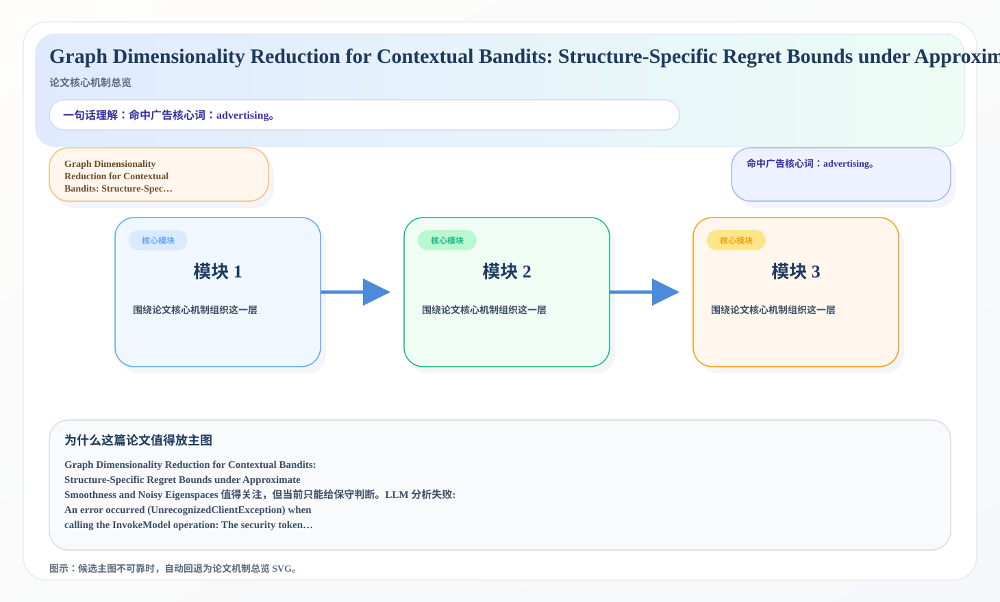
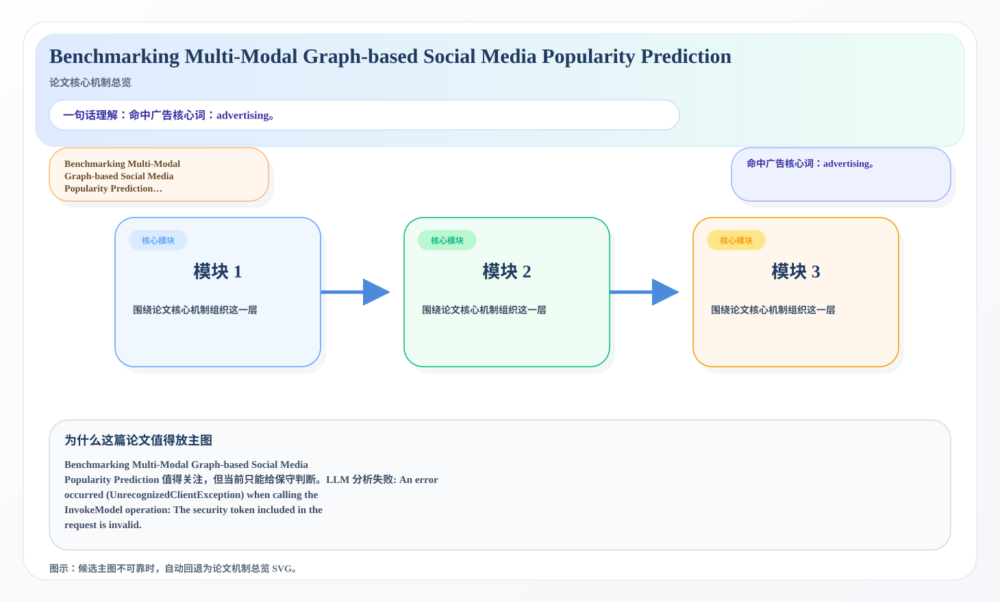

# 2026-06-29 论文日报

## 一、今日趋势与创新观察

### 1. 趋势概况

- 今天一共抓到 220 篇论文，趋势概况优先基于全量抓取结果而不是只看最后保留的候选。
- 从全量论文看，主题最集中的方向是：LLM 与语言理解、表示学习与检索排序、迁移学习与跨域泛化。
- 进入候选池的工作里，直接广告 3 篇、强迁移 12 篇、大公司线索 0 篇，说明今天既有直接商业化问题，也有可迁移的方法论输入。

### 2. 推荐系统 / 排序相关创新点

- 《From Detection to Action: Using LLM Agents for Fault-Tolerant Control》：亮点信号：closed-loop, constraint, semantic, context；主题：LLM 与语言理解、Agent 与多智能体；来自全量抓取的补充观察

### 3. 全局创新点

- 《Agent-Native Immune System: Architecture, Taxonomy, and Engineering》：亮点信号：attack, tool, alignment, robust；主题：Agent 与多智能体；公司线索：Meta；候选属性：大公司优先论文
- 《Forecasting Technological Directions in Wireless Networks and Mobile Computing via AutoML Framework》：亮点信号：embedding, robust, semantic；主题：迁移学习与跨域泛化、LLM 与语言理解；公司线索：Meta；候选属性：大公司优先论文
- 《DysLexLens: A Low-Resource LLM Framework for Analysing Dyslexic Learners Insights from Online Forums》：亮点信号：tool, dit, alignment, robust；主题：LLM 与语言理解；来自全量抓取的补充观察

## 二、今日入选论文

### 1. Graph Dimensionality Reduction for Contextual Bandits: Structure-Specific Regret Bounds under Approximate Smoothness and Noisy Eigenspaces
- 挑选理由：命中广告核心词：advertising。

### 2. Benchmarking Multi-Modal Graph-based Social Media Popularity Prediction
- 挑选理由：命中广告核心词：advertising。

## 三、补充关注

1. **Applicability of memorization indicators for early spotting of overfitting while recalibrating sEMG-decoders on low sample sizes**
   - 理由：有一定相关信号，但不足以进入正式候选：calibration。
2. **Position Bias Correction is Insufficient for One-Pass Attention Sorting**
   - 理由：有一定相关信号，但不足以进入正式候选：debias。
3. **The Simulacrum: Decision-Theoretic Pretraining for Near-Optimal Time-Series Forecasting and Inference**
   - 理由：有一定相关信号，但不足以进入正式候选：calibration。
4. **What Was That Again? Certified Robustness for Automatic Speech Recognition**
   - 理由：有一定相关信号，但不足以进入正式候选：recall。
5. **NormGuard: Reward-Preserving Norm Constraints in Flow-Matching Reinforcement Learning**
   - 理由：有一定相关信号，但不足以进入正式候选：matching。
6. **The Curse of Multiple Mediators: Hidden Interaction Effects in Activation Patching**
   - 理由：有一定相关信号，但不足以进入正式候选：ranking。
7. **RANSAC Scoring Done Right**
   - 理由：有一定相关信号，但不足以进入正式候选：calibration。
8. **EntMTP: Accelerating LLM Inference with Entropy Guided Multi Token Prediction**
   - 理由：有一定相关信号，但不足以进入正式候选：matching。
9. **Test-Input Generation for Tensor Programs: What Actually Finds Kernel Bugs**
   - 理由：有一定相关信号，但不足以进入正式候选：recall。

## 四、重点论文精读

### 1. Graph Dimensionality Reduction for Contextual Bandits: Structure-Specific Regret Bounds under Approximate Smoothness and Noisy Eigenspaces
- **为什么值得看：** 命中广告核心词：advertising。
- **背景：** Graph Dimensionality Reduction for Contextual Bandits: Structure-Specific Regret Bounds under Approximate Smoothness and Noisy Eigenspaces 值得关注，但当前只能给保守判断。LLM 分析失败: An error occurred (UnrecognizedClientException) when calling the InvokeModel operation: The security token included in the request is invalid.

*图示：候选主图不可靠，已回退为论文核心机制总览 SVG。*

- **当前状态：** llm_failed（LLM 分析失败: An error occurred (UnrecognizedClientException) when calling the InvokeModel operation: The security token included in the request is invalid.）
- **核心技术点：** 本次精读未成功，暂不展示结构化核心点，避免误导。
- **对广告的启发：** 暂时只保留候选判断，建议稍后重试精读。

### 2. Benchmarking Multi-Modal Graph-based Social Media Popularity Prediction
- **为什么值得看：** 命中广告核心词：advertising。
- **背景：** Benchmarking Multi-Modal Graph-based Social Media Popularity Prediction 值得关注，但当前只能给保守判断。LLM 分析失败: An error occurred (UnrecognizedClientException) when calling the InvokeModel operation: The security token included in the request is invalid.

*图示：候选主图不可靠，已回退为论文核心机制总览 SVG。*

- **当前状态：** llm_failed（LLM 分析失败: An error occurred (UnrecognizedClientException) when calling the InvokeModel operation: The security token included in the request is invalid.）
- **核心技术点：** 本次精读未成功，暂不展示结构化核心点，避免误导。
- **对广告的启发：** 暂时只保留候选判断，建议稍后重试精读。

## 五、候选但未完成深读的论文

- **Graph Dimensionality Reduction for Contextual Bandits: Structure-Specific Regret Bounds under Approximate Smoothness and Noisy Eigenspaces**
  - 状态：llm_failed
  - 原因：LLM 分析失败: An error occurred (UnrecognizedClientException) when calling the InvokeModel operation: The security token included in the request is invalid.
- **Benchmarking Multi-Modal Graph-based Social Media Popularity Prediction**
  - 状态：llm_failed
  - 原因：LLM 分析失败: An error occurred (UnrecognizedClientException) when calling the InvokeModel operation: The security token included in the request is invalid.
