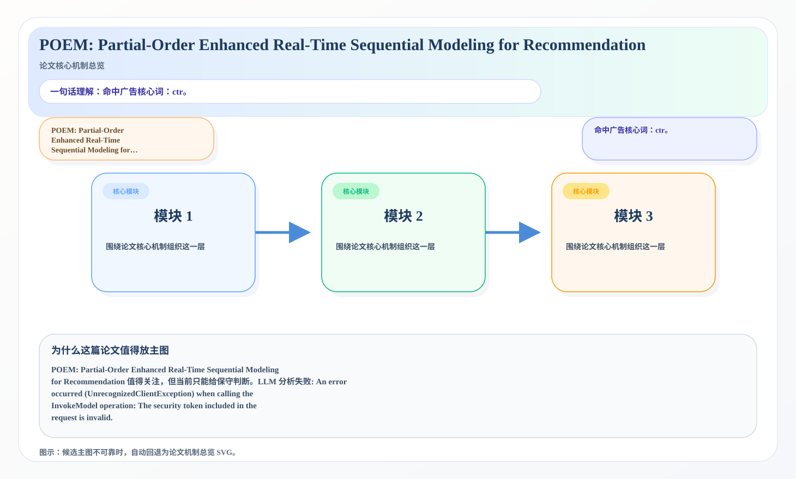
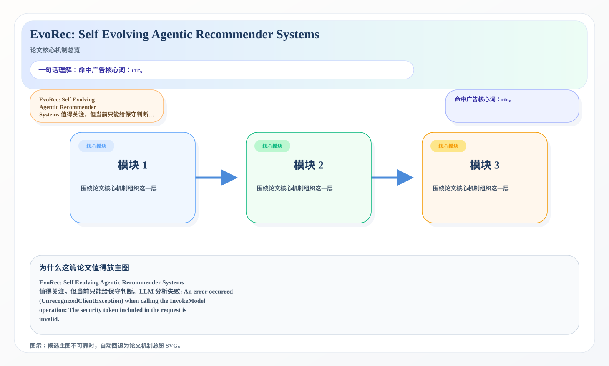

# 2026-06-30 论文日报

## 一、今日趋势与创新观察

### 1. 趋势概况

- 今天一共抓到 683 篇论文，趋势概况优先基于全量抓取结果而不是只看最后保留的候选。
- 从全量论文看，主题最集中的方向是：LLM 与语言理解、表示学习与检索排序、Agent 与多智能体。
- 进入候选池的工作里，直接广告 7 篇、强迁移 48 篇、大公司线索 5 篇，说明今天既有直接商业化问题，也有可迁移的方法论输入。

### 2. 推荐系统 / 排序相关创新点

- 《Internal-State Probes Read the Situation, Not the Action: Three Negative Results for Pre-Action Misalignment Monitoring》：亮点信号：tool, dit, projection, alignment；主题：迁移学习与跨域泛化、LLM 与语言理解；来自全量抓取的补充观察
- 《When Does Overlap Help? OSU-Mem and a Cell-Conditional Analysis of Trajectory Memory for LLM Agents》：亮点信号：tool, dit, semantic, memory；主题：LLM 与语言理解、Agent 与多智能体；公司线索：Meta；候选属性：大公司优先论文
- 《Rank-Aware Hyperbolic Alignment for Vision-Language Dataset Distillation》：亮点信号：alignment, embedding, robust, semantic；主题：迁移学习与跨域泛化、LLM 与语言理解；候选属性：强迁移论文

### 3. 全局创新点

- 《Linguistic Firewall: Geometry as Defense in Multi-Agent Systems Routing》：亮点信号：attack, projection, embedding, robust；主题：LLM 与语言理解、Agent 与多智能体；公司线索：Meta；候选属性：大公司优先论文

## 二、今日入选论文

### 1. POEM: Partial-Order Enhanced Real-Time Sequential Modeling for Recommendation
- 挑选理由：命中广告核心词：ctr。

### 2. EvoRec: Self Evolving Agentic Recommender Systems
- 挑选理由：命中广告核心词：ctr。

## 三、补充关注

1. **Faults in Our Formal Benchmarking: Dataset Defects and Evaluation Failures in Lean Theorem Proving**
   - 理由：有一定相关信号，但不足以进入正式候选：recall。
2. **Measuring Graph-to-Graph Semantic Similarity in Knowledge Graphs: An Empirical Evaluation of Knowledge Graph Embeddings**
   - 理由：有一定相关信号，但不足以进入正式候选：matching。
3. **A Multi-task Mixture of Experts Framework for Malware Classification, Packing Detection, and Family Attribution**
   - 理由：有一定相关信号，但不足以进入正式候选：multi-task。
4. **Can LLMs Rank? A Tale of Triads and Triage**
   - 理由：有一定相关信号，但不足以进入正式候选：ranking。
5. **Estimating Grammatical Gender Directions in Contextual Embeddings under Controlled and Natural Contexts**
   - 理由：有一定相关信号，但不足以进入正式候选：debias。
6. **RiverONE: Generating Knowledge-Intensive VLM by Simulated Quantum Machines**
   - 理由：有一定相关信号，但不足以进入正式候选：calibration。
7. **RGLD: Randomized Global-Local Density Estimation for Tabular Anomaly Detection**
   - 理由：有一定相关信号，但不足以进入正式候选：ranking。
8. **FedLAS: Feature-Modulated Bidirectional Label Smoothing for Neural Network Calibration**
   - 理由：有一定相关信号，但不足以进入正式候选：calibration。
9. **Correct codes for the wrong reasons? validating LLMs as measurement instruments for theoretical constructs**
   - 理由：有一定相关信号，但不足以进入正式候选：calibration。
10. **Spectral Perturbation of the Empirical Fisher Information Matrix under Weight Quantization**
   - 理由：有一定相关信号，但不足以进入正式候选：calibration。

## 四、重点论文精读

### 1. POEM: Partial-Order Enhanced Real-Time Sequential Modeling for Recommendation
- **为什么值得看：** 命中广告核心词：ctr。
- **背景：** POEM: Partial-Order Enhanced Real-Time Sequential Modeling for Recommendation 值得关注，但当前只能给保守判断。LLM 分析失败: An error occurred (UnrecognizedClientException) when calling the InvokeModel operation: The security token included in the request is invalid.

*图示：候选主图不可靠，已回退为论文核心机制总览 SVG。*

- **当前状态：** llm_failed（LLM 分析失败: An error occurred (UnrecognizedClientException) when calling the InvokeModel operation: The security token included in the request is invalid.）
- **核心技术点：** 本次精读未成功，暂不展示结构化核心点，避免误导。
- **对广告的启发：** 暂时只保留候选判断，建议稍后重试精读。

### 2. EvoRec: Self Evolving Agentic Recommender Systems
- **为什么值得看：** 命中广告核心词：ctr。
- **背景：** EvoRec: Self Evolving Agentic Recommender Systems 值得关注，但当前只能给保守判断。LLM 分析失败: An error occurred (UnrecognizedClientException) when calling the InvokeModel operation: The security token included in the request is invalid.

*图示：候选主图不可靠，已回退为论文核心机制总览 SVG。*

- **当前状态：** llm_failed（LLM 分析失败: An error occurred (UnrecognizedClientException) when calling the InvokeModel operation: The security token included in the request is invalid.）
- **核心技术点：** 本次精读未成功，暂不展示结构化核心点，避免误导。
- **对广告的启发：** 暂时只保留候选判断，建议稍后重试精读。

## 五、候选但未完成深读的论文

- **POEM: Partial-Order Enhanced Real-Time Sequential Modeling for Recommendation**
  - 状态：llm_failed
  - 原因：LLM 分析失败: An error occurred (UnrecognizedClientException) when calling the InvokeModel operation: The security token included in the request is invalid.
- **EvoRec: Self Evolving Agentic Recommender Systems**
  - 状态：llm_failed
  - 原因：LLM 分析失败: An error occurred (UnrecognizedClientException) when calling the InvokeModel operation: The security token included in the request is invalid.
