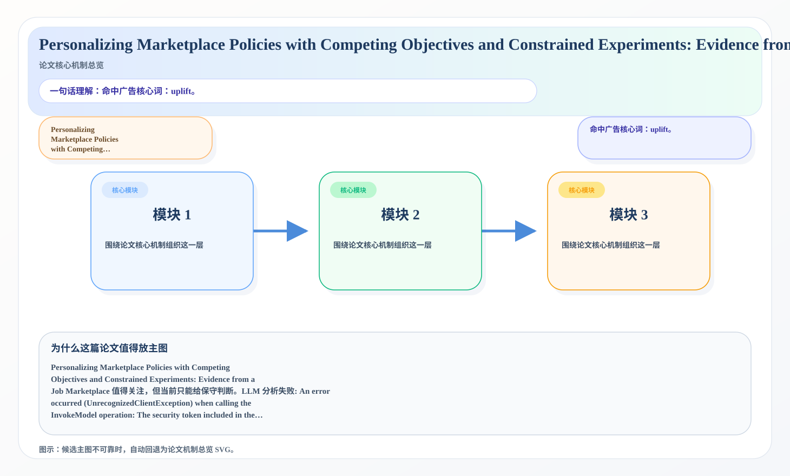
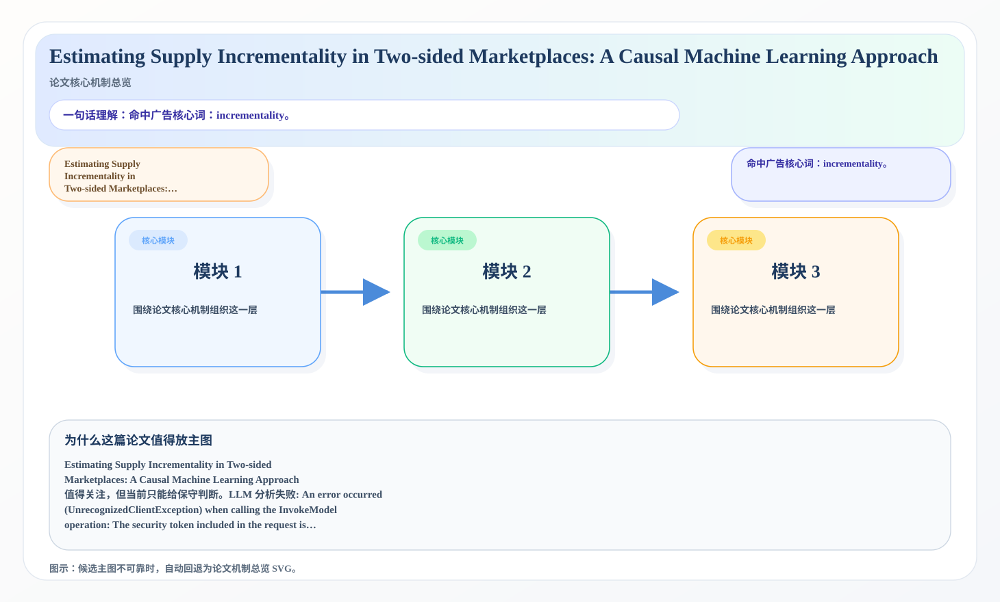

# 2026-07-01 论文日报

## 一、今日趋势与创新观察

### 1. 趋势概况

- 今天一共抓到 343 篇论文，趋势概况优先基于全量抓取结果而不是只看最后保留的候选。
- 从全量论文看，主题最集中的方向是：LLM 与语言理解、表示学习与检索排序、Agent 与多智能体。
- 进入候选池的工作里，直接广告 4 篇、强迁移 14 篇、大公司线索 3 篇，说明今天既有直接商业化问题，也有可迁移的方法论输入。

### 2. 推荐系统 / 排序相关创新点

- 《ShopX: A Foundation Model for Intent-to-Item Fulfillment in Agentic Shopping》：亮点信号：tool, semantic, context；主题：LLM 与语言理解、Agent 与多智能体；公司线索：Alibaba；候选属性：大公司优先论文
- 《Scenario Generation for Testing of Autonomous Driving Systems Using Real-World Failure Records》：亮点信号：dit, constraint, context；主题：LLM 与语言理解、表示学习与检索排序；公司线索：Meta；候选属性：大公司优先论文
- 《CLOUDADV: Decision-Aligned Instance Sizing with Zero-Shot Foundation Models under Drift》：亮点信号：alignment, constraint, context；主题：LLM 与语言理解、商业化决策与资源优化；公司线索：Meta；候选属性：强迁移论文

### 3. 全局创新点

- 今天暂时没有足够稳定的全局创新点可总结。

## 二、今日入选论文

### 1. Personalizing Marketplace Policies with Competing Objectives and Constrained Experiments: Evidence from a Job Marketplace
- 挑选理由：命中广告核心词：uplift。

### 2. Estimating Supply Incrementality in Two-sided Marketplaces: A Causal Machine Learning Approach
- 挑选理由：命中广告核心词：incrementality。

## 三、补充关注

1. **Unsupervised Data-Efficient Cross-Modal Retrieval with Global-Neighborhood Alignment Hashing**
   - 理由：有一定相关信号，但不足以进入正式候选：retrieval。
2. **Towards Critical IR Theories and Practices**
   - 理由：有一定相关信号，但不足以进入正式候选：retrieval。
3. **A time-series classification framework for individual-level absenteeism prediction under severe class imbalance**
   - 理由：有一定相关信号，但不足以进入正式候选：calibration。
4. **RoPoLL: Robust Panel of LLM Judges**
   - 理由：有一定相关信号，但不足以进入正式候选：matching。
5. **BayesBench: Evaluating LLM Belief Trajectories Under Multi-Turn Evidence Accumulation**
   - 理由：有一定相关信号，但不足以进入正式候选：matching。
6. **Introspective Coupling: Self-Explanation Training Tracks Behavioral Change Despite Fixed Supervision**
   - 理由：有一定相关信号，但不足以进入正式候选：counterfactual。
7. **JL1-CC&QA: Extending the JL1-CD Benchmark with Change Captioning and Question Answering**
   - 理由：有一定相关信号，但不足以进入正式候选：multi-task。
8. **Cross-lingual Relation Extraction with Large Language Models: Zero-Shot, Few-Shot, and Fine-Tuned Evaluation on Romanian**
   - 理由：有一定相关信号，但不足以进入正式候选：matching。
9. **ComplianceGate: Classifier-Gated Multi-Tier LLM Routing for Inference in Regulated Industries**
   - 理由：有一定相关信号，但不足以进入正式候选：recall。
10. **The Label Imitation Game: Turing Test Network for Zero-Shot Pseudo-Label Pruning**
   - 理由：有一定相关信号，但不足以进入正式候选：recall。

## 四、重点论文精读

### 1. Personalizing Marketplace Policies with Competing Objectives and Constrained Experiments: Evidence from a Job Marketplace
- **为什么值得看：** 命中广告核心词：uplift。
- **背景：** Personalizing Marketplace Policies with Competing Objectives and Constrained Experiments: Evidence from a Job Marketplace 值得关注，但当前只能给保守判断。LLM 分析失败: An error occurred (UnrecognizedClientException) when calling the InvokeModel operation: The security token included in the request is invalid.

*图示：候选主图不可靠，已回退为论文核心机制总览 SVG。*

- **当前状态：** llm_failed（LLM 分析失败: An error occurred (UnrecognizedClientException) when calling the InvokeModel operation: The security token included in the request is invalid.）
- **核心技术点：** 本次精读未成功，暂不展示结构化核心点，避免误导。
- **对广告的启发：** 暂时只保留候选判断，建议稍后重试精读。

### 2. Estimating Supply Incrementality in Two-sided Marketplaces: A Causal Machine Learning Approach
- **为什么值得看：** 命中广告核心词：incrementality。
- **背景：** Estimating Supply Incrementality in Two-sided Marketplaces: A Causal Machine Learning Approach 值得关注，但当前只能给保守判断。LLM 分析失败: An error occurred (UnrecognizedClientException) when calling the InvokeModel operation: The security token included in the request is invalid.

*图示：候选主图不可靠，已回退为论文核心机制总览 SVG。*

- **当前状态：** llm_failed（LLM 分析失败: An error occurred (UnrecognizedClientException) when calling the InvokeModel operation: The security token included in the request is invalid.）
- **核心技术点：** 本次精读未成功，暂不展示结构化核心点，避免误导。
- **对广告的启发：** 暂时只保留候选判断，建议稍后重试精读。

## 五、候选但未完成深读的论文

- **Personalizing Marketplace Policies with Competing Objectives and Constrained Experiments: Evidence from a Job Marketplace**
  - 状态：llm_failed
  - 原因：LLM 分析失败: An error occurred (UnrecognizedClientException) when calling the InvokeModel operation: The security token included in the request is invalid.
- **Estimating Supply Incrementality in Two-sided Marketplaces: A Causal Machine Learning Approach**
  - 状态：llm_failed
  - 原因：LLM 分析失败: An error occurred (UnrecognizedClientException) when calling the InvokeModel operation: The security token included in the request is invalid.
