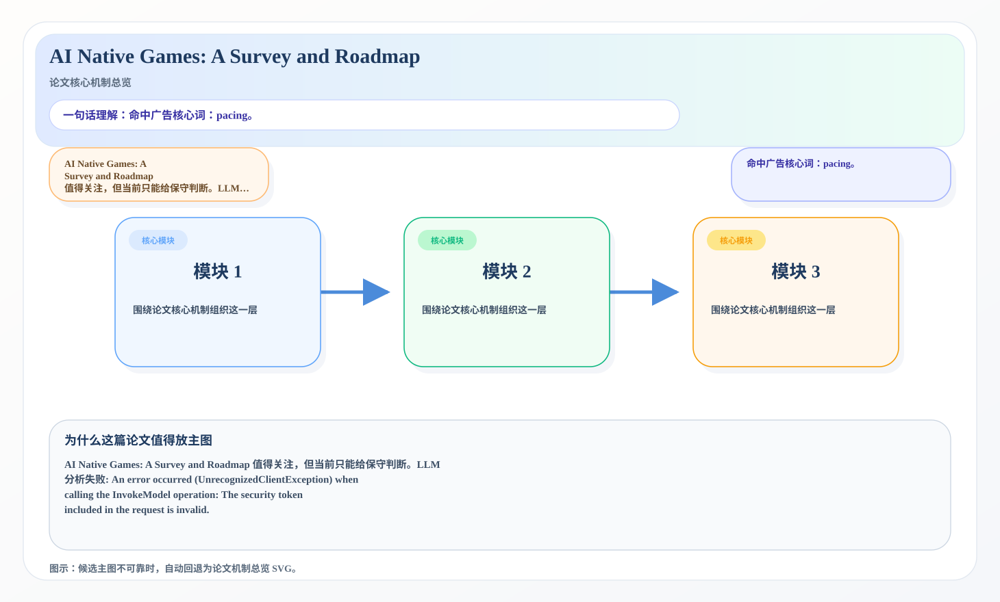
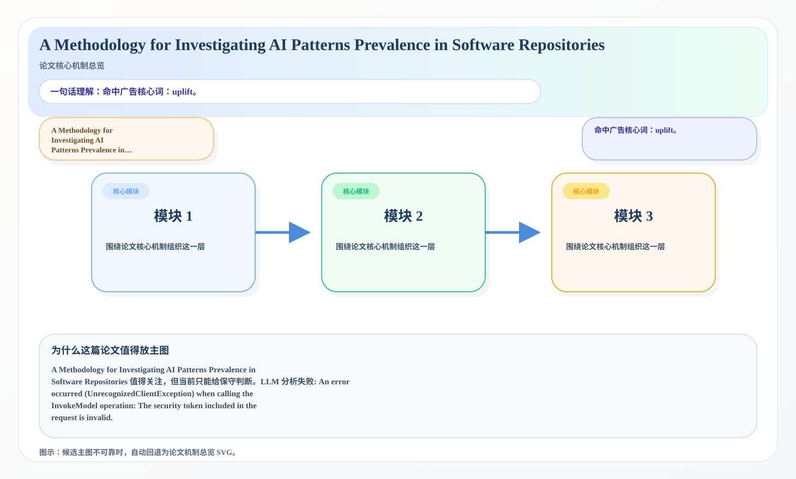

# 2026-07-02 论文日报

## 一、今日趋势与创新观察

### 1. 趋势概况

- 今天一共抓到 291 篇论文，趋势概况优先基于全量抓取结果而不是只看最后保留的候选。
- 从全量论文看，主题最集中的方向是：LLM 与语言理解、表示学习与检索排序、Agent 与多智能体。
- 进入候选池的工作里，直接广告 4 篇、强迁移 17 篇、大公司线索 2 篇，说明今天既有直接商业化问题，也有可迁移的方法论输入。

### 2. 推荐系统 / 排序相关创新点

- 《Distill to Detect: Exposing Stealth Biases in LLMs through Cartridge Distillation》：亮点信号：tool, dit, projection, cache；主题：迁移学习与跨域泛化、LLM 与语言理解；来自全量抓取的补充观察
- 《Attribute-Prompted Kernel Hashing for Unsupervised Data-Efficient Cross-Modal Retrieval》：亮点信号：alignment, constraint, semantic, context；主题：迁移学习与跨域泛化、LLM 与语言理解；候选属性：一般相关论文
- 《TRCGL-Net: A Long-Tailed Multi-Label Chest X-Ray Classification Framework with Generative Data Augmentation and Label Co-Occurrence Modeling》：亮点信号：diffusion, dit, constraint, semantic；主题：表示学习与检索排序；候选属性：强迁移论文

### 3. 全局创新点

- 《UltraFlux: Data-Model Co-Design for High-quality Native 4K Text-to-Image Generation across Diverse Aspect Ratios》：亮点信号：diffusion, dit, compression, alignment；主题：LLM 与语言理解；公司线索：Meta；候选属性：大公司优先论文

## 二、今日入选论文

### 1. AI Native Games: A Survey and Roadmap
- 挑选理由：命中广告核心词：pacing。

### 2. A Methodology for Investigating AI Patterns Prevalence in Software Repositories
- 挑选理由：命中广告核心词：uplift。

## 三、补充关注

1. **Attribute-Prompted Kernel Hashing for Unsupervised Data-Efficient Cross-Modal Retrieval**
   - 理由：有一定相关信号，但不足以进入正式候选：retrieval。
2. **Constructive Alignment: Governing Preference Dynamics in Human-AI Interaction**
   - 理由：有一定相关信号，但不足以进入正式候选：long-term value。
3. **DeWorldSG: Depth-Aware 3D Semantic Scene Graph Generation via World-Model Priors**
   - 理由：有一定相关信号，但不足以进入正式候选：recall。
4. **Predicting Lethal Outcome (Cause) And Understanding Key Biomarkers Linked With Acute Myocardial Infarction Using Deep Artificial Neural Network And Ensemble Of Machine Learning Methodologies**
   - 理由：有一定相关信号，但不足以进入正式候选：recall。
5. **MalariAI: A Label-Resilient Decoupled Framework for Universal Cell Segmentation and Explainable Stage Classification in Dense Malaria Blood Smears**
   - 理由：有一定相关信号，但不足以进入正式候选：recall。
6. **Learning When to Listen: Gated Affect Fusion for Human Motion Prediction**
   - 理由：有一定相关信号，但不足以进入正式候选：counterfactual。
7. **FRAME: Learning the Adaptation Domain with a Mixture of Fractional-Fourier Experts**
   - 理由：有一定相关信号，但不足以进入正式候选：multi-task。
8. **SemiScope: Disentangling Classifier Tuning and Joint Optimization in Semi-Supervised Security Classification**
   - 理由：有一定相关信号，但不足以进入正式候选：recommendation。
9. **Bridging Quantum Computing Paradigms toward Semiconductor Yield: A Controlled CV-versus-DV Comparison on Wafer-Map Defect Classification**
   - 理由：有一定相关信号，但不足以进入正式候选：recall。
10. **Sample Complexities of Estimating Gumbel--Max Watermark Proportions with and without Reduction to Pivotal Statistics**
   - 理由：有一定相关信号，但不足以进入正式候选：matching。

## 四、重点论文精读

### 1. AI Native Games: A Survey and Roadmap
- **为什么值得看：** 命中广告核心词：pacing。
- **背景：** AI Native Games: A Survey and Roadmap 值得关注，但当前只能给保守判断。LLM 分析失败: An error occurred (UnrecognizedClientException) when calling the InvokeModel operation: The security token included in the request is invalid.

*图示：候选主图不可靠，已回退为论文核心机制总览 SVG。*

- **当前状态：** llm_failed（LLM 分析失败: An error occurred (UnrecognizedClientException) when calling the InvokeModel operation: The security token included in the request is invalid.）
- **核心技术点：** 本次精读未成功，暂不展示结构化核心点，避免误导。
- **对广告的启发：** 暂时只保留候选判断，建议稍后重试精读。

### 2. A Methodology for Investigating AI Patterns Prevalence in Software Repositories
- **为什么值得看：** 命中广告核心词：uplift。
- **背景：** A Methodology for Investigating AI Patterns Prevalence in Software Repositories 值得关注，但当前只能给保守判断。LLM 分析失败: An error occurred (UnrecognizedClientException) when calling the InvokeModel operation: The security token included in the request is invalid.

*图示：候选主图不可靠，已回退为论文核心机制总览 SVG。*

- **当前状态：** llm_failed（LLM 分析失败: An error occurred (UnrecognizedClientException) when calling the InvokeModel operation: The security token included in the request is invalid.）
- **核心技术点：** 本次精读未成功，暂不展示结构化核心点，避免误导。
- **对广告的启发：** 暂时只保留候选判断，建议稍后重试精读。

## 五、候选但未完成深读的论文

- **AI Native Games: A Survey and Roadmap**
  - 状态：llm_failed
  - 原因：LLM 分析失败: An error occurred (UnrecognizedClientException) when calling the InvokeModel operation: The security token included in the request is invalid.
- **A Methodology for Investigating AI Patterns Prevalence in Software Repositories**
  - 状态：llm_failed
  - 原因：LLM 分析失败: An error occurred (UnrecognizedClientException) when calling the InvokeModel operation: The security token included in the request is invalid.
