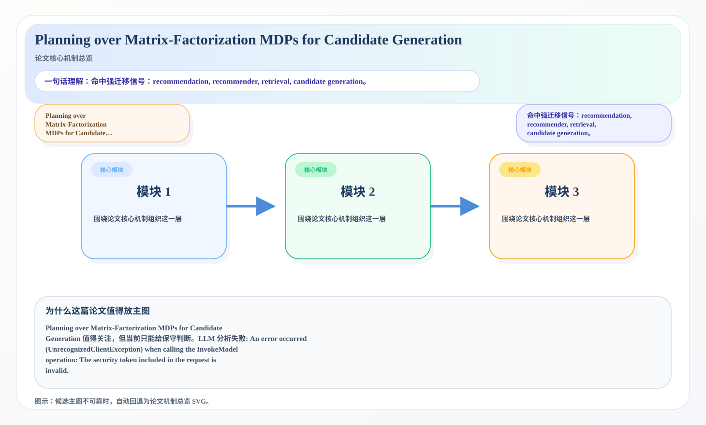
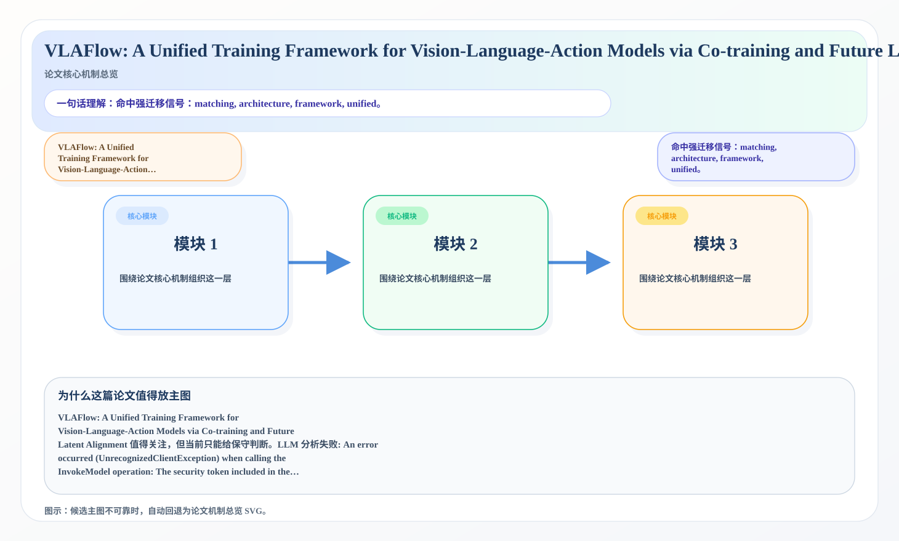

# 2026-07-03 论文日报

## 一、今日趋势与创新观察

### 1. 趋势概况

- 今天一共抓到 341 篇论文，趋势概况优先基于全量抓取结果而不是只看最后保留的候选。
- 从全量论文看，主题最集中的方向是：LLM 与语言理解、表示学习与检索排序、Agent 与多智能体。
- 进入候选池的工作里，直接广告 0 篇、强迁移 15 篇、大公司线索 4 篇，说明今天既有直接商业化问题，也有可迁移的方法论输入。

### 2. 推荐系统 / 排序相关创新点

- 《Pmeta-TLA: Backdoor Attacks for Speech Classification Models via Meta-Learning with Timbre Leakage Attack》：亮点信号：attack, tool, dit, embedding；主题：表示学习与检索排序；公司线索：Meta；候选属性：大公司优先论文
- 《SABER: A Semantic-Aligned Brain Network Analysis Framework via Multi-scale Hypergraphs》：亮点信号：dit, alignment, embedding, robust；主题：LLM 与语言理解、表示学习与检索排序；来自全量抓取的补充观察
- 《ContextNest: Verifiable Context Governance for Autonomous AI Agent》：亮点信号：attack, dit, context；主题：Agent 与多智能体、表示学习与检索排序；公司线索：Meta；候选属性：大公司优先论文

### 3. 全局创新点

- 《ElephantAgent: Contextual State Continuity in Agentic Systems》：亮点信号：attack, tool, dit, semantic；主题：Agent 与多智能体；来自全量抓取的补充观察

## 二、今日入选论文

### 1. Planning over Matrix-Factorization MDPs for Candidate Generation
- 挑选理由：命中强迁移信号：recommendation, recommender, retrieval, candidate generation。

### 2. VLAFlow: A Unified Training Framework for Vision-Language-Action Models via Co-training and Future Latent Alignment
- 挑选理由：命中强迁移信号：matching, architecture, framework, unified。

## 三、补充关注

1. **Hidden Forgetting in Continual Multimodal Learning: When Accuracy Survives but Grounding Fails**
   - 理由：有一定相关信号，但不足以进入正式候选：counterfactual。
2. **Distributionally Robust Listwise Preference Optimization**
   - 理由：有一定相关信号，但不足以进入正式候选：ranking。
3. **Profit-Based Counterfactual Explanations for Product Improvement: A Case Study of Manga Sales in Japan**
   - 理由：有一定相关信号，但不足以进入正式候选：counterfactual。
4. **Program-as-Weights: A Programming Paradigm for Fuzzy Functions**
   - 理由：有一定相关信号，但不足以进入正式候选：ranking。
5. **OrbitQuant: Data-Agnostic Quantization for Image and Video Diffusion Transformers**
   - 理由：有一定相关信号，但不足以进入正式候选：calibration。
6. **Challenges and Recommendations for LLMs-as-a-Judge in Multilingual Settings and Low-Resource Languages**
   - 理由：有一定相关信号，但不足以进入正式候选：recommendation。
7. **Predicting Early Stages Of Alzheimer's Disease And Identifying Key Biomarkers Using Deep Artificial Neural Network And Ensemble Of Machine Learning Methodologies**
   - 理由：有一定相关信号，但不足以进入正式候选：recall。
8. **Beyond the Performance Illusion: Structure-Aware Stratified Partitioning and Curriculum Distributionally Robust Optimization for Spatially Correlated Domains**
   - 理由：有一定相关信号，但不足以进入正式候选：calibration。
9. **Conditional Co-Ablation: Recovering Self-Repair Backups in Transformer Circuits**
   - 理由：有一定相关信号，但不足以进入正式候选：counterfactual。
10. **Population-Based Multi-Objective Training of Discriminators for Semi-Supervised GANs**
   - 理由：有一定相关信号，但不足以进入正式候选：multi-objective。

## 四、重点论文精读

### 1. Planning over Matrix-Factorization MDPs for Candidate Generation
- **为什么值得看：** 命中强迁移信号：recommendation, recommender, re…
- **背景：** Planning over Matrix-Factorization MDPs for Candidate Generation 值得关注，但当前只能给保守判断。LLM 分析失败: An error occurred (UnrecognizedClientException) when calling the InvokeModel operation: The security token included in the request is invalid.

*图示：候选主图不可靠，已回退为论文核心机制总览 SVG。*

- **当前状态：** llm_failed（LLM 分析失败: An error occurred (UnrecognizedClientException) when calling the InvokeModel operation: The security token included in the request is invalid.）
- **核心技术点：** 本次精读未成功，暂不展示结构化核心点，避免误导。
- **对广告的启发：** 暂时只保留候选判断，建议稍后重试精读。

### 2. VLAFlow: A Unified Training Framework for Vision-Language-Action Models via Co-training and Future Latent Alignment
- **为什么值得看：** 命中强迁移信号：matching, architecture, framewo…
- **背景：** VLAFlow: A Unified Training Framework for Vision-Language-Action Models via Co-training and Future Latent Alignment 值得关注，但当前只能给保守判断。LLM 分析失败: An error occurred (UnrecognizedClientException) when calling the InvokeModel operation: The security token included in the request is invalid.

*图示：候选主图不可靠，已回退为论文核心机制总览 SVG。*

- **当前状态：** llm_failed（LLM 分析失败: An error occurred (UnrecognizedClientException) when calling the InvokeModel operation: The security token included in the request is invalid.）
- **核心技术点：** 本次精读未成功，暂不展示结构化核心点，避免误导。
- **对广告的启发：** 暂时只保留候选判断，建议稍后重试精读。

## 五、候选但未完成深读的论文

- **Planning over Matrix-Factorization MDPs for Candidate Generation**
  - 状态：llm_failed
  - 原因：LLM 分析失败: An error occurred (UnrecognizedClientException) when calling the InvokeModel operation: The security token included in the request is invalid.
- **VLAFlow: A Unified Training Framework for Vision-Language-Action Models via Co-training and Future Latent Alignment**
  - 状态：llm_failed
  - 原因：LLM 分析失败: An error occurred (UnrecognizedClientException) when calling the InvokeModel operation: The security token included in the request is invalid.
