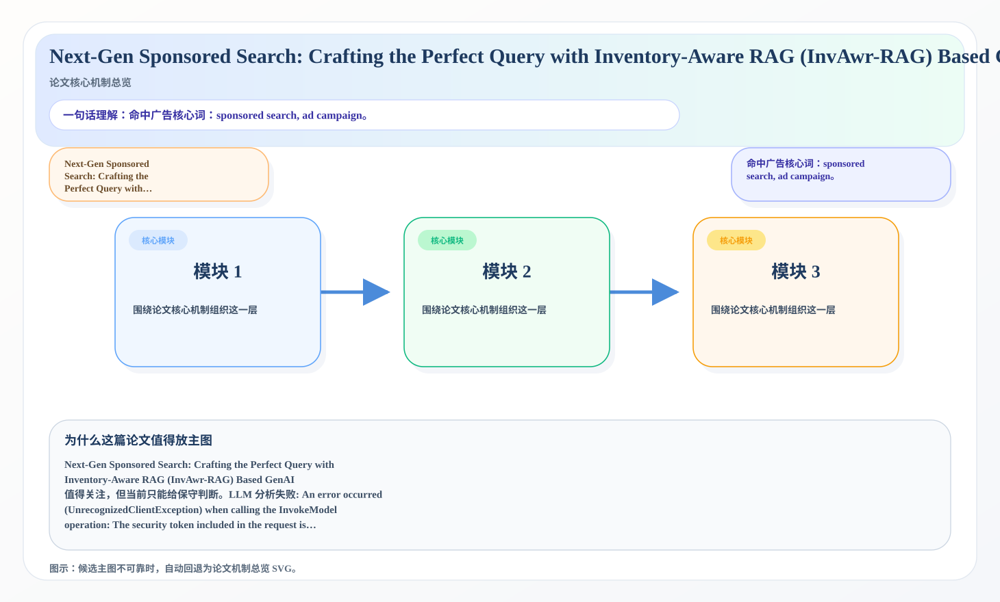
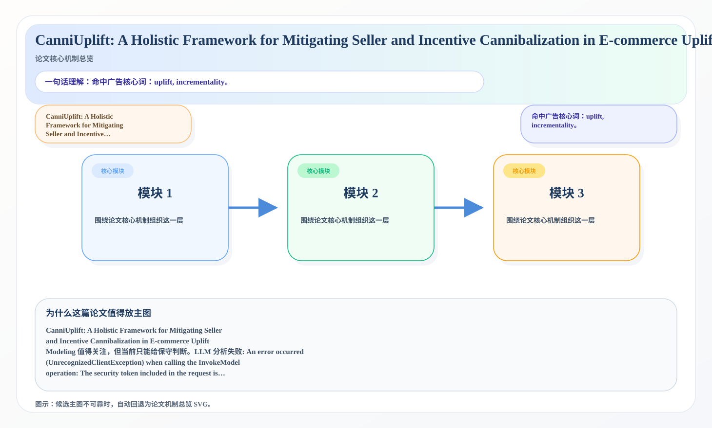

# 2026-07-07 论文日报

## 一、今日趋势与创新观察

### 1. 趋势概况

- 今天一共抓到 744 篇论文，趋势概况优先基于全量抓取结果而不是只看最后保留的候选。
- 从全量论文看，主题最集中的方向是：LLM 与语言理解、表示学习与检索排序、Agent 与多智能体。
- 进入候选池的工作里，直接广告 7 篇、强迁移 36 篇、大公司线索 2 篇，说明今天既有直接商业化问题，也有可迁移的方法论输入。

### 2. 推荐系统 / 排序相关创新点

- 《PLACEMEM: Toward a Compute-Aware Memory Plane for Lifelong Agents》：亮点信号：dit, semantic, memory, context；主题：LLM 与语言理解、Agent 与多智能体；公司线索：Meta；候选属性：大公司优先论文
- 《SovereignPA-Bench: Evaluating User-Owned Personal Agents under Evolving Intent, Platform Mediation, and Consent Constraints》：亮点信号：tool, dit, alignment, constraint；主题：LLM 与语言理解、Agent 与多智能体；来自全量抓取的补充观察
- 《MRMS: A Multi-Resolution Memory Substrate for Long-Lived AI Agents》：亮点信号：projection, constraint, semantic, memory；主题：LLM 与语言理解、Agent 与多智能体；来自全量抓取的补充观察

### 3. 全局创新点

- 《When Aggregate Alignment Misleads: Auditing Policy Repair Without Per-State Expert Actions》：亮点信号：closed-loop, dit, projection, alignment；主题：LLM 与语言理解、Agent 与多智能体；来自全量抓取的补充观察

## 二、今日入选论文

### 1. Next-Gen Sponsored Search: Crafting the Perfect Query with Inventory-Aware RAG (InvAwr-RAG) Based GenAI
- 挑选理由：命中广告核心词：sponsored search, ad campaign。

### 2. CanniUplift: A Holistic Framework for Mitigating Seller and Incentive Cannibalization in E-commerce Uplift Modeling
- 挑选理由：命中广告核心词：uplift, incrementality。

## 三、补充关注

1. **ResearchStudio-Idea: An Evidence-Grounded Research-Ideation Skill Suite from ML Conference Outcomes**
   - 理由：有一定相关信号，但不足以进入正式候选：retrieval。
2. **Explainable AI for Screening Abuse-Related Trauma in Bangladeshi Children: A Training-Free Multimodal Framework Evaluated on Noise-Aware Synthetic Data**
   - 理由：有一定相关信号，但不足以进入正式候选：calibration。
3. **Online Linear Programming for Multi-Objective Routing in LLM Serving**
   - 理由：有一定相关信号，但不足以进入正式候选：multi-objective。
4. **Interpretable Human-Label-Free Deep Learning for Real-Bogus Classification with Uncertainty Quantification**
   - 理由：有一定相关信号，但不足以进入正式候选：calibration。
5. **Training-Free Model Selection and Domain-Aware Score Calibration for First-Shot Anomalous Sound Detection**
   - 理由：有一定相关信号，但不足以进入正式候选：calibration。
6. **Two Black Boxes, One Solver: Encoder Probing and Decoder Attribution for Neural Multi-Attribute VRP under Hard-Mask and Recourse Decoders**
   - 理由：有一定相关信号，但不足以进入正式候选：counterfactual。
7. **evalci: A Python Library for Statistically Rigorous Comparison of Language Model Evaluations**
   - 理由：有一定相关信号，但不足以进入正式候选：ranking。
8. **HiFA4: Training-Free 4-bit FlashAttention on Ascend HIF4 NPUs for LLM Inference**
   - 理由：有一定相关信号，但不足以进入正式候选：calibration。
9. **Consistent but Miscalibrated: Evaluating LLM Limitations for Risk Communication in Natural Language**
   - 理由：有一定相关信号，但不足以进入正式候选：calibration。
10. **EPRA U-Net: An Efficient Pyramid Residual Attention Framework for Accurate Infarct Segmentation in Diffusion-Weighted MRI**
   - 理由：有一定相关信号，但不足以进入正式候选：recall。

## 四、重点论文精读

### 1. Next-Gen Sponsored Search: Crafting the Perfect Query with Inventory-Aware RAG (InvAwr-RAG) Based GenAI
- **为什么值得看：** 命中广告核心词：sponsored search, ad campaign。
- **背景：** Next-Gen Sponsored Search: Crafting the Perfect Query with Inventory-Aware RAG (InvAwr-RAG) Based GenAI 值得关注，但当前只能给保守判断。LLM 分析失败: An error occurred (UnrecognizedClientException) when calling the InvokeModel operation: The security token included in the request is invalid.

*图示：候选主图不可靠，已回退为论文核心机制总览 SVG。*

- **当前状态：** llm_failed（LLM 分析失败: An error occurred (UnrecognizedClientException) when calling the InvokeModel operation: The security token included in the request is invalid.）
- **核心技术点：** 本次精读未成功，暂不展示结构化核心点，避免误导。
- **对广告的启发：** 暂时只保留候选判断，建议稍后重试精读。

### 2. CanniUplift: A Holistic Framework for Mitigating Seller and Incentive Cannibalization in E-commerce Uplift Modeling
- **为什么值得看：** 命中广告核心词：uplift, incrementality。
- **背景：** CanniUplift: A Holistic Framework for Mitigating Seller and Incentive Cannibalization in E-commerce Uplift Modeling 值得关注，但当前只能给保守判断。LLM 分析失败: An error occurred (UnrecognizedClientException) when calling the InvokeModel operation: The security token included in the request is invalid.

*图示：候选主图不可靠，已回退为论文核心机制总览 SVG。*

- **当前状态：** llm_failed（LLM 分析失败: An error occurred (UnrecognizedClientException) when calling the InvokeModel operation: The security token included in the request is invalid.）
- **核心技术点：** 本次精读未成功，暂不展示结构化核心点，避免误导。
- **对广告的启发：** 暂时只保留候选判断，建议稍后重试精读。

## 五、候选但未完成深读的论文

- **Next-Gen Sponsored Search: Crafting the Perfect Query with Inventory-Aware RAG (InvAwr-RAG) Based GenAI**
  - 状态：llm_failed
  - 原因：LLM 分析失败: An error occurred (UnrecognizedClientException) when calling the InvokeModel operation: The security token included in the request is invalid.
- **CanniUplift: A Holistic Framework for Mitigating Seller and Incentive Cannibalization in E-commerce Uplift Modeling**
  - 状态：llm_failed
  - 原因：LLM 分析失败: An error occurred (UnrecognizedClientException) when calling the InvokeModel operation: The security token included in the request is invalid.
