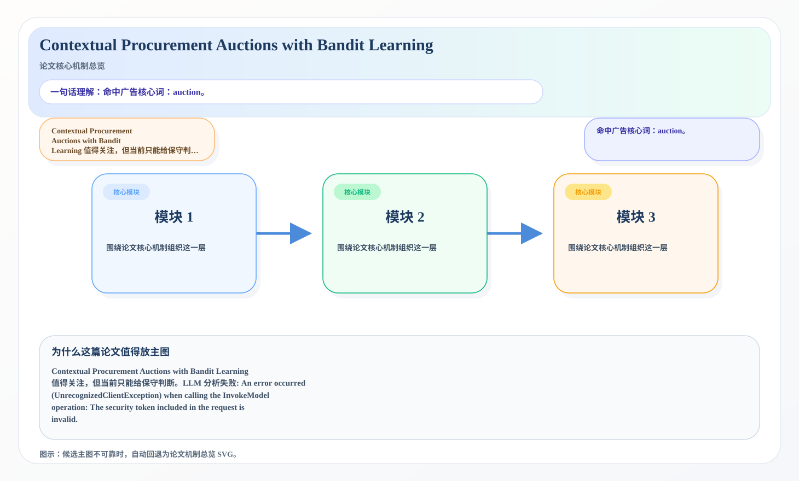
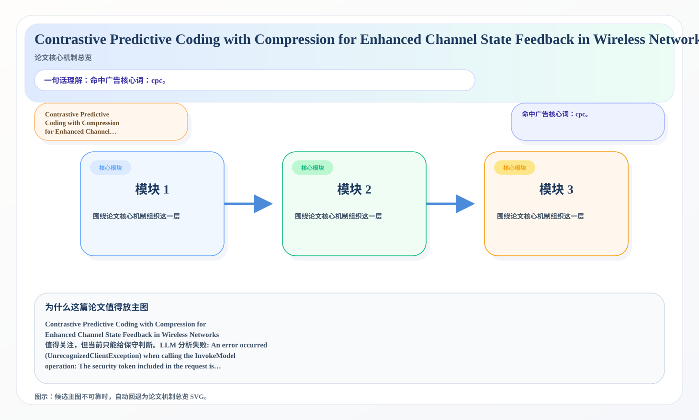

# 2026-07-08 论文日报

## 一、今日趋势与创新观察

### 1. 趋势概况

- 今天一共抓到 273 篇论文，趋势概况优先基于全量抓取结果而不是只看最后保留的候选。
- 从全量论文看，主题最集中的方向是：LLM 与语言理解、表示学习与检索排序、Agent 与多智能体。
- 进入候选池的工作里，直接广告 2 篇、强迁移 18 篇、大公司线索 2 篇，说明今天既有直接商业化问题，也有可迁移的方法论输入。

### 2. 推荐系统 / 排序相关创新点

- 《DepthWeave-KV: Token-Adaptive Cross-Layer Residual Factorization for Long-Context KV Cache Compression》：亮点信号：dit, projection, compression, cache；主题：LLM 与语言理解、表示学习与检索排序；来自全量抓取的补充观察
- 《Inject or Navigate? Token-Efficient Retrieval for LLM Analysis of Transactional Legal Documents》：亮点信号：cache, embedding, semantic, context；主题：LLM 与语言理解、表示学习与检索排序；候选属性：强迁移论文
- 《PORTS: Preference-Optimized Retrievers for Tool Selection with Large Language Models》：亮点信号：tool, alignment, constraint, semantic；主题：迁移学习与跨域泛化、LLM 与语言理解；候选属性：一般相关论文

### 3. 全局创新点

- 今天暂时没有足够稳定的全局创新点可总结。

## 二、今日入选论文

### 1. Contextual Procurement Auctions with Bandit Learning
- 挑选理由：命中广告核心词：auction。

### 2. Contrastive Predictive Coding with Compression for Enhanced Channel State Feedback in Wireless Networks
- 挑选理由：命中广告核心词：cpc。

## 三、补充关注

1. **Scientific Code Search at Scale: A Multi-Domain Dataset and Benchmark**
   - 理由：有一定相关信号，但不足以进入正式候选：retrieval。
2. **PORTS: Preference-Optimized Retrievers for Tool Selection with Large Language Models**
   - 理由：有一定相关信号，但不足以进入正式候选：retrieval。
3. **Synthetic Consumer Insight Generation with Large Language Models**
   - 理由：有一定相关信号，但不足以进入正式候选：recommendation。
4. **Pitwall: Faithful Natural-Language Race-Strategy Briefings from a Calibrated Real-Time Monte Carlo Engine**
   - 理由：有一定相关信号，但不足以进入正式候选：calibration。
5. **Complementary Roles of Image Classification and Vessel Segmentation in AI-Based Screening for Retinopathy of Prematurity Plus Disease in a Kenyan Preterm Cohort**
   - 理由：有一定相关信号，但不足以进入正式候选：multi-task。
6. **Safe Bayesian Optimization with Counterfactual Policies**
   - 理由：有一定相关信号，但不足以进入正式候选：counterfactual。
7. **Full-range Binary Classifier Calibration for Stable Model Updates in Production**
   - 理由：有一定相关信号，但不足以进入正式候选：calibration。
8. **Entanglement as a Structural Complexity Axis: A PAC-Bayesian View of Generalization in Quantum Policies and Value Functions**
   - 理由：有一定相关信号，但不足以进入正式候选：ranking。
9. **On the Condition Number Upper Bound of the L-BFGS Inverse Hessian Approximation Matrix with a Two-Sided Geometric Envelope Safeguarding Mechanism**
   - 理由：有一定相关信号，但不足以进入正式候选：matching。
10. **REVIVE: A Multi-Modal Framework for Vandalism Detection and Recovery in Autonomous Vehicles**
   - 理由：有一定相关信号，但不足以进入正式候选：recall。

## 四、重点论文精读

### 1. Contextual Procurement Auctions with Bandit Learning
- **为什么值得看：** 命中广告核心词：auction。
- **背景：** Contextual Procurement Auctions with Bandit Learning 值得关注，但当前只能给保守判断。LLM 分析失败: An error occurred (UnrecognizedClientException) when calling the InvokeModel operation: The security token included in the request is invalid.

*图示：候选主图不可靠，已回退为论文核心机制总览 SVG。*

- **当前状态：** llm_failed（LLM 分析失败: An error occurred (UnrecognizedClientException) when calling the InvokeModel operation: The security token included in the request is invalid.）
- **核心技术点：** 本次精读未成功，暂不展示结构化核心点，避免误导。
- **对广告的启发：** 暂时只保留候选判断，建议稍后重试精读。

### 2. Contrastive Predictive Coding with Compression for Enhanced Channel State Feedback in Wireless Networks
- **为什么值得看：** 命中广告核心词：cpc。
- **背景：** Contrastive Predictive Coding with Compression for Enhanced Channel State Feedback in Wireless Networks 值得关注，但当前只能给保守判断。LLM 分析失败: An error occurred (UnrecognizedClientException) when calling the InvokeModel operation: The security token included in the request is invalid.

*图示：候选主图不可靠，已回退为论文核心机制总览 SVG。*

- **当前状态：** llm_failed（LLM 分析失败: An error occurred (UnrecognizedClientException) when calling the InvokeModel operation: The security token included in the request is invalid.）
- **核心技术点：** 本次精读未成功，暂不展示结构化核心点，避免误导。
- **对广告的启发：** 暂时只保留候选判断，建议稍后重试精读。

## 五、候选但未完成深读的论文

- **Contextual Procurement Auctions with Bandit Learning**
  - 状态：llm_failed
  - 原因：LLM 分析失败: An error occurred (UnrecognizedClientException) when calling the InvokeModel operation: The security token included in the request is invalid.
- **Contrastive Predictive Coding with Compression for Enhanced Channel State Feedback in Wireless Networks**
  - 状态：llm_failed
  - 原因：LLM 分析失败: An error occurred (UnrecognizedClientException) when calling the InvokeModel operation: The security token included in the request is invalid.
