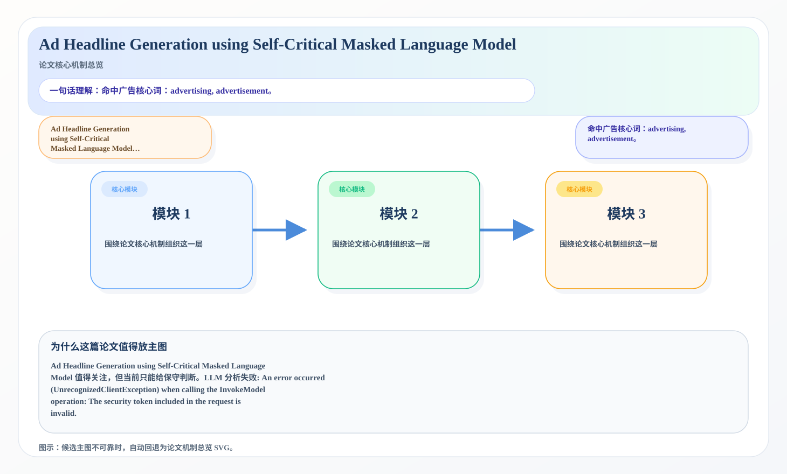
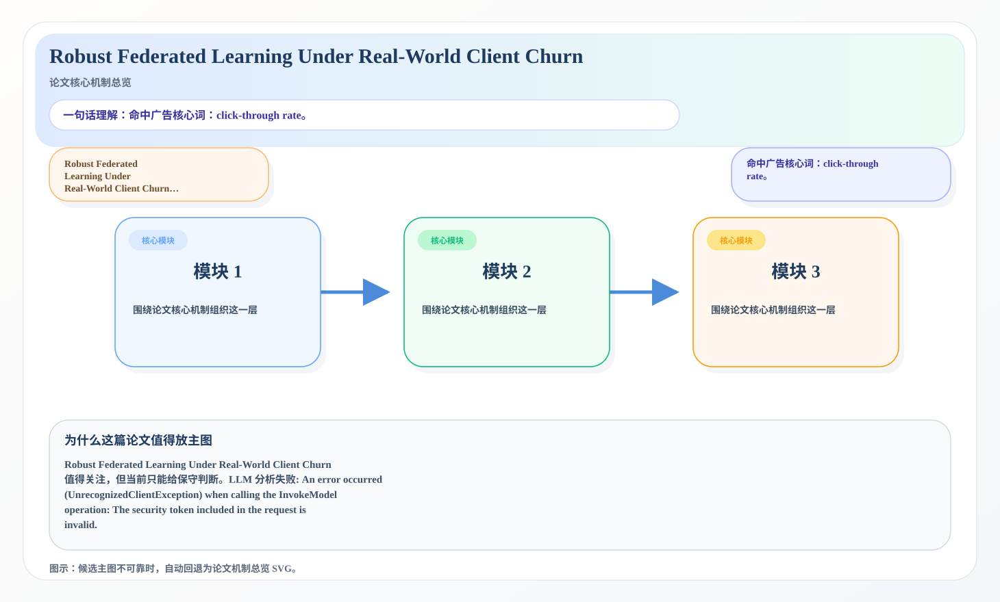

# 2026-07-09 论文日报

## 一、今日趋势与创新观察

### 1. 趋势概况

- 今天一共抓到 262 篇论文，趋势概况优先基于全量抓取结果而不是只看最后保留的候选。
- 从全量论文看，主题最集中的方向是：LLM 与语言理解、表示学习与检索排序、Agent 与多智能体。
- 进入候选池的工作里，直接广告 4 篇、强迁移 17 篇、大公司线索 1 篇，说明今天既有直接商业化问题，也有可迁移的方法论输入。

### 2. 推荐系统 / 排序相关创新点

- 《MILES: Modular Instruction Memory with Learnable Selection for Self-Improving LLM Reasoning》：亮点信号：dit, embedding, constraint, robust；主题：迁移学习与跨域泛化、LLM 与语言理解；来自全量抓取的补充观察

### 3. 全局创新点

- 《Memory Scarcity, Open Models, and the Restructuring of the AI Industry, 2026-2030 -- A quantitative scenario analysis of inference economics, training-cost divergence, and infrastructure solvency》：亮点信号：dit, projection, compression, cache；主题：商业化决策与资源优化；公司线索：Meta；候选属性：大公司优先论文
- 《Heterogeneity-Adaptive Diffusion Schrodinger Bridge for PET-Guided Whole-Body MRI Translation》：亮点信号：diffusion, embedding, context；主题：迁移学习与跨域泛化、LLM 与语言理解；公司线索：Meta；候选属性：大公司优先论文
- 《Online Data Selection Is Implicit Alignment》：亮点信号：dit, alignment, data selection, robust；主题：商业化决策与资源优化；候选属性：强迁移论文

## 二、今日入选论文

### 1. Ad Headline Generation using Self-Critical Masked Language Model
- 挑选理由：命中广告核心词：advertising, advertisement。

### 2. Robust Federated Learning Under Real-World Client Churn
- 挑选理由：命中广告核心词：click-through rate。

## 三、补充关注

1. **Grounding Spatial Relations in a Compact World Model: Instruction Leakage and a Goal-Free Dynamics Fix**
   - 理由：有一定相关信号，但不足以进入正式候选：counterfactual。
2. **Stability of Flow Models for Graph Signals**
   - 理由：有一定相关信号，但不足以进入正式候选：matching。
3. **Do Counterfactually Fair Image Classifiers Satisfy Group Fairness? -- A Theoretical and Empirical Study**
   - 理由：有一定相关信号，但不足以进入正式候选：counterfactual。
4. **How Data Shapes RoPE Frequency Usage: From Positional Scale Matching to Length Generalization**
   - 理由：有一定相关信号，但不足以进入正式候选：matching。
5. **Nonlinear Bandit**
   - 理由：有一定相关信号，但不足以进入正式候选：recommendation。
6. **Best-Arm Identification with Generative Proxy**
   - 理由：有一定相关信号，但不足以进入正式候选：calibration。
7. **Efficient Bayesian Deep Ensembles via Analytic Predictive Inference**
   - 理由：有一定相关信号，但不足以进入正式候选：calibration。
8. **Does Bielik Know What It Doesn't Know? Activation Dispersion Separates Entity Familiarity from Factual Reliability Across Model Scale**
   - 理由：有一定相关信号，但不足以进入正式候选：counterfactual。
9. **Calibration-Family Overfit: Why Trusted Sabotage Monitors Don't Transfer Across Lineages**
   - 理由：有一定相关信号，但不足以进入正式候选：calibration。

## 四、重点论文精读

### 1. Ad Headline Generation using Self-Critical Masked Language Model
- **为什么值得看：** 命中广告核心词：advertising, advertisement。
- **背景：** Ad Headline Generation using Self-Critical Masked Language Model 值得关注，但当前只能给保守判断。LLM 分析失败: An error occurred (UnrecognizedClientException) when calling the InvokeModel operation: The security token included in the request is invalid.

*图示：候选主图不可靠，已回退为论文核心机制总览 SVG。*

- **当前状态：** llm_failed（LLM 分析失败: An error occurred (UnrecognizedClientException) when calling the InvokeModel operation: The security token included in the request is invalid.）
- **核心技术点：** 本次精读未成功，暂不展示结构化核心点，避免误导。
- **对广告的启发：** 暂时只保留候选判断，建议稍后重试精读。

### 2. Robust Federated Learning Under Real-World Client Churn
- **为什么值得看：** 命中广告核心词：click-through rate。
- **背景：** Robust Federated Learning Under Real-World Client Churn 值得关注，但当前只能给保守判断。LLM 分析失败: An error occurred (UnrecognizedClientException) when calling the InvokeModel operation: The security token included in the request is invalid.

*图示：候选主图不可靠，已回退为论文核心机制总览 SVG。*

- **当前状态：** llm_failed（LLM 分析失败: An error occurred (UnrecognizedClientException) when calling the InvokeModel operation: The security token included in the request is invalid.）
- **核心技术点：** 本次精读未成功，暂不展示结构化核心点，避免误导。
- **对广告的启发：** 暂时只保留候选判断，建议稍后重试精读。

## 五、候选但未完成深读的论文

- **Ad Headline Generation using Self-Critical Masked Language Model**
  - 状态：llm_failed
  - 原因：LLM 分析失败: An error occurred (UnrecognizedClientException) when calling the InvokeModel operation: The security token included in the request is invalid.
- **Robust Federated Learning Under Real-World Client Churn**
  - 状态：llm_failed
  - 原因：LLM 分析失败: An error occurred (UnrecognizedClientException) when calling the InvokeModel operation: The security token included in the request is invalid.
