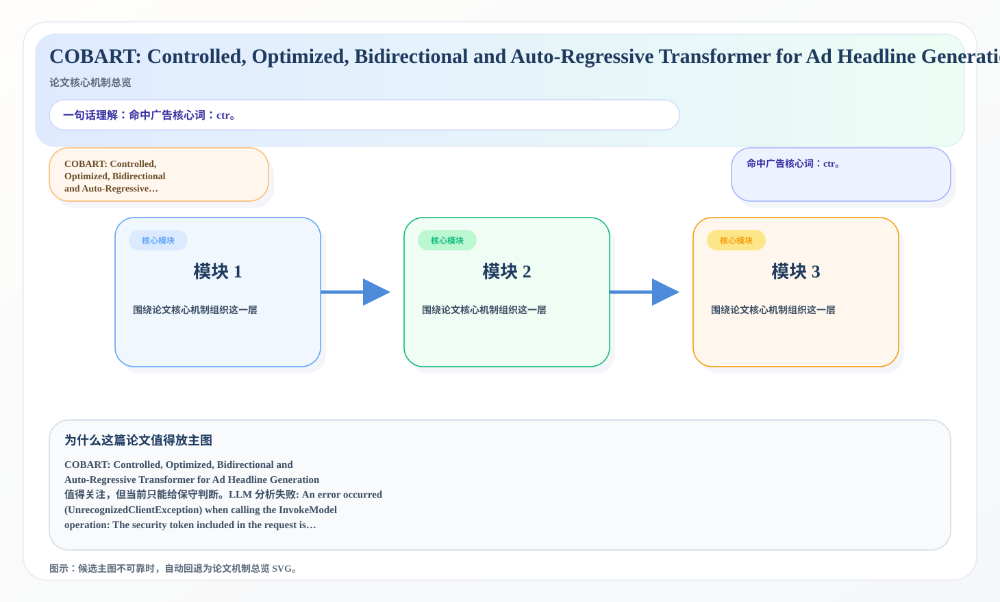
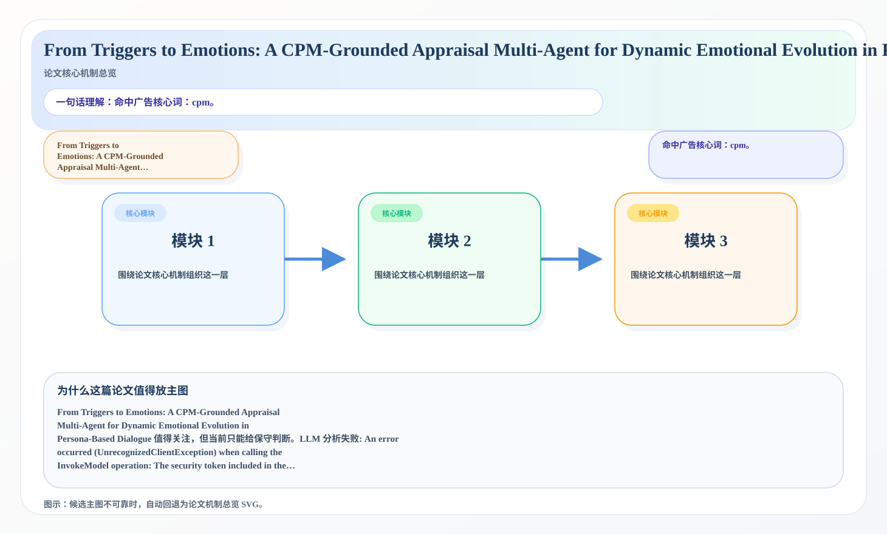

# 2026-07-10 论文日报

## 一、今日趋势与创新观察

### 1. 趋势概况

- 今天一共抓到 269 篇论文，趋势概况优先基于全量抓取结果而不是只看最后保留的候选。
- 从全量论文看，主题最集中的方向是：LLM 与语言理解、表示学习与检索排序、Agent 与多智能体。
- 进入候选池的工作里，直接广告 2 篇、强迁移 19 篇、大公司线索 2 篇，说明今天既有直接商业化问题，也有可迁移的方法论输入。

### 2. 推荐系统 / 排序相关创新点

- 《BiSCo-LLM: Lookup-Free Binary Spherical Coding for Extreme Low-Bit Large Language Model Compression》：亮点信号：dit, compression, memory；主题：LLM 与语言理解、表示学习与检索排序；公司线索：Meta；候选属性：大公司优先论文
- 《ARDY: Autoregressive Diffusion with Hybrid Representation for Interactive Human Motion Generation》：亮点信号：diffusion, dit, embedding, constraint；主题：LLM 与语言理解、表示学习与检索排序；来自全量抓取的补充观察
- 《H3D: Benchmarking Unsupervised Text Hashing for Fine-Grained Document Deduplication》：亮点信号：compression, embedding, robust, semantic；主题：表示学习与检索排序；候选属性：强迁移论文

### 3. 全局创新点

- 《What to Keep, What to Forget: A Rate--Distortion View of Memory Compaction in LLMs and Agents》：亮点信号：compression, cache, memory, context；主题：迁移学习与跨域泛化、LLM 与语言理解；来自全量抓取的补充观察

## 二、今日入选论文

### 1. COBART: Controlled, Optimized, Bidirectional and Auto-Regressive Transformer for Ad Headline Generation
- 挑选理由：命中广告核心词：ctr。

### 2. From Triggers to Emotions: A CPM-Grounded Appraisal Multi-Agent for Dynamic Emotional Evolution in Persona-Based Dialogue
- 挑选理由：命中广告核心词：cpm。

## 三、补充关注

1. **Applying JEPA-Style Predictive Learning to JA4-Derived Network Fingerprints**
   - 理由：有一定相关信号，但不足以进入正式候选：matching。
2. **When Synthetic Speech Is All You Have: Better Call GRPO**
   - 理由：有一定相关信号，但不足以进入正式候选：calibration。
3. **On the Role of Conversational Timing in Synthetic Training Data for ASR**
   - 理由：有一定相关信号，但不足以进入正式候选：multi-objective。
4. **Ensemble Diversity Optimization for Subjective Supervision**
   - 理由：有一定相关信号，但不足以进入正式候选：calibration。
5. **Eigenvalue Calibration for Semantic Embeddings of Large Language Models**
   - 理由：有一定相关信号，但不足以进入正式候选：calibration。
6. **Who Gets Missed in the Tail? Thresholded Subgroup Underdiagnosis in Long-Tailed Chest X-ray Classification**
   - 理由：有一定相关信号，但不足以进入正式候选：ranking。
7. **High-Dimensional Procrustes Matching via Tree Counts**
   - 理由：有一定相关信号，但不足以进入正式候选：matching。
8. **Predicting Viticulture Potential through an Ensemble of U-Net and a Geospatial Foundation Model**
   - 理由：有一定相关信号，但不足以进入正式候选：ranking。
9. **Revisiting One-Zero and Two-Zero Neutrino Mass Textures in Light of Recent Oscillation and Cosmological Data**
   - 理由：有一定相关信号，但不足以进入正式候选：matching。
10. **RadioDiff-v2: Generative Angular Radio Maps for Multi-Beam Selection and Localization**
   - 理由：有一定相关信号，但不足以进入正式候选：matching。

## 四、重点论文精读

### 1. COBART: Controlled, Optimized, Bidirectional and Auto-Regressive Transformer for Ad Headline Generation
- **为什么值得看：** 命中广告核心词：ctr。
- **背景：** COBART: Controlled, Optimized, Bidirectional and Auto-Regressive Transformer for Ad Headline Generation 值得关注，但当前只能给保守判断。LLM 分析失败: An error occurred (UnrecognizedClientException) when calling the InvokeModel operation: The security token included in the request is invalid.

*图示：候选主图不可靠，已回退为论文核心机制总览 SVG。*

- **当前状态：** llm_failed（LLM 分析失败: An error occurred (UnrecognizedClientException) when calling the InvokeModel operation: The security token included in the request is invalid.）
- **核心技术点：** 本次精读未成功，暂不展示结构化核心点，避免误导。
- **对广告的启发：** 暂时只保留候选判断，建议稍后重试精读。

### 2. From Triggers to Emotions: A CPM-Grounded Appraisal Multi-Agent for Dynamic Emotional Evolution in Persona-Based Dialogue
- **为什么值得看：** 命中广告核心词：cpm。
- **背景：** From Triggers to Emotions: A CPM-Grounded Appraisal Multi-Agent for Dynamic Emotional Evolution in Persona-Based Dialogue 值得关注，但当前只能给保守判断。LLM 分析失败: An error occurred (UnrecognizedClientException) when calling the InvokeModel operation: The security token included in the request is invalid.

*图示：候选主图不可靠，已回退为论文核心机制总览 SVG。*

- **当前状态：** llm_failed（LLM 分析失败: An error occurred (UnrecognizedClientException) when calling the InvokeModel operation: The security token included in the request is invalid.）
- **核心技术点：** 本次精读未成功，暂不展示结构化核心点，避免误导。
- **对广告的启发：** 暂时只保留候选判断，建议稍后重试精读。

## 五、候选但未完成深读的论文

- **COBART: Controlled, Optimized, Bidirectional and Auto-Regressive Transformer for Ad Headline Generation**
  - 状态：llm_failed
  - 原因：LLM 分析失败: An error occurred (UnrecognizedClientException) when calling the InvokeModel operation: The security token included in the request is invalid.
- **From Triggers to Emotions: A CPM-Grounded Appraisal Multi-Agent for Dynamic Emotional Evolution in Persona-Based Dialogue**
  - 状态：llm_failed
  - 原因：LLM 分析失败: An error occurred (UnrecognizedClientException) when calling the InvokeModel operation: The security token included in the request is invalid.
