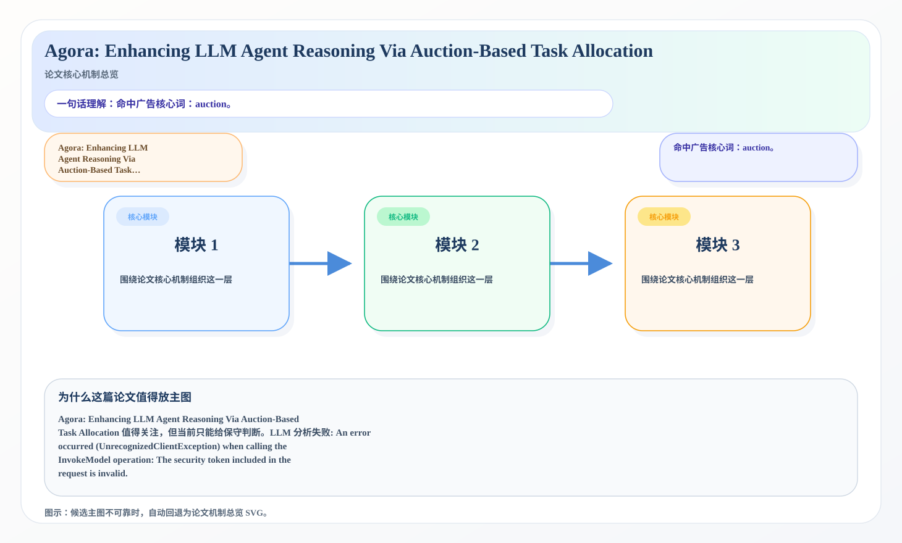
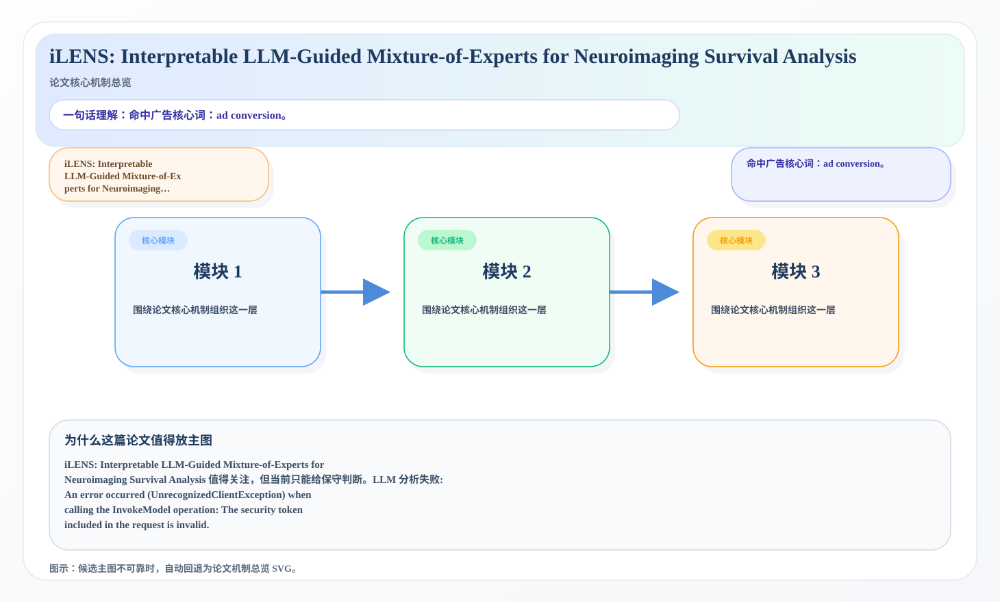

# 2026-07-13 论文日报

## 一、今日趋势与创新观察

### 1. 趋势概况

- 今天一共抓到 192 篇论文，趋势概况优先基于全量抓取结果而不是只看最后保留的候选。
- 从全量论文看，主题最集中的方向是：LLM 与语言理解、表示学习与检索排序、迁移学习与跨域泛化。
- 进入候选池的工作里，直接广告 2 篇、强迁移 19 篇、大公司线索 2 篇，说明今天既有直接商业化问题，也有可迁移的方法论输入。

### 2. 推荐系统 / 排序相关创新点

- 《ReGen: Hierarchical Multi-Prompt Representation Generation for Efficient Waveform Diffusion Models》：亮点信号：diffusion, dit, alignment, semantic；主题：迁移学习与跨域泛化、LLM 与语言理解；候选属性：强迁移论文
- 《From Raw IDs to Semantic Planning: How Recommender Systems Utilize Information at Scale》：亮点信号：dit, constraint, semantic, context；主题：LLM 与语言理解、表示学习与检索排序；候选属性：强迁移论文

### 3. 全局创新点

- 《Parameter-Efficient Vision-Language Adaptation with Continuous Metadata Conditioning for Animal Re-Identification》：亮点信号：dit, alignment, embedding, robust；主题：LLM 与语言理解、表示学习与检索排序；公司线索：Meta；候选属性：大公司优先论文
- 《Shared Selective Persistent Memory for Agentic LLM Systems》：亮点信号：tool, dit, constraint, memory；主题：迁移学习与跨域泛化、LLM 与语言理解；来自全量抓取的补充观察

## 二、今日入选论文

### 1. Agora: Enhancing LLM Agent Reasoning Via Auction-Based Task Allocation
- 挑选理由：命中广告核心词：auction。

### 2. iLENS: Interpretable LLM-Guided Mixture-of-Experts for Neuroimaging Survival Analysis
- 挑选理由：命中广告核心词：ad conversion。

## 三、补充关注

1. **Large-Scale Portfolio Optimization Problem Under Cardinality Constraint With Enhanced Multi-Objective Evolutionary Algorithms**
   - 理由：有一定相关信号，但不足以进入正式候选：multi-objective。
2. **Reward Transport: Property Control in Flow Matching via Noise-Space Alignment**
   - 理由：有一定相关信号，但不足以进入正式候选：matching。
3. **Pitfalls and Remedies for Multi-Task Bayesian Optimization**
   - 理由：有一定相关信号，但不足以进入正式候选：multi-task。
4. **Sensitivity-Aware Thresholding and Token Routing for Activation Sparsification in Large Language Models**
   - 理由：有一定相关信号，但不足以进入正式候选：calibration。
5. **GenVid2Robot: From Video Generation to Robot Manipulation via Rigid-Geometric Consistency**
   - 理由：有一定相关信号，但不足以进入正式候选：calibration。
6. **Quantum-Enhanced Synthetic Data Generation Using Quantum Circuit Born Machines for Imbalanced Tabular Learning**
   - 理由：有一定相关信号，但不足以进入正式候选：recall。

## 四、重点论文精读

### 1. Agora: Enhancing LLM Agent Reasoning Via Auction-Based Task Allocation
- **为什么值得看：** 命中广告核心词：auction。
- **背景：** Agora: Enhancing LLM Agent Reasoning Via Auction-Based Task Allocation 值得关注，但当前只能给保守判断。LLM 分析失败: An error occurred (UnrecognizedClientException) when calling the InvokeModel operation: The security token included in the request is invalid.

*图示：候选主图不可靠，已回退为论文核心机制总览 SVG。*

- **当前状态：** llm_failed（LLM 分析失败: An error occurred (UnrecognizedClientException) when calling the InvokeModel operation: The security token included in the request is invalid.）
- **核心技术点：** 本次精读未成功，暂不展示结构化核心点，避免误导。
- **对广告的启发：** 暂时只保留候选判断，建议稍后重试精读。

### 2. iLENS: Interpretable LLM-Guided Mixture-of-Experts for Neuroimaging Survival Analysis
- **为什么值得看：** 命中广告核心词：ad conversion。
- **背景：** iLENS: Interpretable LLM-Guided Mixture-of-Experts for Neuroimaging Survival Analysis 值得关注，但当前只能给保守判断。LLM 分析失败: An error occurred (UnrecognizedClientException) when calling the InvokeModel operation: The security token included in the request is invalid.

*图示：候选主图不可靠，已回退为论文核心机制总览 SVG。*

- **当前状态：** llm_failed（LLM 分析失败: An error occurred (UnrecognizedClientException) when calling the InvokeModel operation: The security token included in the request is invalid.）
- **核心技术点：** 本次精读未成功，暂不展示结构化核心点，避免误导。
- **对广告的启发：** 暂时只保留候选判断，建议稍后重试精读。

## 五、候选但未完成深读的论文

- **Agora: Enhancing LLM Agent Reasoning Via Auction-Based Task Allocation**
  - 状态：llm_failed
  - 原因：LLM 分析失败: An error occurred (UnrecognizedClientException) when calling the InvokeModel operation: The security token included in the request is invalid.
- **iLENS: Interpretable LLM-Guided Mixture-of-Experts for Neuroimaging Survival Analysis**
  - 状态：llm_failed
  - 原因：LLM 分析失败: An error occurred (UnrecognizedClientException) when calling the InvokeModel operation: The security token included in the request is invalid.
