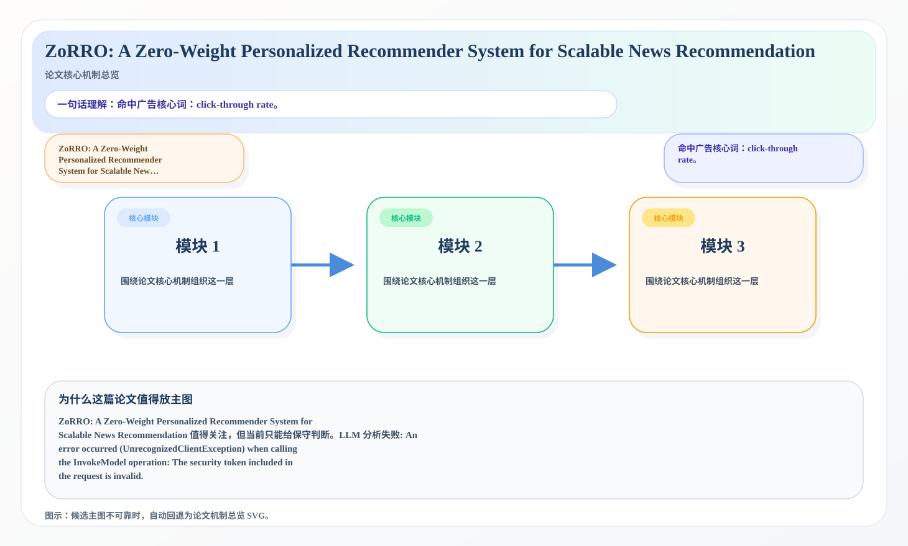
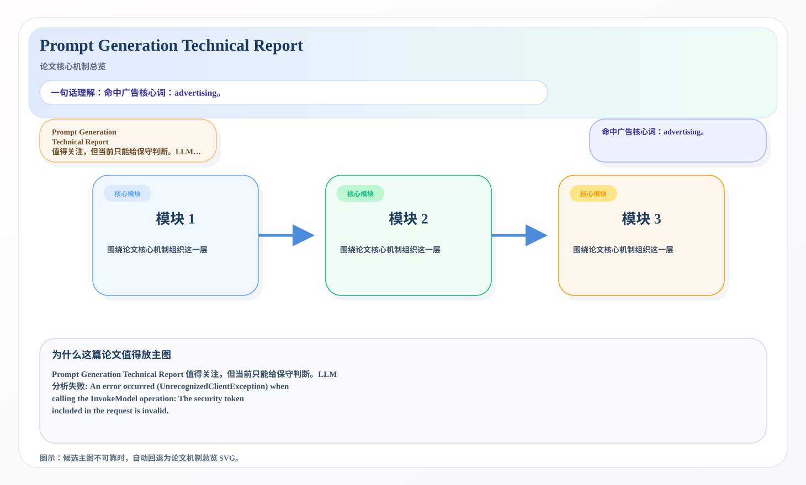

# 2026-07-14 论文日报

## 一、今日趋势与创新观察

### 1. 趋势概况

- 今天一共抓到 568 篇论文，趋势概况优先基于全量抓取结果而不是只看最后保留的候选。
- 从全量论文看，主题最集中的方向是：LLM 与语言理解、表示学习与检索排序、Agent 与多智能体。
- 进入候选池的工作里，直接广告 7 篇、强迁移 43 篇、大公司线索 3 篇，说明今天既有直接商业化问题，也有可迁移的方法论输入。

### 2. 推荐系统 / 排序相关创新点

- 《Stream-aware Side Adaptation for Large Pre-trained Multimodal Embedding Models in Sequential Recommendation》：亮点信号：dit, alignment, embedding, semantic；主题：LLM 与语言理解、表示学习与检索排序；候选属性：强迁移论文
- 《MemDecay: Region-Aware KV Cache Eviction for Efficient LLM Agent Inference》：亮点信号：tool, cache, robust, semantic；主题：LLM 与语言理解、Agent 与多智能体；来自全量抓取的补充观察
- 《Large language model agents accelerate inverse design of metal-organic frameworks for gas separation》：亮点信号：closed-loop, dit, constraint, memory；主题：LLM 与语言理解、Agent 与多智能体；公司线索：Meta；候选属性：大公司优先论文

### 3. 全局创新点

- 《Workload-Driven Optimization for On-Device Real-Time Subtitle Translation》：亮点信号：dit, projection, embedding, constraint；主题：表示学习与检索排序；公司线索：Google、Meta；候选属性：大公司优先论文

## 二、今日入选论文

### 1. ZoRRO: A Zero-Weight Personalized Recommender System for Scalable News Recommendation
- 挑选理由：命中广告核心词：click-through rate。

### 2. Prompt Generation Technical Report
- 挑选理由：命中广告核心词：advertising。

## 三、补充关注

1. **Characterising AI Models for Cataloguing**
   - 理由：有一定相关信号，但不足以进入正式候选：recommendation。
2. **Context by Distinct Information: An Auditable Dirichlet-Process Working Memory for Long, Redundant Context Streams**
   - 理由：有一定相关信号，但不足以进入正式候选：recall。
3. **MRUF: Multi-granularity Routing with Uncertainty-Aware Fusion for Robust Multimodal Sentiment Analysis**
   - 理由：有一定相关信号，但不足以进入正式候选：calibration。
4. **PhenoEmbed: Self-Supervised Multispectral UAV Time-Series Embeddings for Individual Tree Crown Phenology**
   - 理由：有一定相关信号，但不足以进入正式候选：retrieval。
5. **What You Train Is What You Get: Gender Bias, Training Composition, and Post-Hoc Mitigation in Audio Deepfake Detection**
   - 理由：有一定相关信号，但不足以进入正式候选：calibration。
6. **More Structure, Not More Capacity: Object-Centric Representations for Visuomotor Imitation Learning**
   - 理由：有一定相关信号，但不足以进入正式候选：calibration。
7. **Physics-Informed Structure Anchoring With Capture-Aware Prototype Calibration for Cross-Environment RF Fingerprinting**
   - 理由：有一定相关信号，但不足以进入正式候选：calibration。
8. **An Exact Instrument for State Usage in Selective State-Space Models, and the Input-Driven Migration It Reveals**
   - 理由：有一定相关信号，但不足以进入正式候选：counterfactual。
9. **Bet on Features: Anytime-Valid and Feature-Aware Auditing of Conditional Quantile Forecasters**
   - 理由：有一定相关信号，但不足以进入正式候选：calibration。
10. **Fundamental Limitations of Fixed-Budget Best-Arm Identification**
   - 理由：有一定相关信号，但不足以进入正式候选：ranking。

## 四、重点论文精读

### 1. ZoRRO: A Zero-Weight Personalized Recommender System for Scalable News Recommendation
- **为什么值得看：** 命中广告核心词：click-through rate。
- **背景：** ZoRRO: A Zero-Weight Personalized Recommender System for Scalable News Recommendation 值得关注，但当前只能给保守判断。LLM 分析失败: An error occurred (UnrecognizedClientException) when calling the InvokeModel operation: The security token included in the request is invalid.

*图示：候选主图不可靠，已回退为论文核心机制总览 SVG。*

- **当前状态：** llm_failed（LLM 分析失败: An error occurred (UnrecognizedClientException) when calling the InvokeModel operation: The security token included in the request is invalid.）
- **核心技术点：** 本次精读未成功，暂不展示结构化核心点，避免误导。
- **对广告的启发：** 暂时只保留候选判断，建议稍后重试精读。

### 2. Prompt Generation Technical Report
- **为什么值得看：** 命中广告核心词：advertising。
- **背景：** Prompt Generation Technical Report 值得关注，但当前只能给保守判断。LLM 分析失败: An error occurred (UnrecognizedClientException) when calling the InvokeModel operation: The security token included in the request is invalid.

*图示：候选主图不可靠，已回退为论文核心机制总览 SVG。*

- **当前状态：** llm_failed（LLM 分析失败: An error occurred (UnrecognizedClientException) when calling the InvokeModel operation: The security token included in the request is invalid.）
- **核心技术点：** 本次精读未成功，暂不展示结构化核心点，避免误导。
- **对广告的启发：** 暂时只保留候选判断，建议稍后重试精读。

## 五、候选但未完成深读的论文

- **ZoRRO: A Zero-Weight Personalized Recommender System for Scalable News Recommendation**
  - 状态：llm_failed
  - 原因：LLM 分析失败: An error occurred (UnrecognizedClientException) when calling the InvokeModel operation: The security token included in the request is invalid.
- **Prompt Generation Technical Report**
  - 状态：llm_failed
  - 原因：LLM 分析失败: An error occurred (UnrecognizedClientException) when calling the InvokeModel operation: The security token included in the request is invalid.
